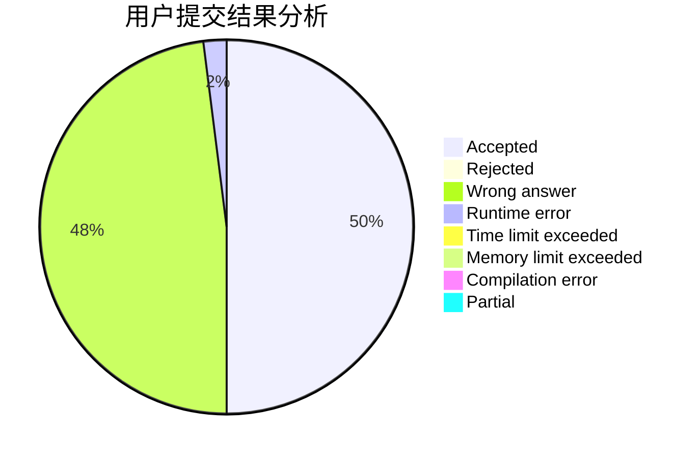
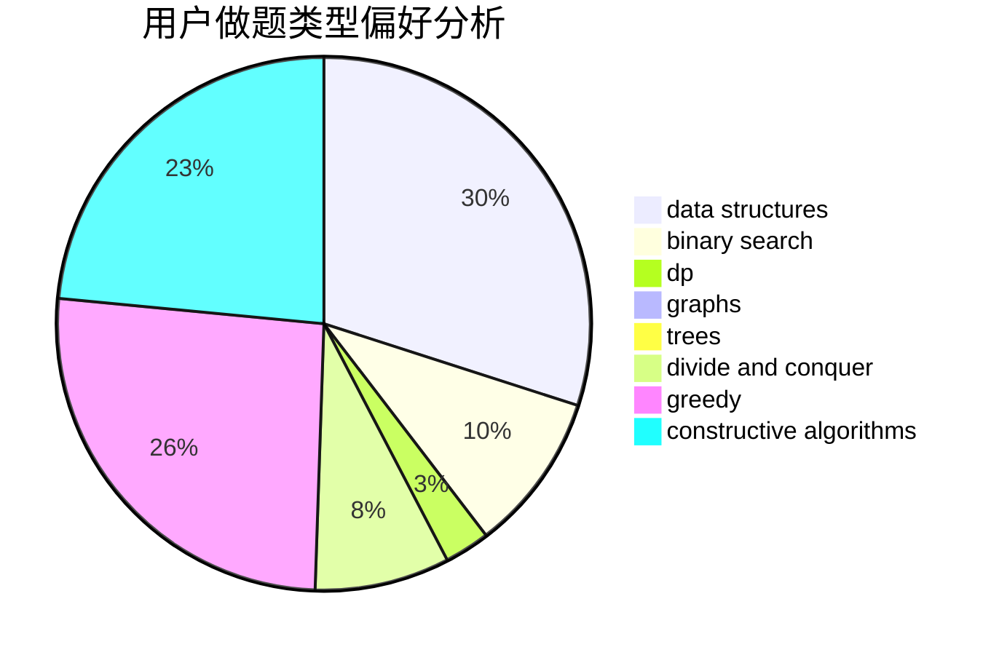
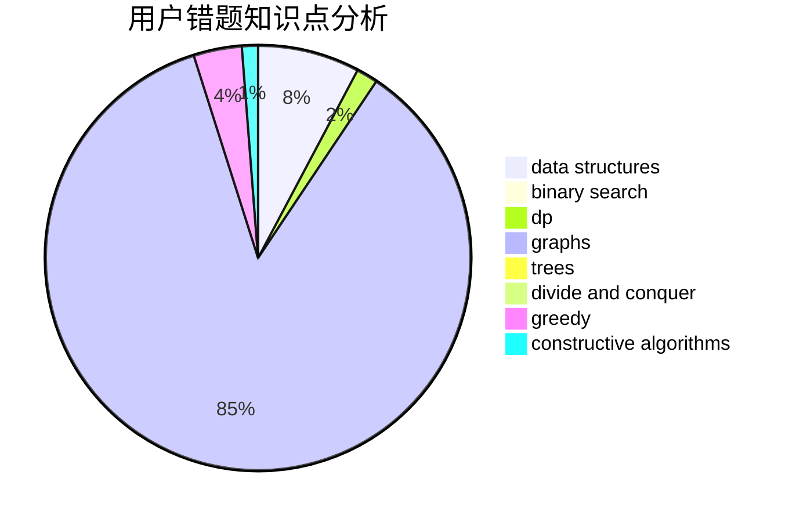

# dqsjysgs

<!-- tabs:start -->

#### **用户提交结果分析**

#### **用户做题类型偏好分析**

#### **用户错题知识点分析**

<!-- tabs:end -->
# 推荐题目
[1137A](https://codeforces.com/contest/1137/problem/A)		implementation,
                        sortings		  
[51F](https://codeforces.com/contest/51/problem/F)		dfs and similar,
                        dp,
                        graphs,
                        trees		  
[1101F](https://codeforces.com/contest/1101/problem/F)		binary search,
                        dp		  
[165A](https://codeforces.com/contest/165/problem/A)		implementation		  
[645E](https://codeforces.com/contest/645/problem/E)		dp,
                        greedy,
                        strings		  
[254D](https://codeforces.com/contest/254/problem/D)		brute force,
                        dfs and similar,
                        graphs,
                        implementation,
                        shortest paths		  
[555E](https://codeforces.com/contest/555/problem/E)		dfs and similar,
                        graphs,
                        trees		  
[802A](https://codeforces.com/contest/802/problem/A)		greedy		  
[758F](https://codeforces.com/contest/758/problem/F)		brute force,
                        math,
                        number theory		  
[704E](https://codeforces.com/contest/704/problem/E)		data structures,
                        geometry,
                        trees		  
