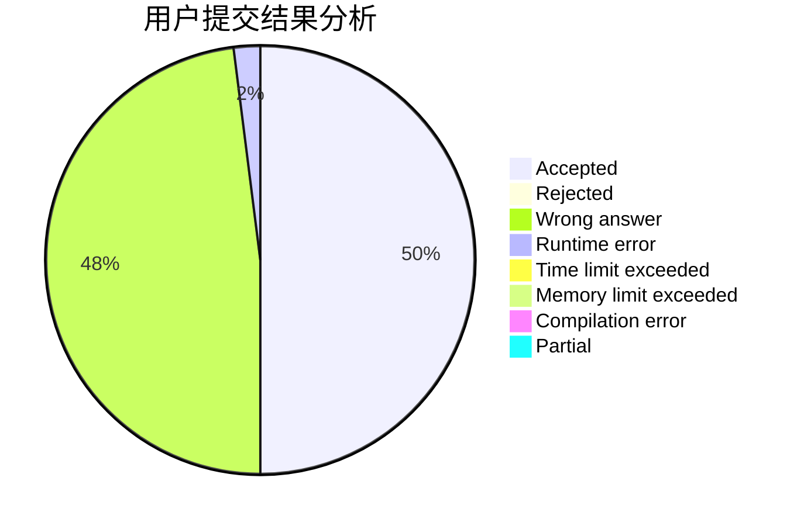
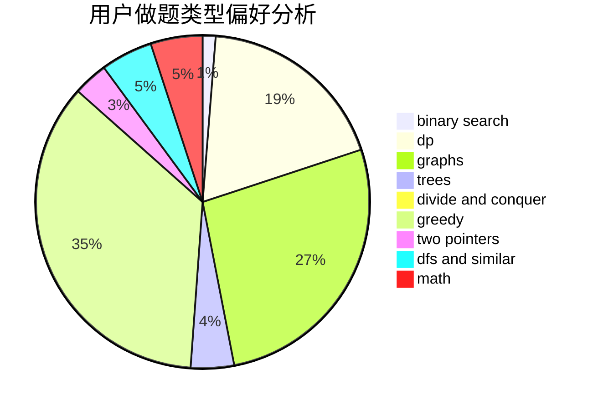

# dqsjysgs

<!-- tabs:start -->

#### **用户提交结果分析**

#### **用户做题类型偏好分析**

<!-- tabs:end -->
# 推荐题目
[1139B](https://codeforces.com/contest/1139/problem/B)
[545D](https://codeforces.com/contest/545/problem/D)
[1102B](https://codeforces.com/contest/1102/problem/B)
[18C](https://codeforces.com/contest/18/problem/C)
[672A](https://codeforces.com/contest/672/problem/A)
[273D](https://codeforces.com/contest/273/problem/D)
[580B](https://codeforces.com/contest/580/problem/B)
[816E](https://codeforces.com/contest/816/problem/E)
[778A](https://codeforces.com/contest/778/problem/A)
[723E](https://codeforces.com/contest/723/problem/E)
