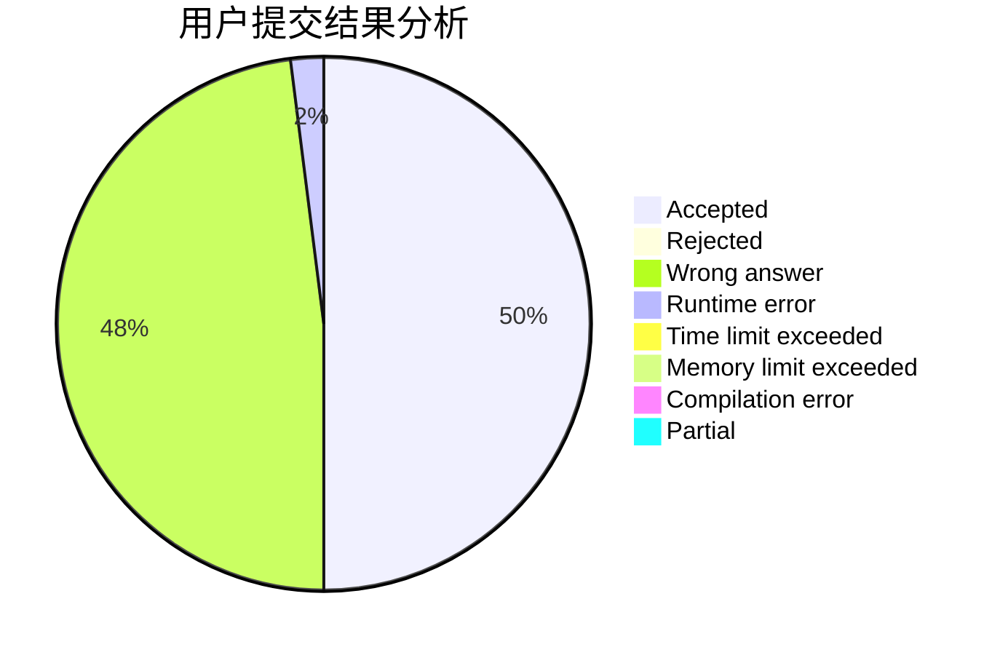
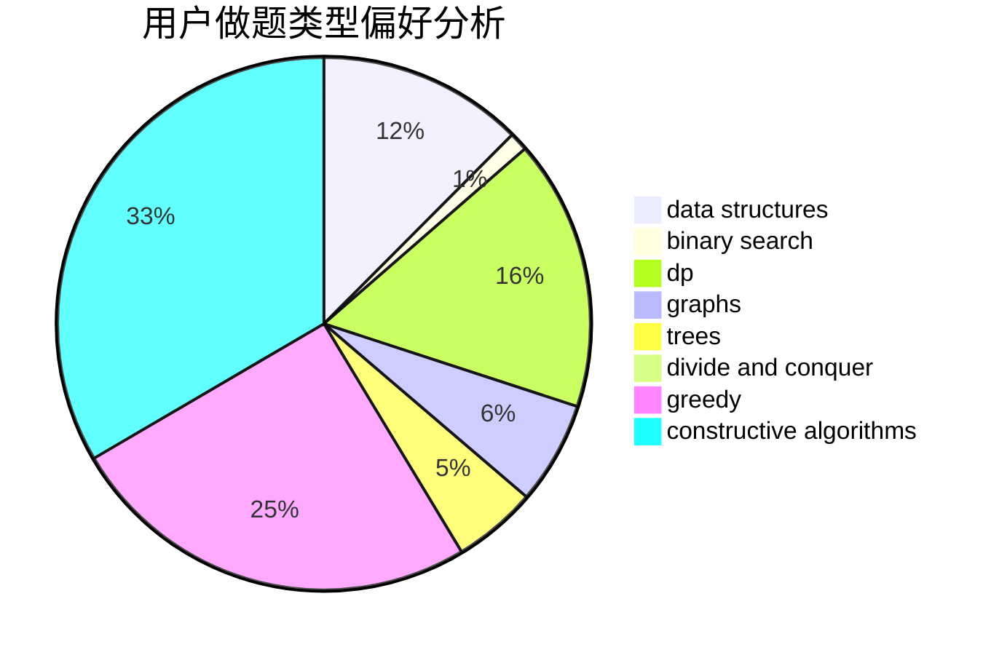
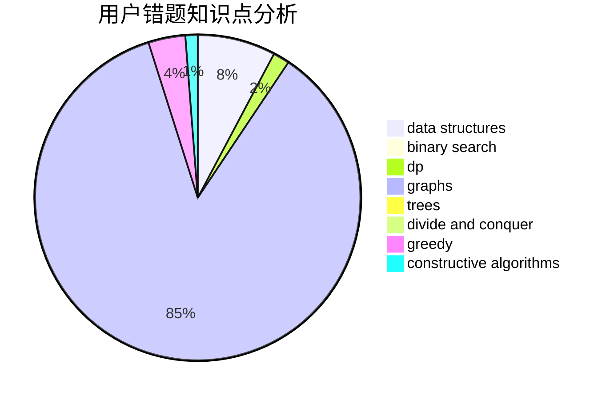

# dqsjysgs

<!-- tabs:start -->

#### **用户提交结果分析**

#### **用户做题类型偏好分析**

#### **用户错题知识点分析**

<!-- tabs:end -->
# 推荐题目
[1139B](https://codeforces.com/contest/1139/problem/B)		greedy,
                        implementation		  
[545D](https://codeforces.com/contest/545/problem/D)		greedy,
                        implementation,
                        sortings		  
[1102B](https://codeforces.com/contest/1102/problem/B)		greedy,
                        sortings		  
[18C](https://codeforces.com/contest/18/problem/C)		data structures,
                        implementation		  
[672A](https://codeforces.com/contest/672/problem/A)		implementation		  
[273D](https://codeforces.com/contest/273/problem/D)		dp		  
[580B](https://codeforces.com/contest/580/problem/B)		binary search,
                        sortings,
                        two pointers		  
[816E](https://codeforces.com/contest/816/problem/E)		dsu,graphs,sortings,trees		  
[778A](https://codeforces.com/contest/778/problem/A)		binary search,
                        greedy,
                        strings		  
[723E](https://codeforces.com/contest/723/problem/E)		constructive algorithms,
                        dfs and similar,
                        flows,
                        graphs,
                        greedy		  
