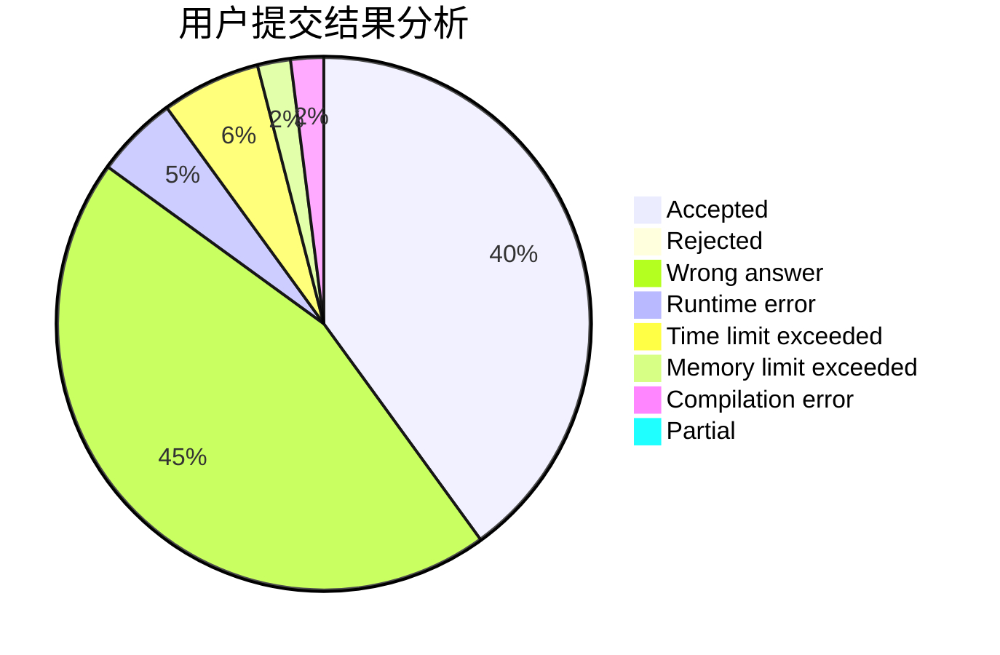
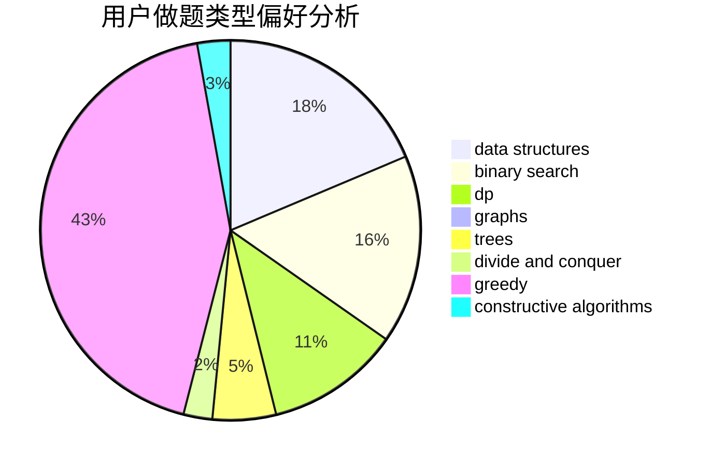
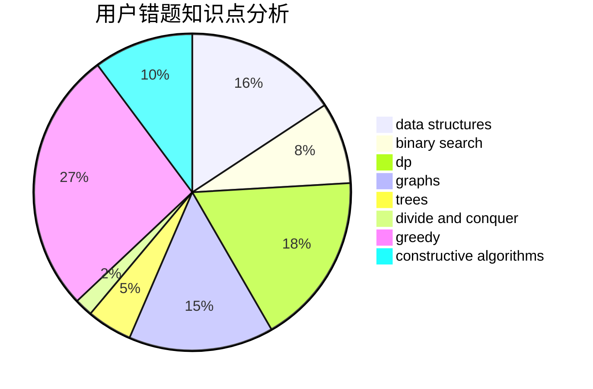

# dragon_bra

<!-- tabs:start -->

#### **用户提交结果分析**

#### **用户做题类型偏好分析**

#### **用户错题知识点分析**

<!-- tabs:end -->
# 推荐题目
[354B](https://codeforces.com/contest/354/problem/B)		bitmasks,
                        dp,
                        games		  
[149E](https://codeforces.com/contest/149/problem/E)		string suffix structures,
                        strings		  
[484E](https://codeforces.com/contest/484/problem/E)		binary search,
                        constructive algorithms,
                        data structures		  
[316G3](https://codeforces.com/contest/316G/problem/3)		string suffix structures		  
[765D](https://codeforces.com/contest/765/problem/D)		constructive algorithms,
                        dsu,
                        math		  
[868G](https://codeforces.com/contest/868/problem/G)		math		  
[543D](https://codeforces.com/contest/543/problem/D)		dp,
                        trees		  
[6C](https://codeforces.com/contest/6/problem/C)		greedy,
                        two pointers		  
[1163F](https://codeforces.com/contest/1163/problem/F)		data structures,
                        graphs,
                        shortest paths		  
[674G](https://codeforces.com/contest/674/problem/G)		dsu,graphs,sortings,trees		  
