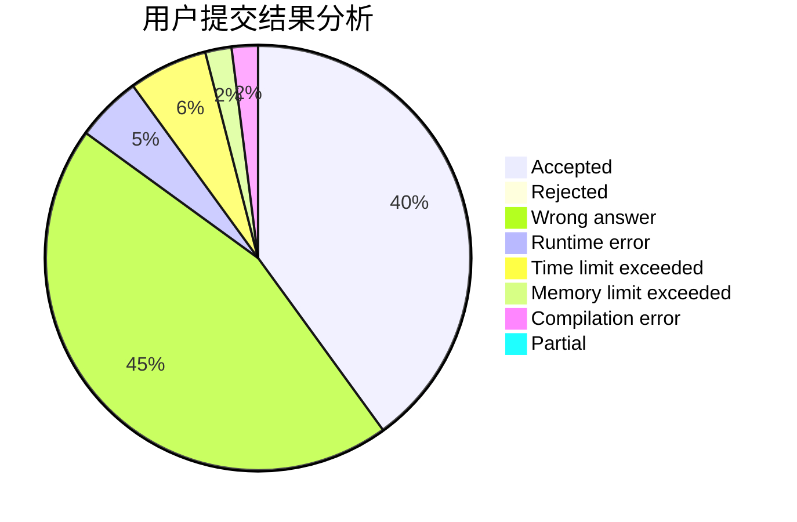
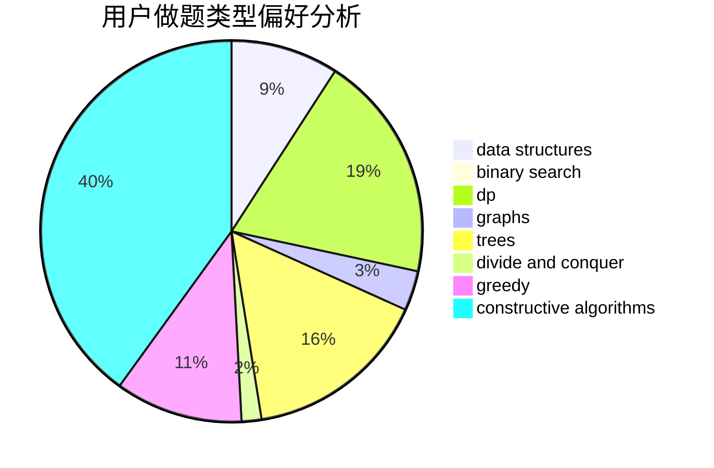
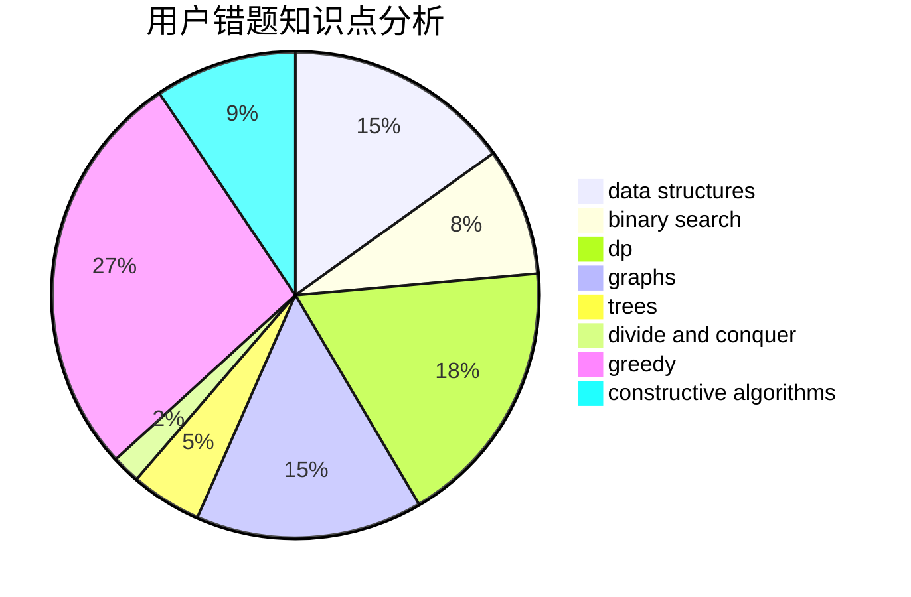

# dragon_bra

<!-- tabs:start -->

#### **用户提交结果分析**

#### **用户做题类型偏好分析**

#### **用户错题知识点分析**

<!-- tabs:end -->
# 推荐题目
[380A](https://codeforces.com/contest/380/problem/A)		binary search,
                        brute force		  
[1510A](https://codeforces.com/contest/1510/problem/A)		nan		  
[506A](https://codeforces.com/contest/506/problem/A)		dsu,graphs,sortings,trees		  
[346A](https://codeforces.com/contest/346/problem/A)		games,
                        math,
                        number theory		  
[784G](https://codeforces.com/contest/784/problem/G)		*special problem		  
[888C](https://codeforces.com/contest/888/problem/C)		binary search,
                        implementation,
                        two pointers		  
[567F](https://codeforces.com/contest/567/problem/F)		dp		  
[717E](https://codeforces.com/contest/717/problem/E)		dfs and similar		  
[1165B](https://codeforces.com/contest/1165/problem/B)		data structures,
                        greedy,
                        sortings		  
[699D](https://codeforces.com/contest/699/problem/D)		dsu,graphs,sortings,trees		  
