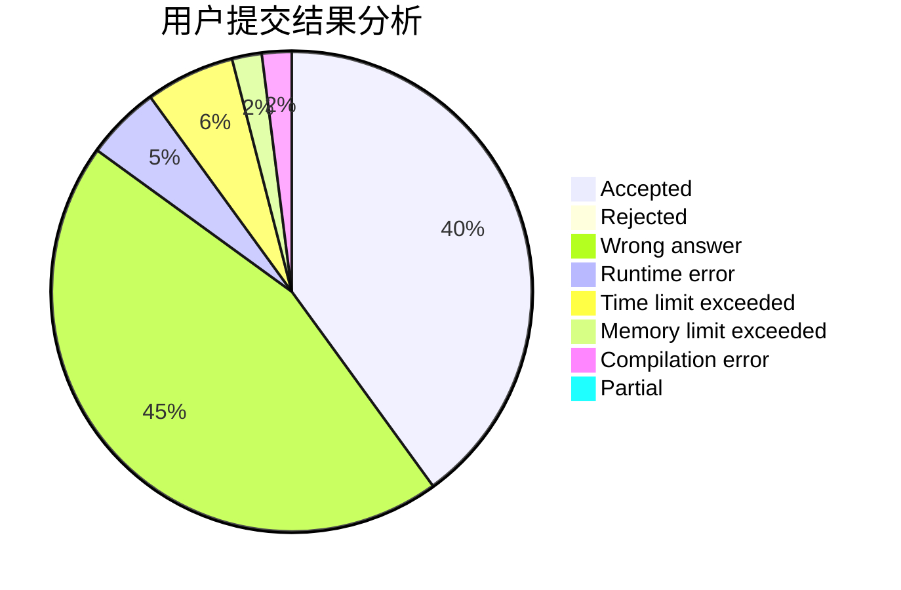
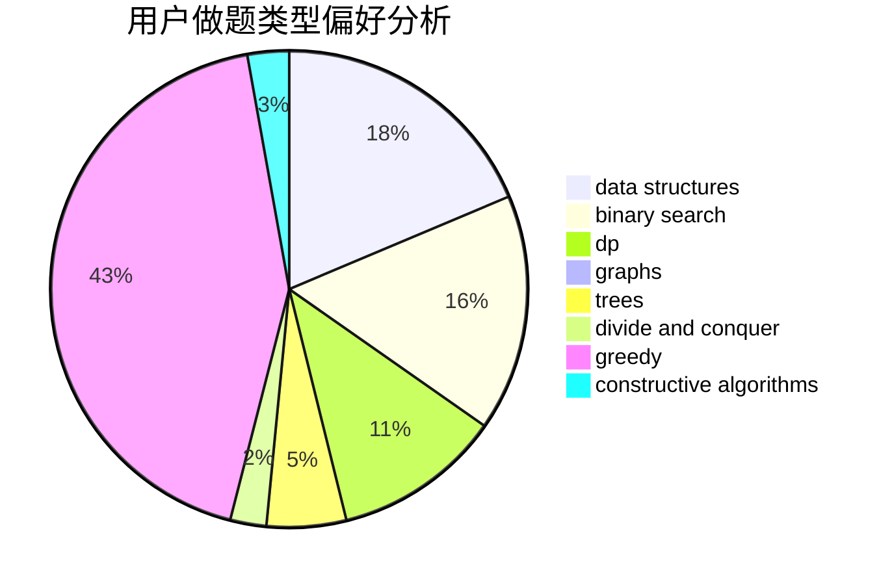
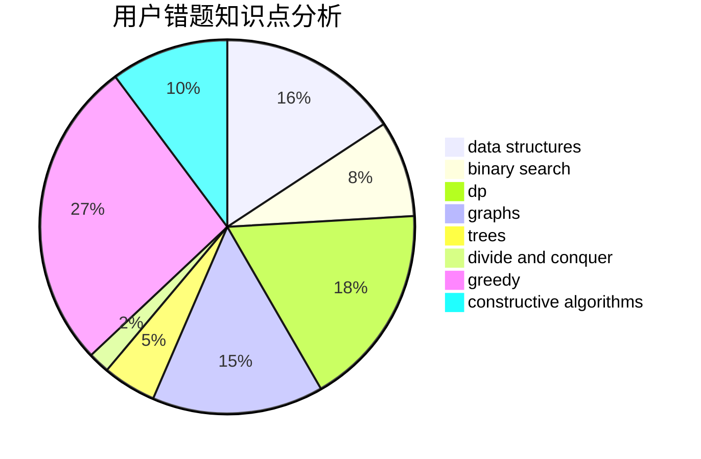

# dragon_bra
<!-- tabs:start -->
#### **用户提交结果分析**

#### **用户做题类型偏好分析**

#### **用户错题知识点分析**

<!-- tabs:end -->
# 推荐题目
[Martian Strings](http://codeforces.com/problemset/problem/149/E)		string suffix structures,
                        strings		  
[Instant Noodles](http://codeforces.com/problemset/problem/1322/C)		graphs,
                        hashing,
                        math,
                        number theory		  
[Two Rooted Trees](http://codeforces.com/problemset/problem/403/E)		data structures,
                        implementation,
                        trees		  
[Alice, Bob and Chocolate](http://codeforces.com/problemset/problem/6/C)		greedy,
                        two pointers		  
[Greg and Graph](https://codeforces.com/contest/296/problem/D)		dp,
                        graphs,
                        shortest paths		  
[Office Keys](https://codeforces.com/contest/831/problem/D)		binary search,
                        brute force,
                        dp,
                        greedy,
                        sortings		  
[pSort](http://codeforces.com/problemset/problem/28/B)		dfs and similar,
                        dsu,
                        graphs		  
[Road Improvement](http://codeforces.com/problemset/problem/543/D)		dp,
                        trees		  
[Clique Problem](http://codeforces.com/problemset/problem/527/D)		data structures,
                        dp,
                        greedy,
                        implementation,
                        sortings		  
[Dušan's Railway](http://codeforces.com/problemset/problem/1423/C)		divide and conquer,
                        graphs,
                        trees		  
<!-- tabs:start -->
#### **data structures**
[Martian Strings](http://codeforces.com/problemset/problem/403/E)		data structures,
                        implementation,
                        trees		  
[Instant Noodles](http://codeforces.com/problemset/problem/527/D)		data structures,
                        dp,
                        greedy,
                        implementation,
                        sortings		  
[Two Rooted Trees](http://codeforces.com/problemset/problem/1163/F)		data structures,
                        graphs,
                        shortest paths		  
[Alice, Bob and Chocolate](https://codeforces.com/contest/674/problem/G)		data structures		  
[Greg and Graph](http://codeforces.com/problemset/problem/713/D)		binary search,
                        data structures		  
[Office Keys](http://codeforces.com/problemset/problem/1295/E)		data structures,
                        divide and conquer		  
[pSort](http://codeforces.com/problemset/problem/1200/D)		brute force,
                        data structures,
                        dp,
                        implementation,
                        two pointers		  
[Road Improvement](http://codeforces.com/problemset/problem/1407/D)		data structures,
                        dp,
                        graphs		  
[Clique Problem](http://codeforces.com/problemset/problem/484/E)		binary search,
                        constructive algorithms,
                        data structures		  
[Dušan's Railway](http://codeforces.com/problemset/problem/1149/C)		data structures,
                        implementation,
                        trees		  
#### **binary search**
[Martian Strings](https://codeforces.com/contest/831/problem/D)		binary search,
                        brute force,
                        dp,
                        greedy,
                        sortings		  
[Instant Noodles](http://codeforces.com/problemset/problem/713/D)		binary search,
                        data structures		  
[Two Rooted Trees](http://codeforces.com/problemset/problem/484/E)		binary search,
                        constructive algorithms,
                        data structures		  
[Alice, Bob and Chocolate](http://codeforces.com/problemset/problem/1492/C)		binary search,
                        data structures,
                        dp,
                        greedy,
                        two pointers		  
[Greg and Graph](http://codeforces.com/problemset/problem/1463/D)		binary search,
                        constructive algorithms,
                        greedy,
                        two pointers		  
[Office Keys](http://codeforces.com/problemset/problem/1490/G)		binary search,
                        data structures,
                        math		  
[pSort](http://codeforces.com/problemset/problem/1479/D)		binary search,
                        bitmasks,
                        brute force,
                        data structures,
                        probabilities,
                        trees		  
[Road Improvement](http://codeforces.com/problemset/problem/1436/E)		binary search,
                        data structures,
                        two pointers		  
[Clique Problem](http://codeforces.com/problemset/problem/1461/D)		binary search,
                        brute force,
                        data structures,
                        divide and conquer,
                        implementation,
                        sortings		  
[Dušan's Railway](http://codeforces.com/problemset/problem/1493/C)		binary search,
                        brute force,
                        constructive algorithms,
                        greedy,
                        strings		  
#### **dp**
[Martian Strings](https://codeforces.com/contest/296/problem/D)		dp,
                        graphs,
                        shortest paths		  
[Instant Noodles](https://codeforces.com/contest/831/problem/D)		binary search,
                        brute force,
                        dp,
                        greedy,
                        sortings		  
[Two Rooted Trees](http://codeforces.com/problemset/problem/543/D)		dp,
                        trees		  
[Alice, Bob and Chocolate](http://codeforces.com/problemset/problem/527/D)		data structures,
                        dp,
                        greedy,
                        implementation,
                        sortings		  
[Greg and Graph](http://codeforces.com/problemset/problem/354/B)		bitmasks,
                        dp,
                        games		  
[Office Keys](http://codeforces.com/problemset/problem/148/E)		dp		  
[pSort](http://codeforces.com/problemset/problem/1015/F)		dp,
                        strings		  
[Road Improvement](http://codeforces.com/problemset/problem/295/D)		combinatorics,
                        dp		  
[Clique Problem](http://codeforces.com/problemset/problem/1200/D)		brute force,
                        data structures,
                        dp,
                        implementation,
                        two pointers		  
[Dušan's Railway](http://codeforces.com/problemset/problem/1407/D)		data structures,
                        dp,
                        graphs		  
#### **graph**
[Martian Strings](http://codeforces.com/problemset/problem/1322/C)		graphs,
                        hashing,
                        math,
                        number theory		  
[Instant Noodles](https://codeforces.com/contest/296/problem/D)		dp,
                        graphs,
                        shortest paths		  
[Two Rooted Trees](http://codeforces.com/problemset/problem/28/B)		dfs and similar,
                        dsu,
                        graphs		  
[Alice, Bob and Chocolate](http://codeforces.com/problemset/problem/1423/C)		divide and conquer,
                        graphs,
                        trees		  
[Greg and Graph](http://codeforces.com/problemset/problem/23/B)		constructive algorithms,
                        graphs,
                        math		  
[Office Keys](http://codeforces.com/problemset/problem/755/C)		dfs and similar,
                        dsu,
                        graphs,
                        interactive,
                        trees		  
[pSort](https://codeforces.com/contest/1011/problem/F)		dfs and similar,
                        graphs,
                        implementation,
                        trees		  
[Road Improvement](http://codeforces.com/problemset/problem/1163/F)		data structures,
                        graphs,
                        shortest paths		  
[Clique Problem](http://codeforces.com/problemset/problem/770/C)		*special problem,
                        dfs and similar,
                        graphs,
                        implementation		  
[Dušan's Railway](http://codeforces.com/problemset/problem/1407/D)		data structures,
                        dp,
                        graphs		  
#### **trees**
[Martian Strings](http://codeforces.com/problemset/problem/403/E)		data structures,
                        implementation,
                        trees		  
[Instant Noodles](http://codeforces.com/problemset/problem/543/D)		dp,
                        trees		  
[Two Rooted Trees](http://codeforces.com/problemset/problem/1423/C)		divide and conquer,
                        graphs,
                        trees		  
[Alice, Bob and Chocolate](http://codeforces.com/problemset/problem/755/C)		dfs and similar,
                        dsu,
                        graphs,
                        interactive,
                        trees		  
[Greg and Graph](https://codeforces.com/contest/1011/problem/F)		dfs and similar,
                        graphs,
                        implementation,
                        trees		  
[Office Keys](http://codeforces.com/problemset/problem/1149/C)		data structures,
                        implementation,
                        trees		  
[pSort](http://codeforces.com/problemset/problem/1479/D)		binary search,
                        bitmasks,
                        brute force,
                        data structures,
                        probabilities,
                        trees		  
[Road Improvement](http://codeforces.com/problemset/problem/1511/C)		brute force,
                        data structures,
                        implementation,
                        trees		  
[Clique Problem](http://codeforces.com/problemset/problem/1499/F)		combinatorics,
                        dfs and similar,
                        dp,
                        trees		  
[Dušan's Railway](http://codeforces.com/problemset/problem/1491/E)		brute force,
                        dfs and similar,
                        divide and conquer,
                        number theory,
                        trees		  
#### **divide and conquer**
[Martian Strings](http://codeforces.com/problemset/problem/1423/C)		divide and conquer,
                        graphs,
                        trees		  
[Instant Noodles](http://codeforces.com/problemset/problem/1295/E)		data structures,
                        divide and conquer		  
[Two Rooted Trees](http://codeforces.com/problemset/problem/1461/D)		binary search,
                        brute force,
                        data structures,
                        divide and conquer,
                        implementation,
                        sortings		  
[Alice, Bob and Chocolate](http://codeforces.com/problemset/problem/1466/G)		combinatorics,
                        divide and conquer,
                        hashing,
                        math,
                        string suffix structures,
                        strings		  
[Greg and Graph](http://codeforces.com/problemset/problem/1490/D)		dfs and similar,
                        divide and conquer,
                        implementation		  
[Office Keys](https://codeforces.com/contest/1483/problem/C)		data structures,
                        divide and conquer,
                        dp		  
[pSort](http://codeforces.com/problemset/problem/1491/E)		brute force,
                        dfs and similar,
                        divide and conquer,
                        number theory,
                        trees		  
[Road Improvement](http://codeforces.com/problemset/problem/1303/G)		data structures,
                        divide and conquer,
                        geometry,
                        trees		  
[Clique Problem](http://codeforces.com/problemset/problem/1494/D)		constructive algorithms,
                        data structures,
                        dfs and similar,
                        divide and conquer,
                        dsu,
                        greedy,
                        sortings,
                        trees		  
[Dušan's Railway](http://codeforces.com/problemset/problem/1482/E)		data structures,
                        divide and conquer,
                        dp		  
#### **greedy**
[Martian Strings](http://codeforces.com/problemset/problem/6/C)		greedy,
                        two pointers		  
[Instant Noodles](https://codeforces.com/contest/831/problem/D)		binary search,
                        brute force,
                        dp,
                        greedy,
                        sortings		  
[Two Rooted Trees](http://codeforces.com/problemset/problem/527/D)		data structures,
                        dp,
                        greedy,
                        implementation,
                        sortings		  
[Alice, Bob and Chocolate](https://codeforces.com/contest/1086/problem/C)		greedy,
                        implementation,
                        strings		  
[Greg and Graph](http://codeforces.com/problemset/problem/779/C)		constructive algorithms,
                        greedy,
                        sortings		  
[Office Keys](http://codeforces.com/problemset/problem/1453/D)		brute force,
                        constructive algorithms,
                        greedy,
                        math,
                        probabilities		  
[pSort](https://codeforces.com/contest/1362/problem/E)		greedy,
                        implementation,
                        math,
                        sortings		  
[Road Improvement](http://codeforces.com/problemset/problem/1153/C)		greedy,
                        strings		  
[Clique Problem](https://codeforces.com/contest/418/problem/B)		bitmasks,
                        dp,
                        greedy,
                        sortings		  
[Dušan's Railway](http://codeforces.com/problemset/problem/1173/B)		constructive algorithms,
                        greedy		  
#### **constructive algorithms**
[Martian Strings](http://codeforces.com/problemset/problem/23/B)		constructive algorithms,
                        graphs,
                        math		  
[Instant Noodles](http://codeforces.com/problemset/problem/779/C)		constructive algorithms,
                        greedy,
                        sortings		  
[Two Rooted Trees](http://codeforces.com/problemset/problem/765/D)		constructive algorithms,
                        dsu,
                        math		  
[Alice, Bob and Chocolate](http://codeforces.com/problemset/problem/23/C)		constructive algorithms,
                        sortings		  
[Greg and Graph](http://codeforces.com/problemset/problem/484/E)		binary search,
                        constructive algorithms,
                        data structures		  
[Office Keys](http://codeforces.com/problemset/problem/1453/D)		brute force,
                        constructive algorithms,
                        greedy,
                        math,
                        probabilities		  
[pSort](http://codeforces.com/problemset/problem/1173/B)		constructive algorithms,
                        greedy		  
[Road Improvement](http://codeforces.com/problemset/problem/1153/B)		constructive algorithms,
                        greedy		  
[Clique Problem](http://codeforces.com/problemset/problem/883/K)		constructive algorithms,
                        greedy,
                        implementation		  
[Dušan's Railway](http://codeforces.com/problemset/problem/1492/E)		brute force,
                        constructive algorithms,
                        dfs and similar,
                        greedy,
                        implementation		  
#### **sortings**
[Martian Strings](https://codeforces.com/contest/831/problem/D)		binary search,
                        brute force,
                        dp,
                        greedy,
                        sortings		  
[Instant Noodles](http://codeforces.com/problemset/problem/527/D)		data structures,
                        dp,
                        greedy,
                        implementation,
                        sortings		  
[Two Rooted Trees](http://codeforces.com/problemset/problem/779/C)		constructive algorithms,
                        greedy,
                        sortings		  
[Alice, Bob and Chocolate](http://codeforces.com/problemset/problem/23/C)		constructive algorithms,
                        sortings		  
[Greg and Graph](https://codeforces.com/contest/1362/problem/E)		greedy,
                        implementation,
                        math,
                        sortings		  
[Office Keys](https://codeforces.com/contest/418/problem/B)		bitmasks,
                        dp,
                        greedy,
                        sortings		  
[pSort](http://codeforces.com/problemset/problem/1189/B)		greedy,
                        math,
                        sortings		  
[Road Improvement](http://codeforces.com/problemset/problem/1316/E)		bitmasks,
                        dp,
                        greedy,
                        sortings		  
[Clique Problem](http://codeforces.com/problemset/problem/1513/E)		combinatorics,
                        constructive algorithms,
                        math,
                        sortings		  
[Dušan's Railway](https://codeforces.com/contest/1496/problem/C)		geometry,
                        greedy,
                        math,
                        sortings		  
<!-- tabs:end -->
