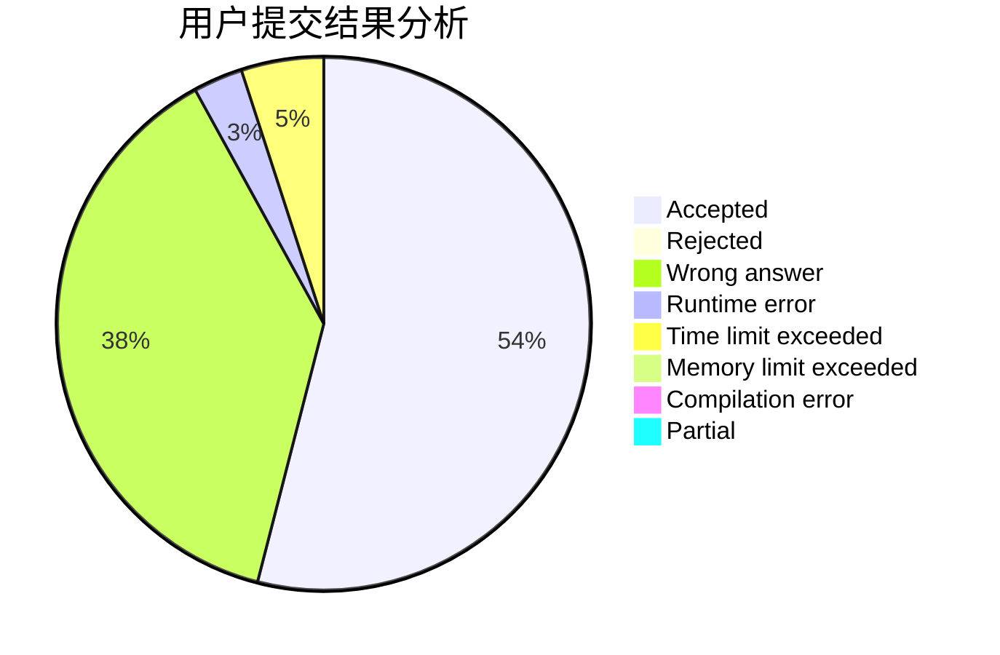
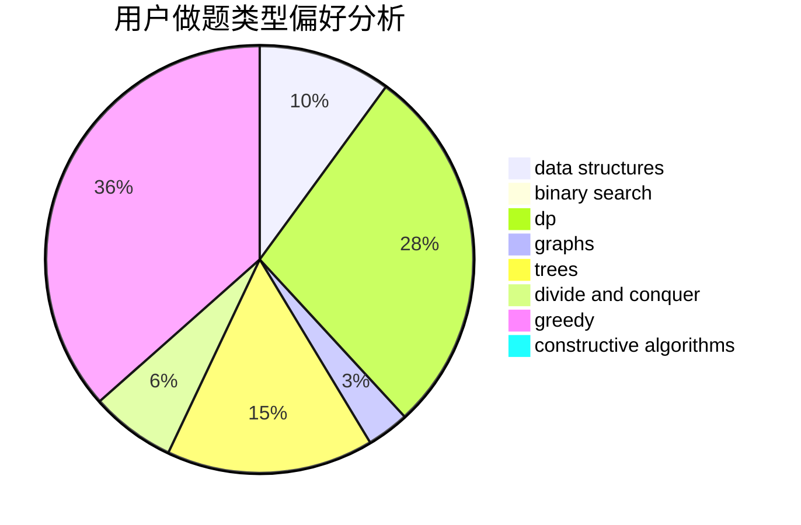
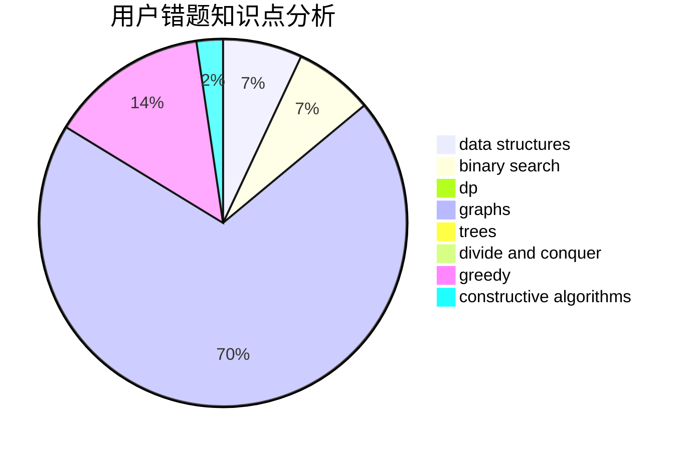

# dragonylee

<!-- tabs:start -->

#### **用户提交结果分析**

#### **用户做题类型偏好分析**

#### **用户错题知识点分析**

<!-- tabs:end -->
# 推荐题目
[1099C](https://codeforces.com/contest/1099/problem/C)		constructive algorithms,
                        implementation		  
[1312G](https://codeforces.com/contest/1312/problem/G)		data structures,
                        dfs and similar,
                        dp		  
[429E](https://codeforces.com/contest/429/problem/E)		graphs		  
[1256A](https://codeforces.com/contest/1256/problem/A)		math		  
[853C](https://codeforces.com/contest/853/problem/C)		data structures		  
[521B](https://codeforces.com/contest/521/problem/B)		dsu,graphs,sortings,trees		  
[279E](https://codeforces.com/contest/279/problem/E)		dp,
                        games,
                        greedy,
                        number theory		  
[1042B](https://codeforces.com/contest/1042/problem/B)		bitmasks,
                        brute force,
                        dp,
                        implementation		  
[1081D](https://codeforces.com/contest/1081/problem/D)		dsu,
                        graphs,
                        shortest paths,
                        sortings		  
[189E](https://codeforces.com/contest/189/problem/E)		dsu,graphs,sortings,trees		  
