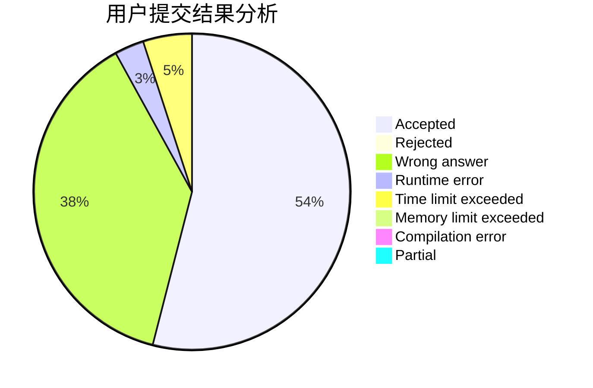
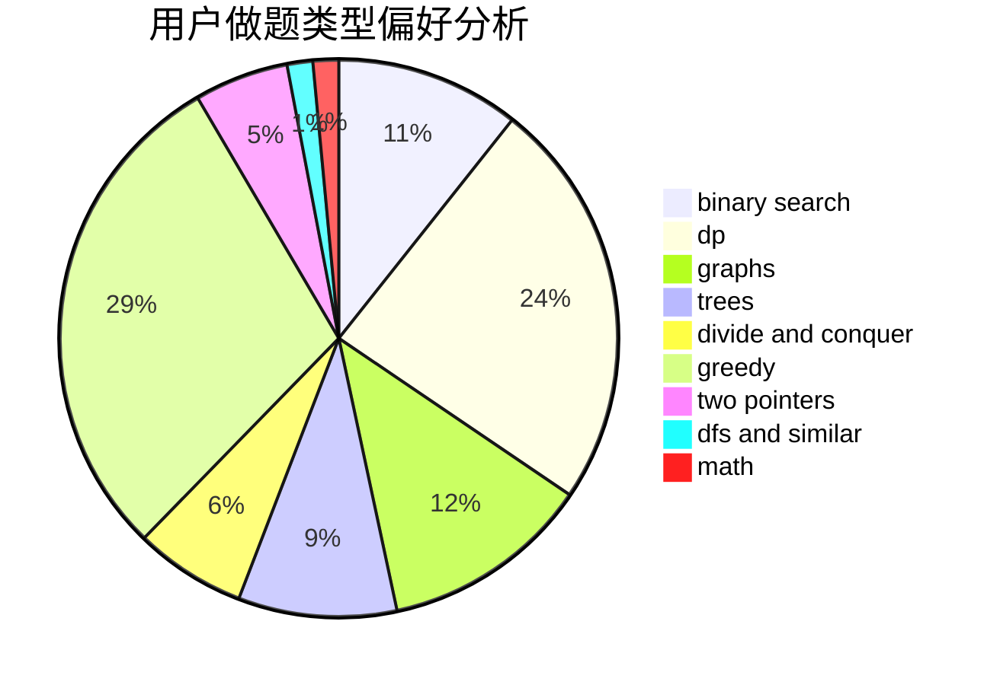

# dragonylee

<!-- tabs:start -->

#### **用户提交结果分析**

#### **用户做题类型偏好分析**

<!-- tabs:end -->
# 推荐题目
[1099F](https://codeforces.com/contest/1099/problem/F)
[1322C](https://codeforces.com/contest/1322/problem/C)
[451A](https://codeforces.com/contest/451/problem/A)
[1263C](https://codeforces.com/contest/1263/problem/C)
[871E](https://codeforces.com/contest/871/problem/E)
[547A](https://codeforces.com/contest/547/problem/A)
[294D](https://codeforces.com/contest/294/problem/D)
[1042E](https://codeforces.com/contest/1042/problem/E)
[1081G](https://codeforces.com/contest/1081/problem/G)
[213E](https://codeforces.com/contest/213/problem/E)
