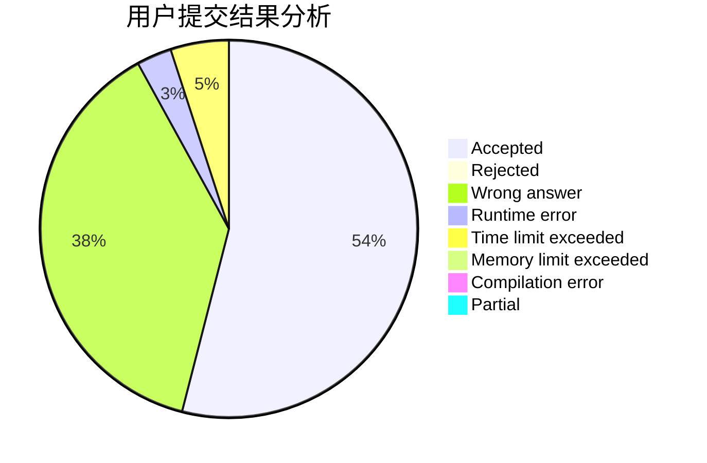
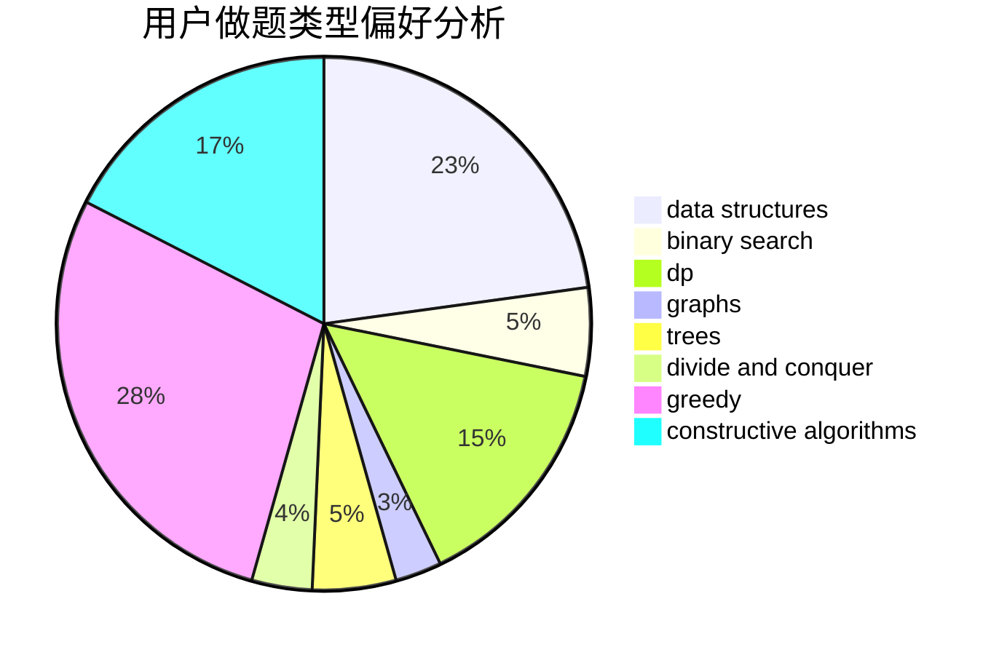
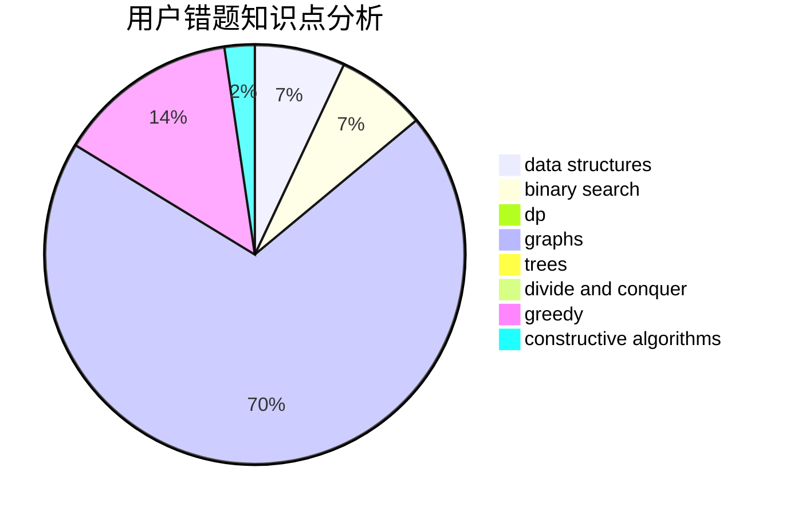

# dragonylee

<!-- tabs:start -->

#### **用户提交结果分析**

#### **用户做题类型偏好分析**

#### **用户错题知识点分析**

<!-- tabs:end -->
# 推荐题目
[1099F](https://codeforces.com/contest/1099/problem/F)		binary search,
                        data structures,
                        dfs and similar,
                        dp,
                        games,
                        trees		  
[1322C](https://codeforces.com/contest/1322/problem/C)		graphs,
                        hashing,
                        math,
                        number theory		  
[451A](https://codeforces.com/contest/451/problem/A)		implementation		  
[1263C](https://codeforces.com/contest/1263/problem/C)		binary search,
                        math,
                        meet-in-the-middle,
                        number theory		  
[871E](https://codeforces.com/contest/871/problem/E)		graphs,
                        greedy,
                        trees		  
[547A](https://codeforces.com/contest/547/problem/A)		brute force,
                        greedy,
                        implementation,
                        math		  
[294D](https://codeforces.com/contest/294/problem/D)		brute force,
                        implementation,
                        number theory		  
[1042E](https://codeforces.com/contest/1042/problem/E)		dp,
                        math,
                        probabilities		  
[1081G](https://codeforces.com/contest/1081/problem/G)		math,
                        probabilities		  
[213E](https://codeforces.com/contest/213/problem/E)		data structures,
                        hashing,
                        strings		  
