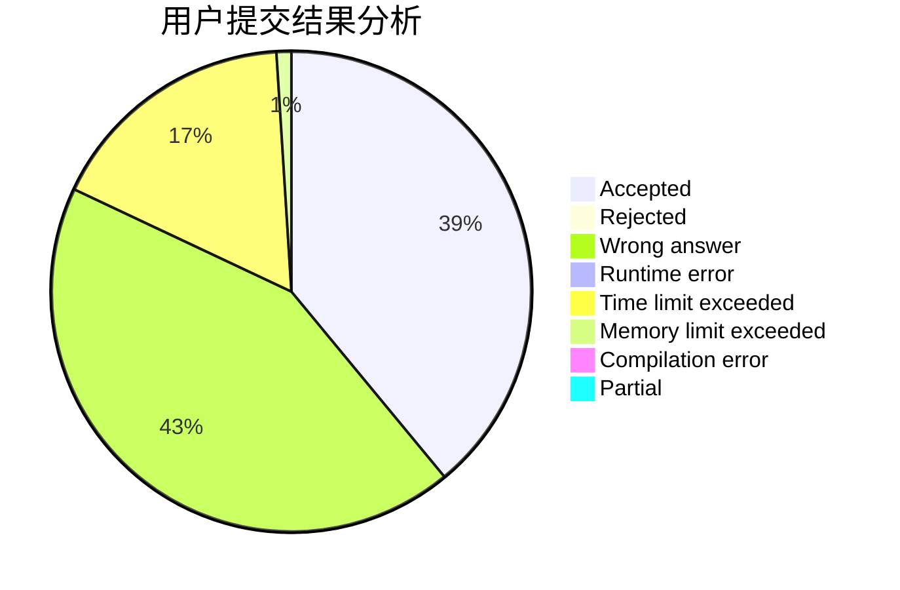
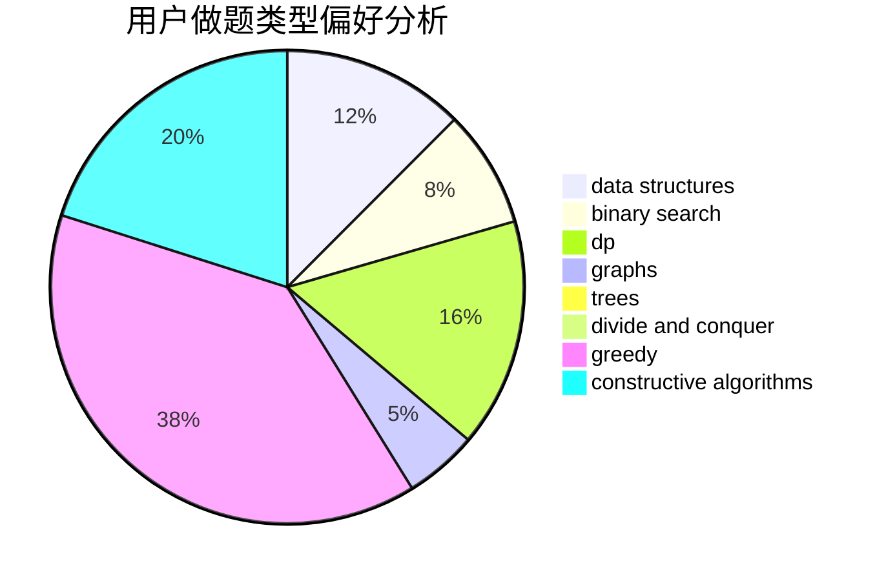
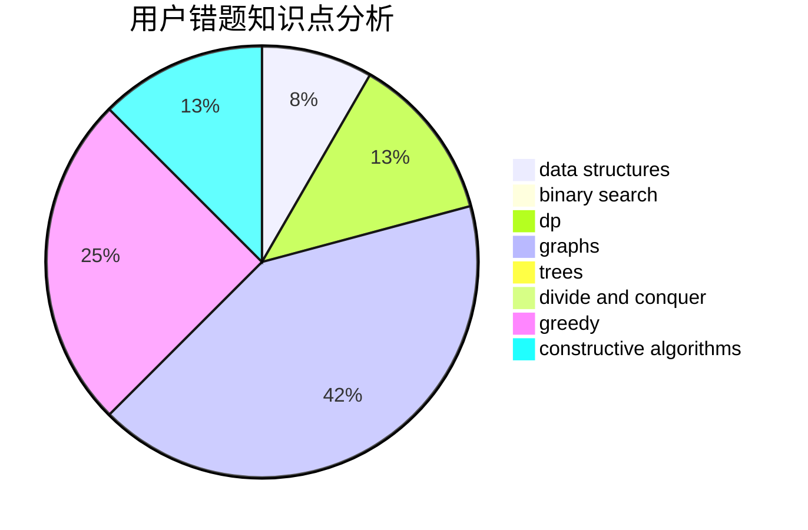

# dreaming2019

<!-- tabs:start -->

#### **用户提交结果分析**

#### **用户做题类型偏好分析**

#### **用户错题知识点分析**

<!-- tabs:end -->
# 推荐题目
[1286A](https://codeforces.com/contest/1286/problem/A)		dp,
                        greedy,
                        sortings		  
[630F](https://codeforces.com/contest/630/problem/F)		combinatorics,
                        math		  
[716A](https://codeforces.com/contest/716/problem/A)		implementation		  
[591B](https://codeforces.com/contest/591/problem/B)		implementation,
                        strings		  
[877C](https://codeforces.com/contest/877/problem/C)		constructive algorithms		  
[981A](https://codeforces.com/contest/981/problem/A)		brute force,
                        implementation,
                        strings		  
[290C](https://codeforces.com/contest/290/problem/C)		*special problem,
                        graph matchings,
                        implementation,
                        trees		  
[961C](https://codeforces.com/contest/961/problem/C)		bitmasks,
                        brute force,
                        implementation		  
[1114C](https://codeforces.com/contest/1114/problem/C)		brute force,
                        implementation,
                        math,
                        number theory		  
[417C](https://codeforces.com/contest/417/problem/C)		constructive algorithms,
                        graphs,
                        implementation		  
