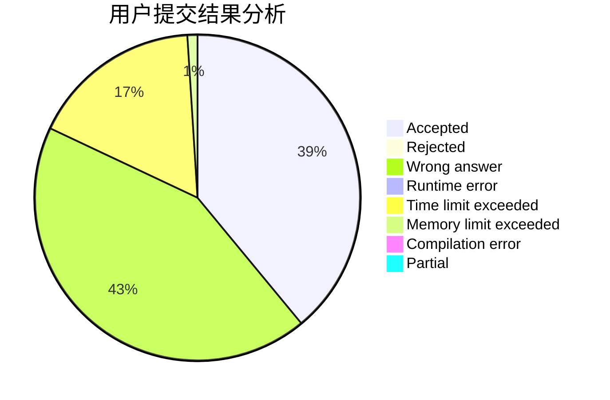
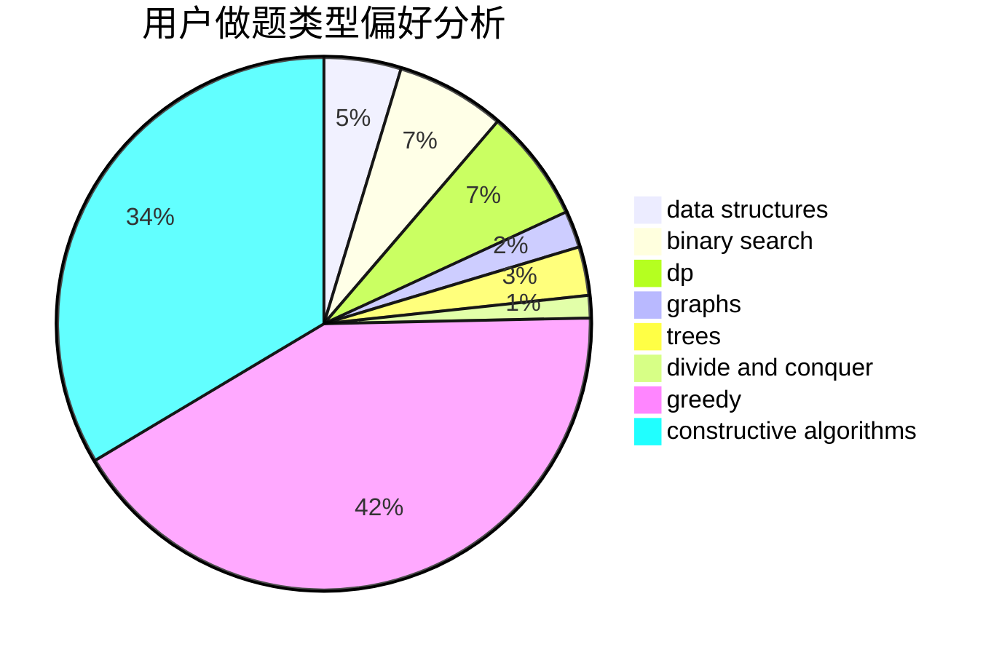
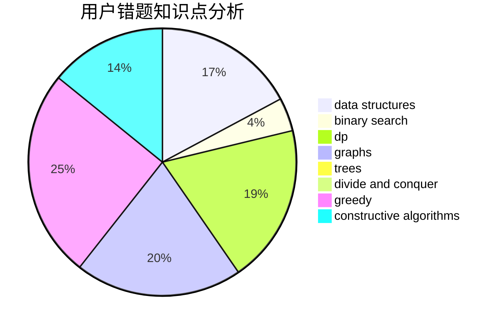

# dreaming2019

<!-- tabs:start -->

#### **用户提交结果分析**

#### **用户做题类型偏好分析**

#### **用户错题知识点分析**

<!-- tabs:end -->
# 推荐题目
[1280A](https://codeforces.com/contest/1280/problem/A)		implementation,
                        math		  
[611C](https://codeforces.com/contest/611/problem/C)		dp,
                        implementation		  
[699B](https://codeforces.com/contest/699/problem/B)		implementation		  
[570E](https://codeforces.com/contest/570/problem/E)		combinatorics,
                        dp		  
[859F](https://codeforces.com/contest/859/problem/F)		greedy		  
[959B](https://codeforces.com/contest/959/problem/B)		dsu,
                        greedy,
                        implementation		  
[276C](https://codeforces.com/contest/276/problem/C)		data structures,
                        greedy,
                        implementation,
                        sortings		  
[93C](https://codeforces.com/contest/93/problem/C)		brute force,
                        implementation		  
[1113F](https://codeforces.com/contest/1113/problem/F)		dsu,graphs,sortings,trees		  
[388A](https://codeforces.com/contest/388/problem/A)		greedy,
                        sortings		  
