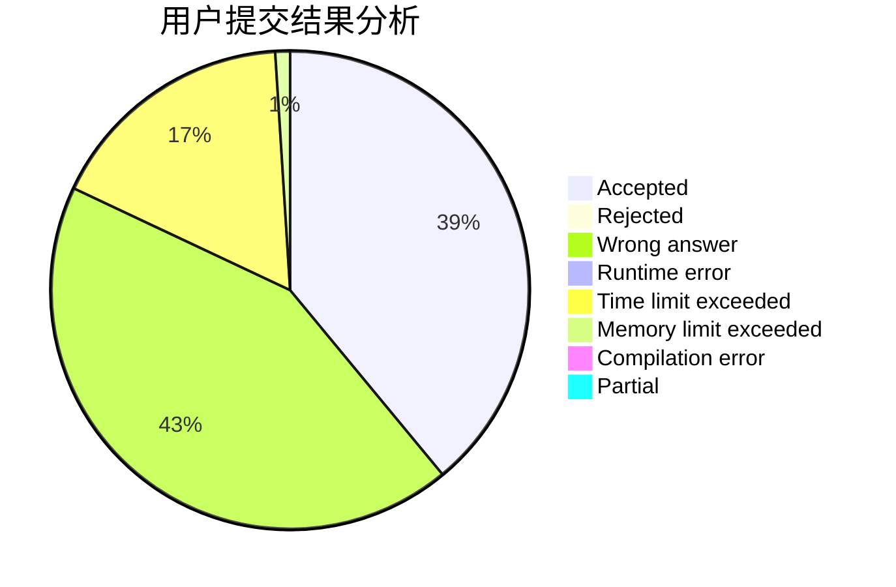
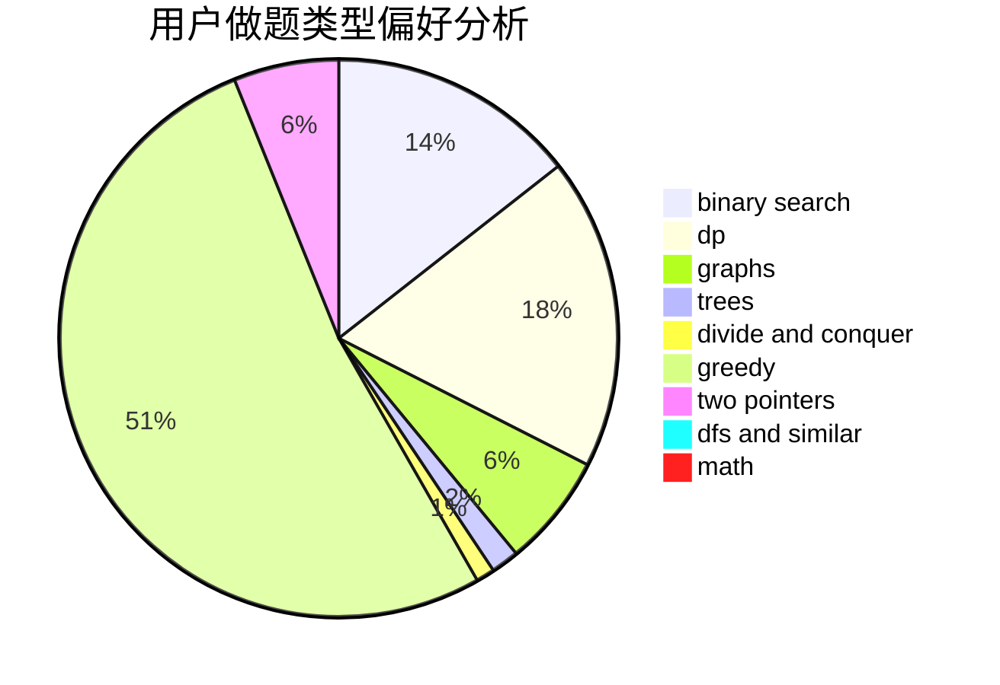

# dreaming2019

<!-- tabs:start -->

#### **用户提交结果分析**

#### **用户做题类型偏好分析**

<!-- tabs:end -->
# 推荐题目
[1286A](https://codeforces.com/contest/1286/problem/A)
[630F](https://codeforces.com/contest/630/problem/F)
[716A](https://codeforces.com/contest/716/problem/A)
[591B](https://codeforces.com/contest/591/problem/B)
[877C](https://codeforces.com/contest/877/problem/C)
[981A](https://codeforces.com/contest/981/problem/A)
[290C](https://codeforces.com/contest/290/problem/C)
[961C](https://codeforces.com/contest/961/problem/C)
[1114C](https://codeforces.com/contest/1114/problem/C)
[417C](https://codeforces.com/contest/417/problem/C)
