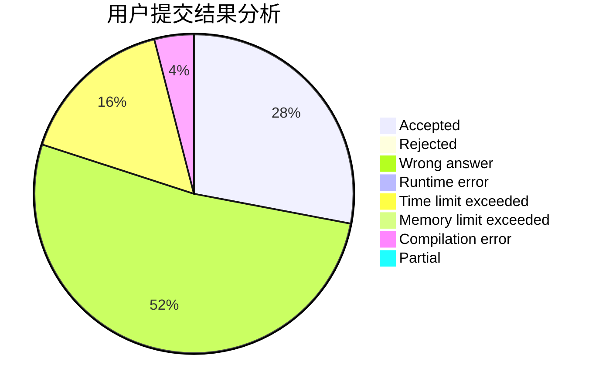
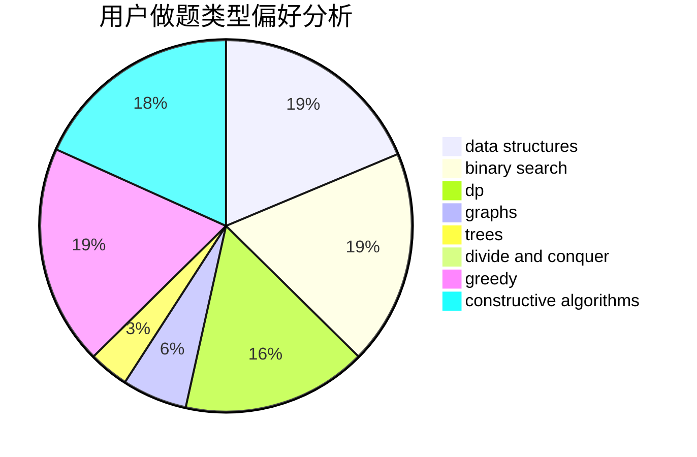

# dreamtrueqaq

<!-- tabs:start -->

#### **用户提交结果分析**

#### **用户做题类型偏好分析**

#### **用户错题知识点分析**

<!-- tabs:end -->
# 推荐题目
[1028G](https://codeforces.com/contest/1028/problem/G)		dp,
                        interactive		  
[1360D](https://codeforces.com/contest/1360/problem/D)		math,
                        number theory		  
[10C](https://codeforces.com/contest/10/problem/C)		number theory		  
[933B](https://codeforces.com/contest/933/problem/B)		math		  
[441C](https://codeforces.com/contest/441/problem/C)		constructive algorithms,
                        dfs and similar,
                        implementation		  
[1204B](https://codeforces.com/contest/1204/problem/B)		greedy,
                        math		  
[1185E](https://codeforces.com/contest/1185/problem/E)		brute force,
                        implementation		  
[1167B](https://codeforces.com/contest/1167/problem/B)		brute force,
                        divide and conquer,
                        interactive,
                        math		  
[1151B](https://codeforces.com/contest/1151/problem/B)		bitmasks,
                        brute force,
                        constructive algorithms,
                        dp		  
[961E](https://codeforces.com/contest/961/problem/E)		data structures		  
