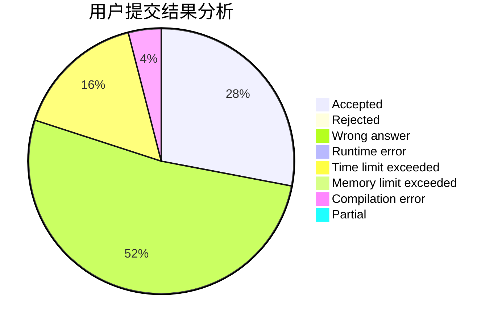
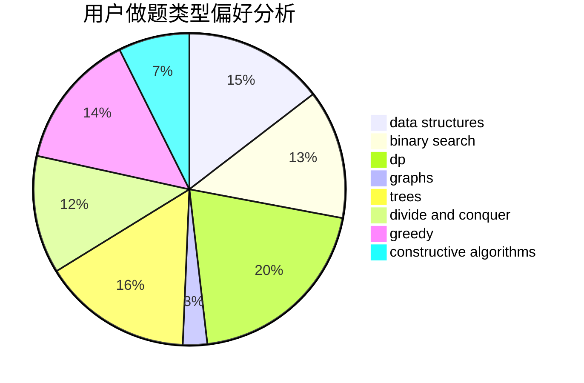

# dreamtrueqaq

<!-- tabs:start -->

#### **用户提交结果分析**

#### **用户做题类型偏好分析**

#### **用户错题知识点分析**

<!-- tabs:end -->
# 推荐题目
[1029B](https://codeforces.com/contest/1029/problem/B)		dp,
                        greedy,
                        math		  
[1368C](https://codeforces.com/contest/1368/problem/C)		constructive algorithms		  
[1100A](https://codeforces.com/contest/1100/problem/A)		implementation		  
[955B](https://codeforces.com/contest/955/problem/B)		implementation		  
[462A](https://codeforces.com/contest/462/problem/A)		brute force,
                        implementation		  
[1208G](https://codeforces.com/contest/1208/problem/G)		greedy,
                        math,
                        number theory		  
[1189E](https://codeforces.com/contest/1189/problem/E)		dsu,graphs,sortings,trees		  
[11721](https://codeforces.com/contest/1172/problem/1)		dsu,graphs,sortings,trees		  
[1153B](https://codeforces.com/contest/1153/problem/B)		constructive algorithms,
                        greedy		  
[984A](https://codeforces.com/contest/984/problem/A)		sortings		  
