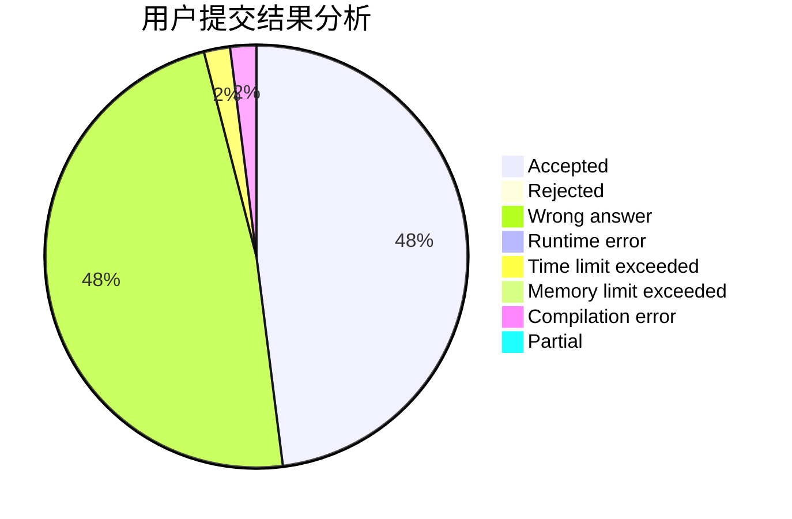
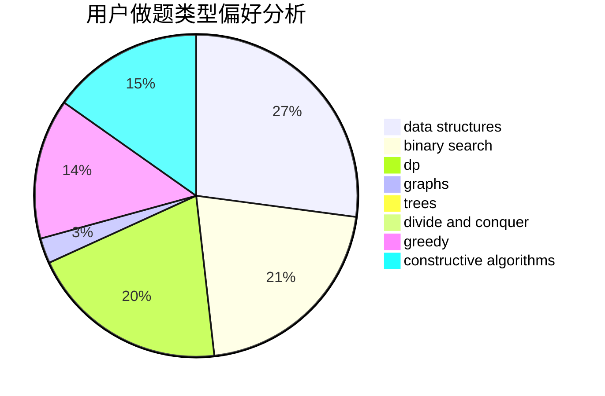
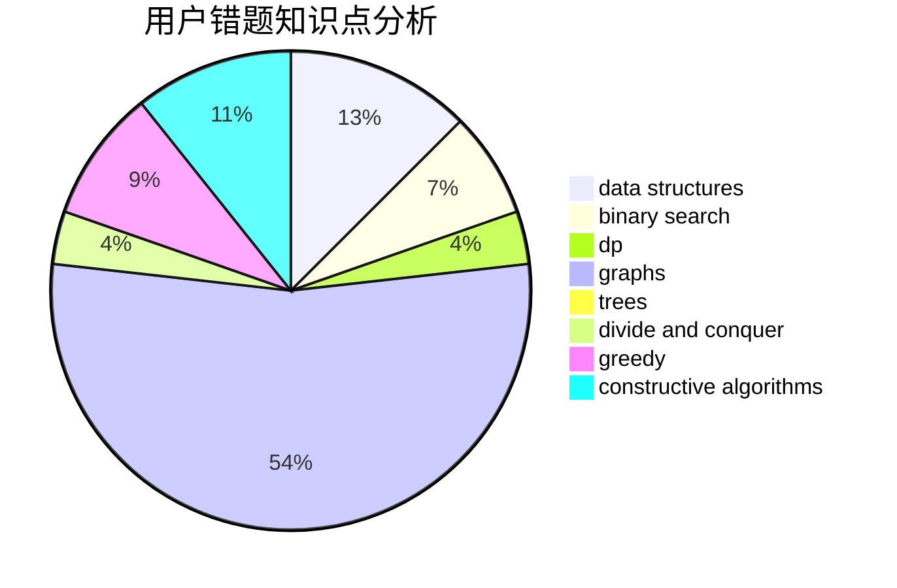

# Asd_Okuu

<!-- tabs:start -->

#### **用户提交结果分析**

#### **用户做题类型偏好分析**

#### **用户错题知识点分析**

<!-- tabs:end -->
# 推荐题目
[266B](https://codeforces.com/contest/266/problem/B)		constructive algorithms,
                        graph matchings,
                        implementation,
                        shortest paths		  
[448B](https://codeforces.com/contest/448/problem/B)		implementation,
                        strings		  
[449C](https://codeforces.com/contest/449/problem/C)		constructive algorithms,
                        number theory		  
[132C](https://codeforces.com/contest/132/problem/C)		dp		  
[1030G](https://codeforces.com/contest/1030/problem/G)		number theory		  
[1361E](https://codeforces.com/contest/1361/problem/E)		dfs and similar,
                        graphs,
                        probabilities,
                        trees		  
[298D](https://codeforces.com/contest/298/problem/D)		dsu,graphs,sortings,trees		  
[44A](https://codeforces.com/contest/44/problem/A)		implementation		  
[448D](https://codeforces.com/contest/448/problem/D)		binary search,
                        brute force		  
[449B](https://codeforces.com/contest/449/problem/B)		graphs,
                        greedy,
                        shortest paths		  
