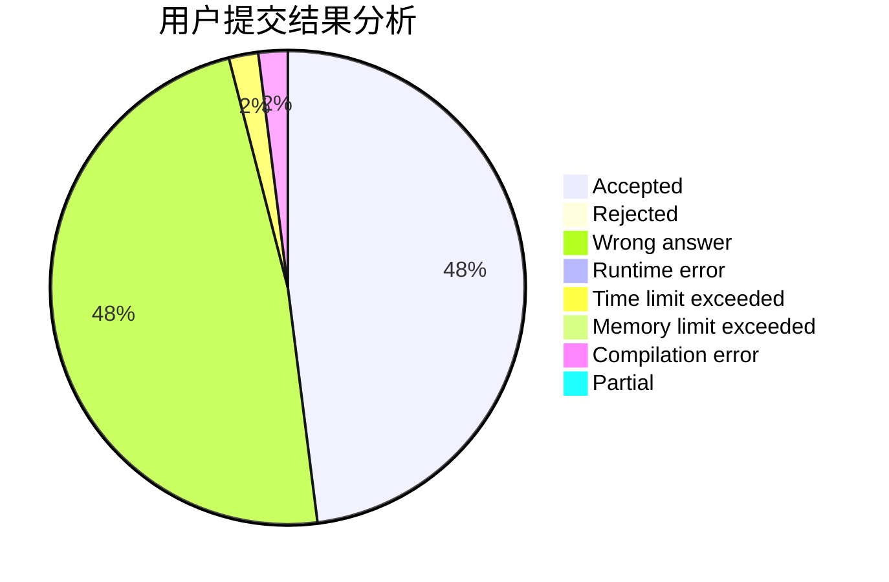
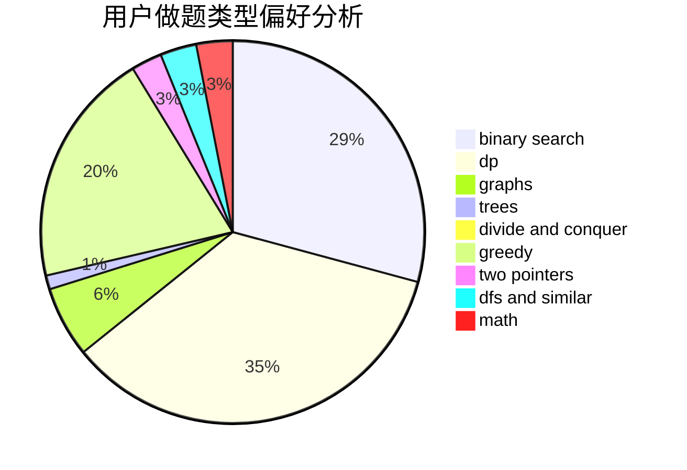

# Asd_Okuu

<!-- tabs:start -->

#### **用户提交结果分析**

#### **用户做题类型偏好分析**

<!-- tabs:end -->
# 推荐题目
[266B](https://codeforces.com/contest/266/problem/B)
[448B](https://codeforces.com/contest/448/problem/B)
[449C](https://codeforces.com/contest/449/problem/C)
[132C](https://codeforces.com/contest/132/problem/C)
[1030G](https://codeforces.com/contest/1030/problem/G)
[1361E](https://codeforces.com/contest/1361/problem/E)
[298D](https://codeforces.com/contest/298/problem/D)
[44A](https://codeforces.com/contest/44/problem/A)
[448D](https://codeforces.com/contest/448/problem/D)
[449B](https://codeforces.com/contest/449/problem/B)
