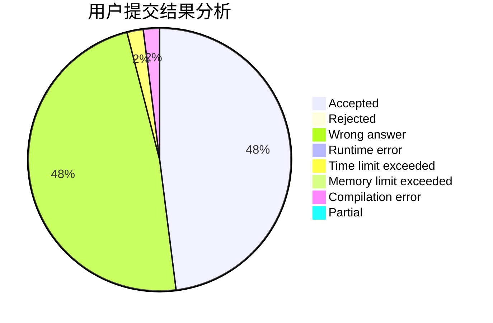
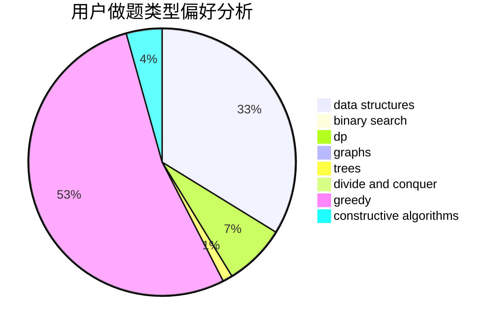
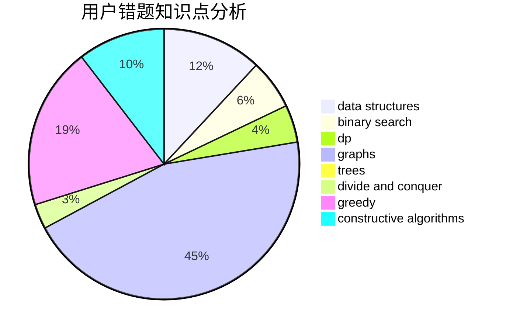

# Asd_Okuu

<!-- tabs:start -->

#### **用户提交结果分析**

#### **用户做题类型偏好分析**

#### **用户错题知识点分析**

<!-- tabs:end -->
# 推荐题目
[245H](https://codeforces.com/contest/245/problem/H)		dp,
                        hashing,
                        strings		  
[424E](https://codeforces.com/contest/424/problem/E)		dfs and similar,
                        dp,
                        probabilities		  
[425E](https://codeforces.com/contest/425/problem/E)		dp		  
[1323A](https://codeforces.com/contest/1323/problem/A)		brute force,
                        dp,
                        greedy,
                        implementation		  
[1030C](https://codeforces.com/contest/1030/problem/C)		implementation		  
[1355A](https://codeforces.com/contest/1355/problem/A)		brute force,
                        implementation,
                        math		  
[282B](https://codeforces.com/contest/282/problem/B)		greedy,
                        math		  
[427B](https://codeforces.com/contest/427/problem/B)		data structures,
                        implementation		  
[425B](https://codeforces.com/contest/425/problem/B)		bitmasks,
                        greedy		  
[425C](https://codeforces.com/contest/425/problem/C)		data structures,
                        dp		  
