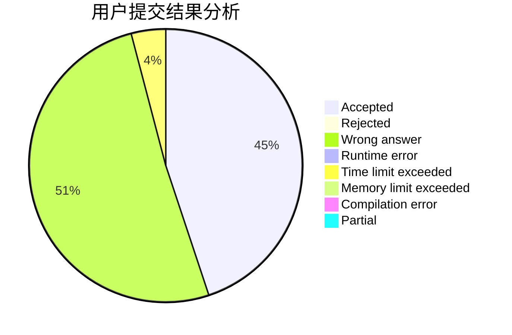
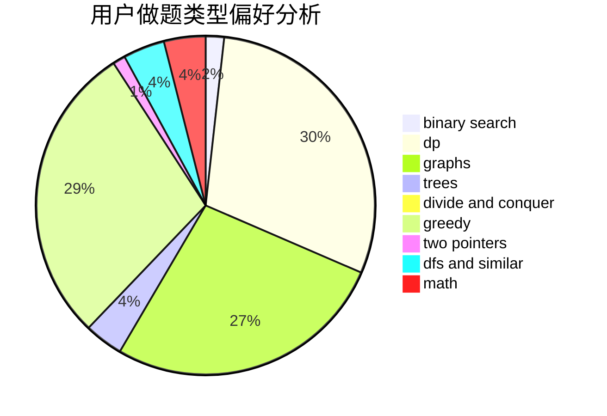

# dsbuaa

<!-- tabs:start -->

#### **用户提交结果分析**

#### **用户做题类型偏好分析**

<!-- tabs:end -->
# 推荐题目
[1416D](https://codeforces.com/contest/1416/problem/D)
[1168E](https://codeforces.com/contest/1168/problem/E)
[228B](https://codeforces.com/contest/228/problem/B)
[11962](https://codeforces.com/contest/1196/problem/2)
[870C](https://codeforces.com/contest/870/problem/C)
[13932](https://codeforces.com/contest/1393/problem/2)
[1078D](https://codeforces.com/contest/1078/problem/D)
[171F](https://codeforces.com/contest/171/problem/F)
[1236E](https://codeforces.com/contest/1236/problem/E)
[1178H](https://codeforces.com/contest/1178/problem/H)
