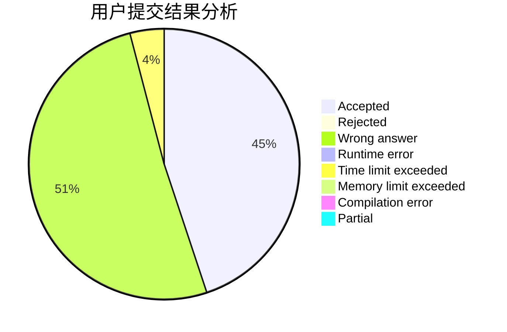
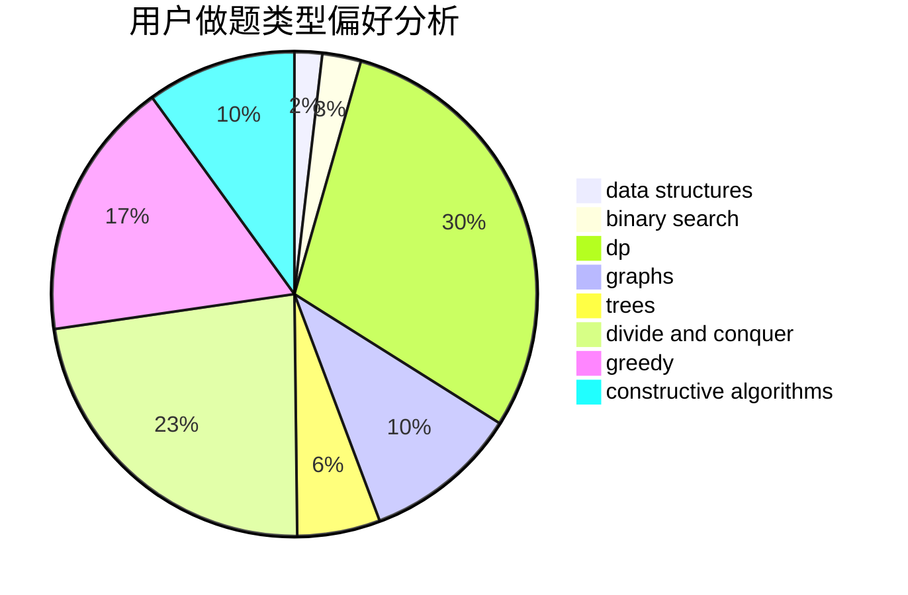
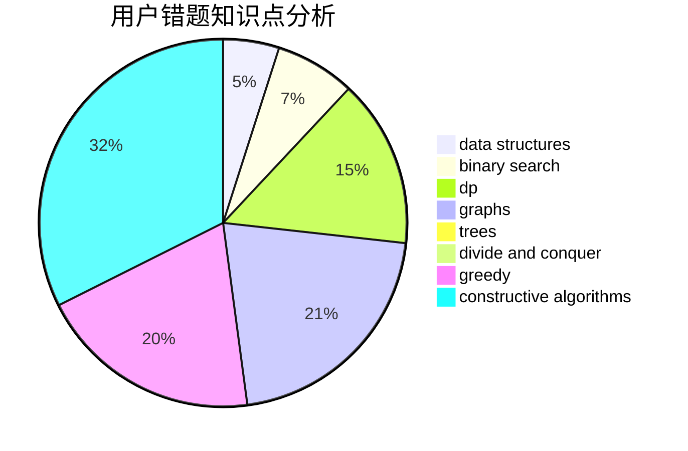

# dsbuaa

<!-- tabs:start -->

#### **用户提交结果分析**

#### **用户做题类型偏好分析**

#### **用户错题知识点分析**

<!-- tabs:end -->
# 推荐题目
[1405C](https://codeforces.com/contest/1405/problem/C)		dsu,graphs,sortings,trees		  
[1166A](https://codeforces.com/contest/1166/problem/A)		combinatorics,
                        greedy		  
[204C](https://codeforces.com/contest/204/problem/C)		math,
                        probabilities		  
[1190B](https://codeforces.com/contest/1190/problem/B)		games		  
[852D](https://codeforces.com/contest/852/problem/D)		binary search,
                        flows,
                        graph matchings,
                        shortest paths		  
[1383C](https://codeforces.com/contest/1383/problem/C)		bitmasks,
                        dp,
                        graphs,
                        trees		  
[1078A](https://codeforces.com/contest/1078/problem/A)		dsu,graphs,sortings,trees		  
[1512F](https://codeforces.com/contest/1512/problem/F)		brute force,
                        dp,
                        greedy,
                        implementation		  
[1227G](https://codeforces.com/contest/1227/problem/G)		constructive algorithms		  
[1175F](https://codeforces.com/contest/1175/problem/F)		brute force,
                        data structures,
                        divide and conquer,
                        hashing,
                        math		  
