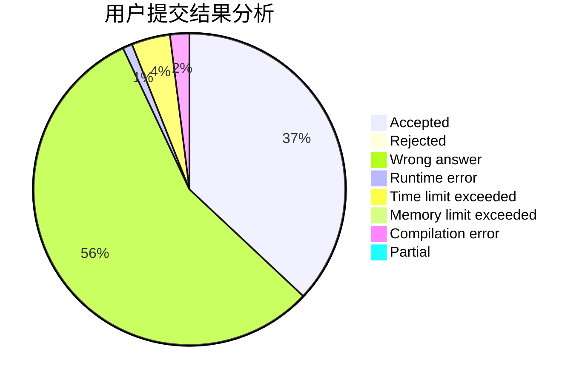
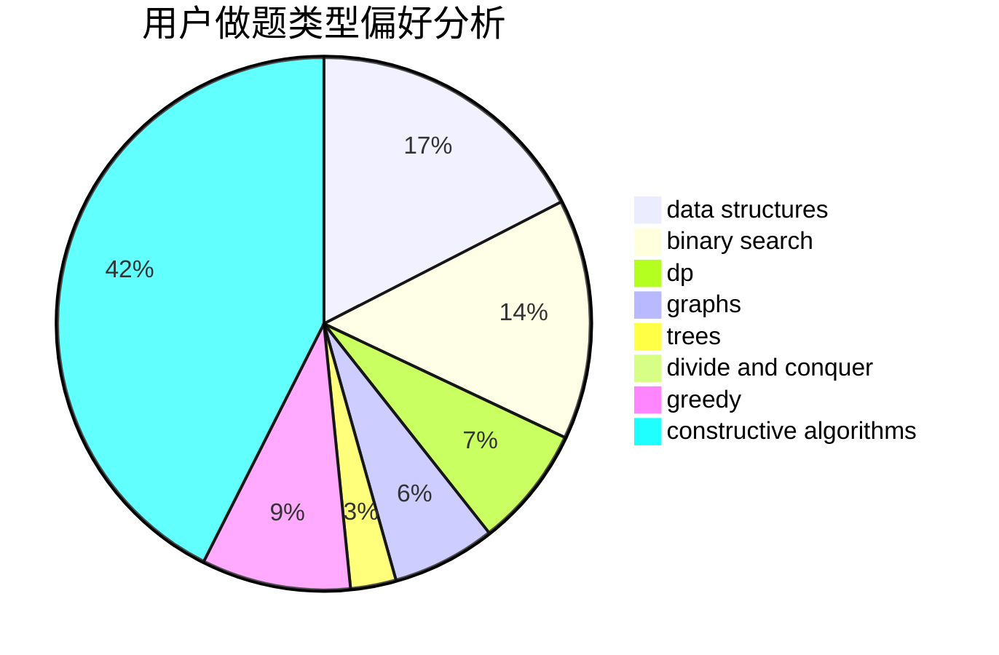

# dujinyvluori
<!-- tabs:start -->
#### **用户提交结果分析**

#### **用户做题类型偏好分析**

#### **用户错题知识点分析**

<!-- tabs:end -->
# 推荐题目
[Permutation Separation](http://codeforces.com/problemset/problem/1295/E)		data structures,
                        divide and conquer		  
[Same Parity Summands](http://codeforces.com/problemset/problem/1352/B)		constructive algorithms,
                        math		  
[Nezzar and Nice Beatmap](https://codeforces.com/contest/1478/problem/F)		constructive algorithms,
                        geometry,
                        greedy,
                        math,
                        sortings		  
[Coins Exhibition](http://codeforces.com/problemset/problem/930/E)		data structures,
                        dp,
                        math		  
[Name](http://codeforces.com/problemset/problem/180/D)		greedy,
                        strings		  
[A Good Contest](http://codeforces.com/problemset/problem/681/A)		implementation		  
[Game with Powers](http://codeforces.com/problemset/problem/317/D)		dp,
                        games		  
[Barnicle](http://codeforces.com/problemset/problem/697/B)		brute force,
                        implementation,
                        math,
                        strings		  
[String Multiplication](http://codeforces.com/problemset/problem/1131/E)		dp,
                        greedy,
                        strings		  
[Rhombus](http://codeforces.com/problemset/problem/263/E)		brute force,
                        data structures,
                        dp		  
<!-- tabs:start -->
#### **data structures**
[Permutation Separation](http://codeforces.com/problemset/problem/1295/E)		data structures,
                        divide and conquer		  
[Same Parity Summands](http://codeforces.com/problemset/problem/930/E)		data structures,
                        dp,
                        math		  
[Nezzar and Nice Beatmap](http://codeforces.com/problemset/problem/263/E)		brute force,
                        data structures,
                        dp		  
[Coins Exhibition](http://codeforces.com/problemset/problem/343/B)		data structures,
                        greedy,
                        implementation		  
[Name](http://codeforces.com/problemset/problem/713/D)		binary search,
                        data structures		  
[A Good Contest](http://codeforces.com/problemset/problem/1371/F)		data structures,
                        divide and conquer,
                        implementation		  
[Game with Powers](http://codeforces.com/problemset/problem/246/E)		binary search,
                        data structures,
                        dfs and similar,
                        dp,
                        sortings		  
[Barnicle](http://codeforces.com/problemset/problem/1497/E2)		data structures,
                        dp,
                        greedy,
                        math,
                        number theory,
                        two pointers		  
[String Multiplication](http://codeforces.com/problemset/problem/1492/C)		binary search,
                        data structures,
                        dp,
                        greedy,
                        two pointers		  
[Rhombus](http://codeforces.com/problemset/problem/1490/G)		binary search,
                        data structures,
                        math		  
#### **binary search**
[Permutation Separation](http://codeforces.com/problemset/problem/650/B)		binary search,
                        brute force,
                        dp,
                        two pointers		  
[Same Parity Summands](http://codeforces.com/problemset/problem/1225/E)		binary search,
                        dp		  
[Nezzar and Nice Beatmap](http://codeforces.com/problemset/problem/713/D)		binary search,
                        data structures		  
[Coins Exhibition](http://codeforces.com/problemset/problem/1042/A)		binary search,
                        implementation		  
[Name](http://codeforces.com/problemset/problem/1297/D)		*special problem,
                        binary search,
                        greedy,
                        sortings		  
[A Good Contest](http://codeforces.com/problemset/problem/822/E)		binary search,
                        dp,
                        hashing,
                        string suffix structures		  
[Game with Powers](http://codeforces.com/problemset/problem/246/E)		binary search,
                        data structures,
                        dfs and similar,
                        dp,
                        sortings		  
[Barnicle](http://codeforces.com/problemset/problem/730/C)		binary search,
                        dfs and similar		  
[String Multiplication](http://codeforces.com/problemset/problem/1100/C)		binary search,
                        geometry,
                        math		  
[Rhombus](http://codeforces.com/problemset/problem/1492/C)		binary search,
                        data structures,
                        dp,
                        greedy,
                        two pointers		  
#### **dp**
[Permutation Separation](http://codeforces.com/problemset/problem/930/E)		data structures,
                        dp,
                        math		  
[Same Parity Summands](http://codeforces.com/problemset/problem/317/D)		dp,
                        games		  
[Nezzar and Nice Beatmap](http://codeforces.com/problemset/problem/1131/E)		dp,
                        greedy,
                        strings		  
[Coins Exhibition](http://codeforces.com/problemset/problem/263/E)		brute force,
                        data structures,
                        dp		  
[Name](http://codeforces.com/problemset/problem/6/D)		brute force,
                        dp		  
[A Good Contest](http://codeforces.com/problemset/problem/377/C)		bitmasks,
                        dp,
                        games		  
[Game with Powers](http://codeforces.com/problemset/problem/348/D)		dp,
                        matrices		  
[Barnicle](http://codeforces.com/problemset/problem/650/B)		binary search,
                        brute force,
                        dp,
                        two pointers		  
[String Multiplication](http://codeforces.com/problemset/problem/1225/E)		binary search,
                        dp		  
[Rhombus](http://codeforces.com/problemset/problem/467/D)		dfs and similar,
                        dp,
                        graphs,
                        hashing,
                        strings		  
#### **graph**
[Permutation Separation](http://codeforces.com/problemset/problem/915/D)		dfs and similar,
                        graphs		  
[Same Parity Summands](http://codeforces.com/problemset/problem/467/D)		dfs and similar,
                        dp,
                        graphs,
                        hashing,
                        strings		  
[Nezzar and Nice Beatmap](http://codeforces.com/problemset/problem/41/E)		constructive algorithms,
                        graphs,
                        greedy		  
[Coins Exhibition](http://codeforces.com/problemset/problem/1487/C)		brute force,
                        constructive algorithms,
                        dfs and similar,
                        graphs,
                        greedy,
                        implementation,
                        math		  
[Name](http://codeforces.com/problemset/problem/1437/C)		dp,
                        flows,
                        graph matchings,
                        greedy,
                        math,
                        sortings		  
[A Good Contest](http://codeforces.com/problemset/problem/1470/D)		constructive algorithms,
                        dfs and similar,
                        graph matchings,
                        graphs,
                        greedy		  
[Game with Powers](http://codeforces.com/problemset/problem/1476/C)		dp,
                        graphs,
                        greedy		  
[Barnicle](http://codeforces.com/problemset/problem/1304/D)		constructive algorithms,
                        graphs,
                        greedy,
                        two pointers		  
[String Multiplication](http://codeforces.com/problemset/problem/1475/C)		combinatorics,
                        graphs,
                        math		  
[Rhombus](http://codeforces.com/problemset/problem/553/E)		dp,
                        fft,
                        graphs,
                        math,
                        probabilities		  
#### **trees**
[Permutation Separation](http://codeforces.com/problemset/problem/1296/F)		constructive algorithms,
                        dfs and similar,
                        greedy,
                        sortings,
                        trees		  
[Same Parity Summands](http://codeforces.com/problemset/problem/1092/F)		dfs and similar,
                        dp,
                        trees		  
[Nezzar and Nice Beatmap](http://codeforces.com/problemset/problem/1479/D)		binary search,
                        bitmasks,
                        brute force,
                        data structures,
                        probabilities,
                        trees		  
[Coins Exhibition](http://codeforces.com/problemset/problem/1511/C)		brute force,
                        data structures,
                        implementation,
                        trees		  
[Name](http://codeforces.com/problemset/problem/1499/F)		combinatorics,
                        dfs and similar,
                        dp,
                        trees		  
[A Good Contest](http://codeforces.com/problemset/problem/1491/E)		brute force,
                        dfs and similar,
                        divide and conquer,
                        number theory,
                        trees		  
[Game with Powers](http://codeforces.com/problemset/problem/1466/D)		data structures,
                        greedy,
                        sortings,
                        trees		  
[Barnicle](http://codeforces.com/problemset/problem/1495/D)		combinatorics,
                        dfs and similar,
                        graphs,
                        math,
                        shortest paths,
                        trees		  
[String Multiplication](http://codeforces.com/problemset/problem/1303/G)		data structures,
                        divide and conquer,
                        geometry,
                        trees		  
[Rhombus](http://codeforces.com/problemset/problem/1454/E)		combinatorics,
                        dfs and similar,
                        graphs,
                        trees		  
#### **divide and conquer**
[Permutation Separation](http://codeforces.com/problemset/problem/1295/E)		data structures,
                        divide and conquer		  
[Same Parity Summands](http://codeforces.com/problemset/problem/1371/F)		data structures,
                        divide and conquer,
                        implementation		  
[Nezzar and Nice Beatmap](http://codeforces.com/problemset/problem/1461/D)		binary search,
                        brute force,
                        data structures,
                        divide and conquer,
                        implementation,
                        sortings		  
[Coins Exhibition](http://codeforces.com/problemset/problem/1466/G)		combinatorics,
                        divide and conquer,
                        hashing,
                        math,
                        string suffix structures,
                        strings		  
[Name](http://codeforces.com/problemset/problem/1490/D)		dfs and similar,
                        divide and conquer,
                        implementation		  
[A Good Contest](https://codeforces.com/contest/1483/problem/C)		data structures,
                        divide and conquer,
                        dp		  
[Game with Powers](http://codeforces.com/problemset/problem/1491/E)		brute force,
                        dfs and similar,
                        divide and conquer,
                        number theory,
                        trees		  
[Barnicle](http://codeforces.com/problemset/problem/1303/G)		data structures,
                        divide and conquer,
                        geometry,
                        trees		  
[String Multiplication](http://codeforces.com/problemset/problem/1494/D)		constructive algorithms,
                        data structures,
                        dfs and similar,
                        divide and conquer,
                        dsu,
                        greedy,
                        sortings,
                        trees		  
[Rhombus](http://codeforces.com/problemset/problem/1482/E)		data structures,
                        divide and conquer,
                        dp		  
#### **greedy**
[Permutation Separation](https://codeforces.com/contest/1478/problem/F)		constructive algorithms,
                        geometry,
                        greedy,
                        math,
                        sortings		  
[Same Parity Summands](http://codeforces.com/problemset/problem/180/D)		greedy,
                        strings		  
[Nezzar and Nice Beatmap](http://codeforces.com/problemset/problem/1131/E)		dp,
                        greedy,
                        strings		  
[Coins Exhibition](http://codeforces.com/problemset/problem/1296/F)		constructive algorithms,
                        dfs and similar,
                        greedy,
                        sortings,
                        trees		  
[Name](http://codeforces.com/problemset/problem/1415/E)		constructive algorithms,
                        greedy,
                        math		  
[A Good Contest](http://codeforces.com/problemset/problem/343/B)		data structures,
                        greedy,
                        implementation		  
[Game with Powers](http://codeforces.com/problemset/problem/845/B)		brute force,
                        greedy,
                        implementation		  
[Barnicle](http://codeforces.com/problemset/problem/337/B)		greedy,
                        math,
                        number theory		  
[String Multiplication](https://codeforces.com/contest/1099/problem/E)		brute force,
                        constructive algorithms,
                        greedy,
                        math		  
[Rhombus](http://codeforces.com/problemset/problem/1297/D)		*special problem,
                        binary search,
                        greedy,
                        sortings		  
#### **constructive algorithms**
[Permutation Separation](http://codeforces.com/problemset/problem/1352/B)		constructive algorithms,
                        math		  
[Same Parity Summands](https://codeforces.com/contest/1478/problem/F)		constructive algorithms,
                        geometry,
                        greedy,
                        math,
                        sortings		  
[Nezzar and Nice Beatmap](http://codeforces.com/problemset/problem/1296/F)		constructive algorithms,
                        dfs and similar,
                        greedy,
                        sortings,
                        trees		  
[Coins Exhibition](http://codeforces.com/problemset/problem/1415/E)		constructive algorithms,
                        greedy,
                        math		  
[Name](https://codeforces.com/contest/1099/problem/E)		brute force,
                        constructive algorithms,
                        greedy,
                        math		  
[A Good Contest](http://codeforces.com/problemset/problem/1436/B)		constructive algorithms,
                        math		  
[Game with Powers](http://codeforces.com/problemset/problem/1443/A)		constructive algorithms,
                        math		  
[Barnicle](http://codeforces.com/problemset/problem/672/B)		constructive algorithms,
                        implementation,
                        strings		  
[String Multiplication](http://codeforces.com/problemset/problem/226/D)		constructive algorithms,
                        greedy		  
[Rhombus](http://codeforces.com/problemset/problem/41/E)		constructive algorithms,
                        graphs,
                        greedy		  
#### **sortings**
[Permutation Separation](https://codeforces.com/contest/1478/problem/F)		constructive algorithms,
                        geometry,
                        greedy,
                        math,
                        sortings		  
[Same Parity Summands](http://codeforces.com/problemset/problem/1296/F)		constructive algorithms,
                        dfs and similar,
                        greedy,
                        sortings,
                        trees		  
[Nezzar and Nice Beatmap](http://codeforces.com/problemset/problem/558/A)		brute force,
                        implementation,
                        sortings		  
[Coins Exhibition](http://codeforces.com/problemset/problem/1297/D)		*special problem,
                        binary search,
                        greedy,
                        sortings		  
[Name](http://codeforces.com/problemset/problem/246/E)		binary search,
                        data structures,
                        dfs and similar,
                        dp,
                        sortings		  
[A Good Contest](http://codeforces.com/problemset/problem/1311/B)		dfs and similar,
                        sortings		  
[Game with Powers](http://codeforces.com/problemset/problem/978/G)		greedy,
                        implementation,
                        sortings		  
[Barnicle](https://codeforces.com/contest/1496/problem/C)		geometry,
                        greedy,
                        math,
                        sortings		  
[String Multiplication](http://codeforces.com/problemset/problem/1495/A)		geometry,
                        greedy,
                        math,
                        sortings		  
[Rhombus](http://codeforces.com/problemset/problem/1497/A)		brute force,
                        data structures,
                        greedy,
                        sortings		  
<!-- tabs:end -->
