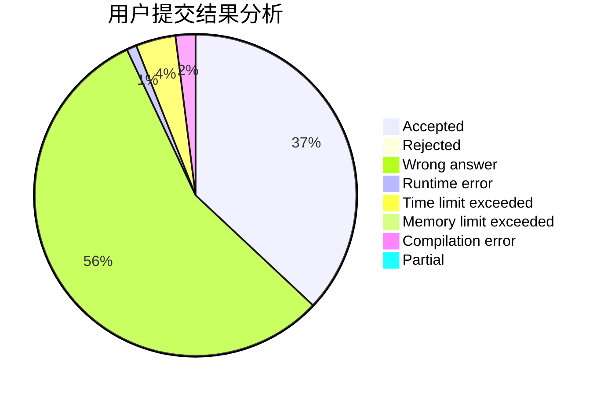
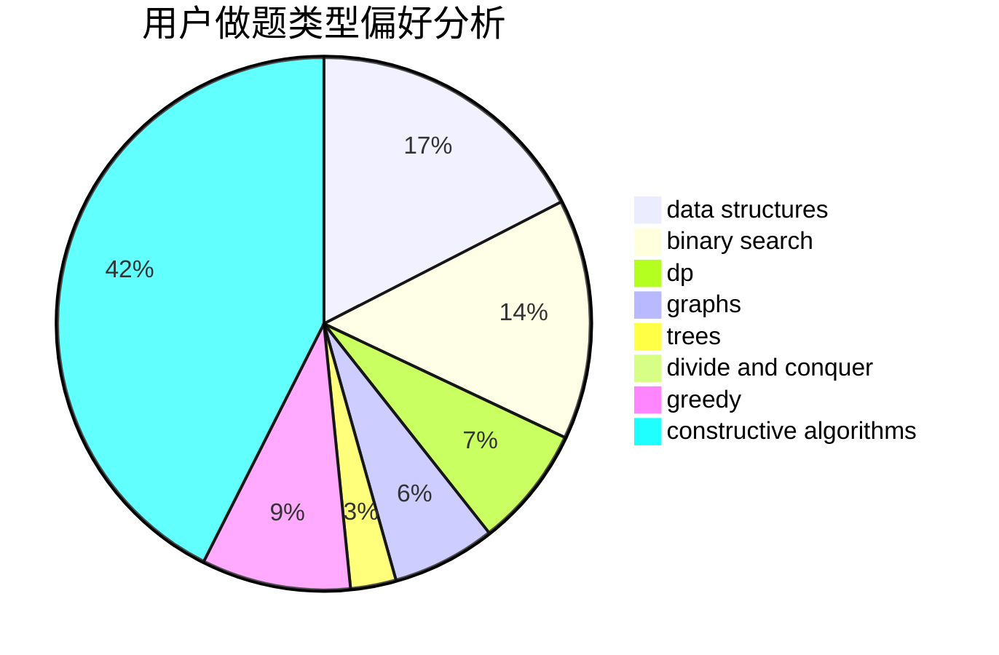

# dujinyvluori

<!-- tabs:start -->

#### **用户提交结果分析**

#### **用户做题类型偏好分析**

#### **用户错题知识点分析**

<!-- tabs:end -->
# 推荐题目
[1478F](https://codeforces.com/contest/1478/problem/F)		dsu,graphs,sortings,trees		  
[1295E](https://codeforces.com/contest/1295/problem/E)		data structures,
                        divide and conquer		  
[681A](https://codeforces.com/contest/681/problem/A)		implementation		  
[1415E](https://codeforces.com/contest/1415/problem/E)		constructive algorithms,
                        greedy,
                        math		  
[180D](https://codeforces.com/contest/180/problem/D)		greedy,
                        strings		  
[1360D](https://codeforces.com/contest/1360/problem/D)		math,
                        number theory		  
[317D](https://codeforces.com/contest/317/problem/D)		dp,
                        games		  
[915D](https://codeforces.com/contest/915/problem/D)		dfs and similar,
                        graphs		  
[343B](https://codeforces.com/contest/343/problem/B)		data structures,
                        greedy,
                        implementation		  
[1296F](https://codeforces.com/contest/1296/problem/F)		constructive algorithms,
                        dfs and similar,
                        greedy,
                        sortings,
                        trees		  
