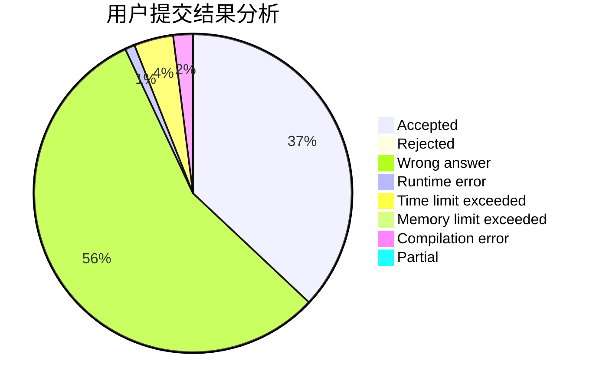
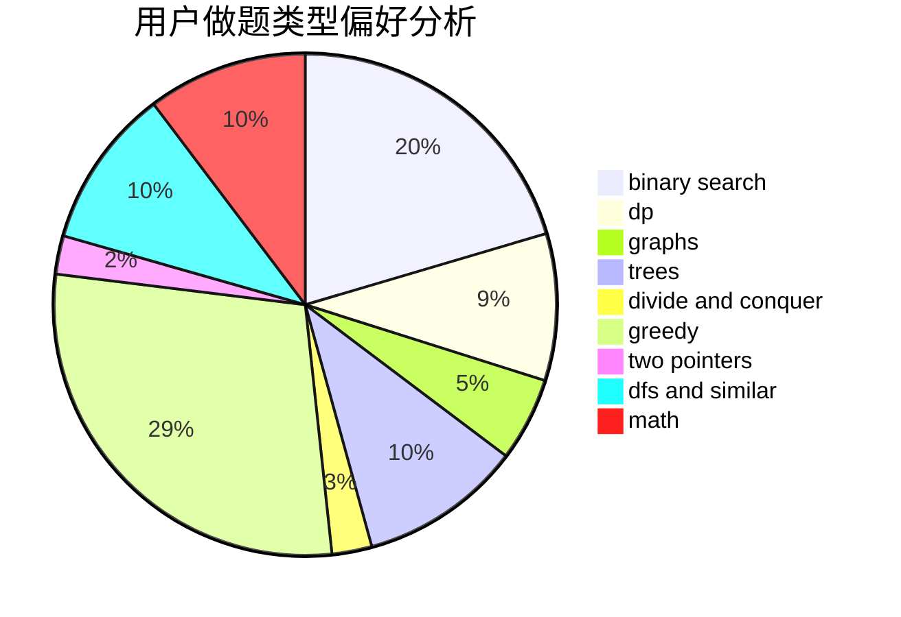

# dujinyvluori

<!-- tabs:start -->

#### **用户提交结果分析**

#### **用户做题类型偏好分析**

<!-- tabs:end -->
# 推荐题目
[1487D](https://codeforces.com/contest/1487/problem/D)
[1303A](https://codeforces.com/contest/1303/problem/A)
[704E](https://codeforces.com/contest/704/problem/E)
[1423I](https://codeforces.com/contest/1423/problem/I)
[208A](https://codeforces.com/contest/208/problem/A)
[1368C](https://codeforces.com/contest/1368/problem/C)
[347A](https://codeforces.com/contest/347/problem/A)
[935C](https://codeforces.com/contest/935/problem/C)
[36C](https://codeforces.com/contest/36/problem/C)
[13042](https://codeforces.com/contest/1304/problem/2)
