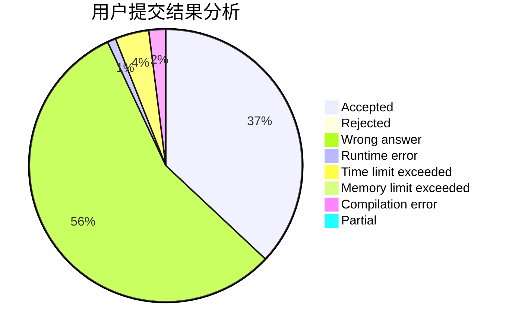
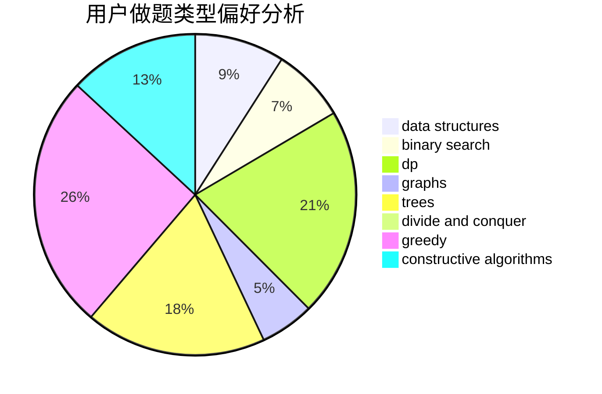

# dujinyvluori

<!-- tabs:start -->

#### **用户提交结果分析**

#### **用户做题类型偏好分析**

#### **用户错题知识点分析**

<!-- tabs:end -->
# 推荐题目
[1487D](https://codeforces.com/contest/1487/problem/D)		binary search,
                        brute force,
                        math,
                        number theory		  
[1303A](https://codeforces.com/contest/1303/problem/A)		implementation,
                        strings		  
[704E](https://codeforces.com/contest/704/problem/E)		data structures,
                        geometry,
                        trees		  
[1423I](https://codeforces.com/contest/1423/problem/I)		bitmasks		  
[208A](https://codeforces.com/contest/208/problem/A)		strings		  
[1368C](https://codeforces.com/contest/1368/problem/C)		constructive algorithms		  
[347A](https://codeforces.com/contest/347/problem/A)		constructive algorithms,
                        implementation,
                        sortings		  
[935C](https://codeforces.com/contest/935/problem/C)		geometry		  
[36C](https://codeforces.com/contest/36/problem/C)		geometry,
                        implementation		  
[13042](https://codeforces.com/contest/1304/problem/2)		dsu,graphs,sortings,trees		  
