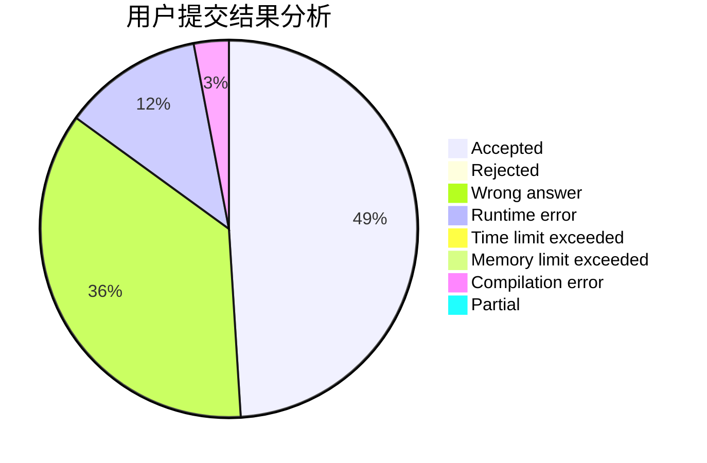
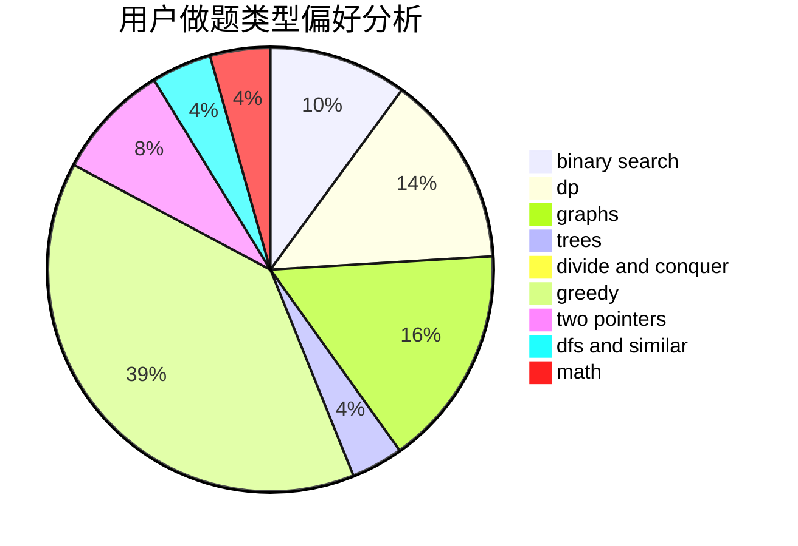

# dvorak

<!-- tabs:start -->

#### **用户提交结果分析**

#### **用户做题类型偏好分析**

<!-- tabs:end -->
# 推荐题目
[132C](https://codeforces.com/contest/132/problem/C)
[733D](https://codeforces.com/contest/733/problem/D)
[746A](https://codeforces.com/contest/746/problem/A)
[784G](https://codeforces.com/contest/784/problem/G)
[1057B](https://codeforces.com/contest/1057/problem/B)
[1240A](https://codeforces.com/contest/1240/problem/A)
[9583](https://codeforces.com/contest/958/problem/3)
[549E](https://codeforces.com/contest/549/problem/E)
[360E](https://codeforces.com/contest/360/problem/E)
[303A](https://codeforces.com/contest/303/problem/A)
