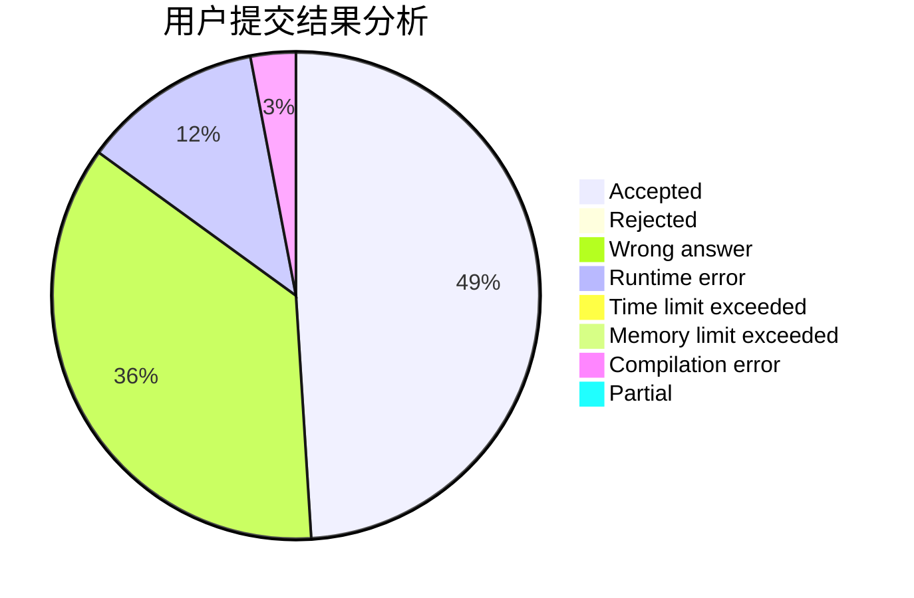
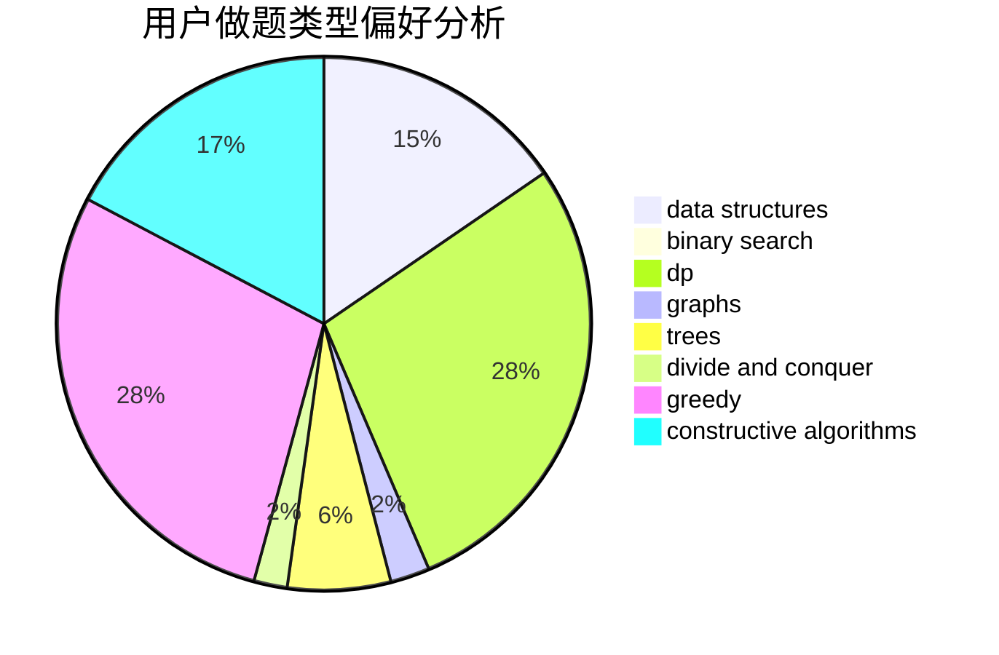
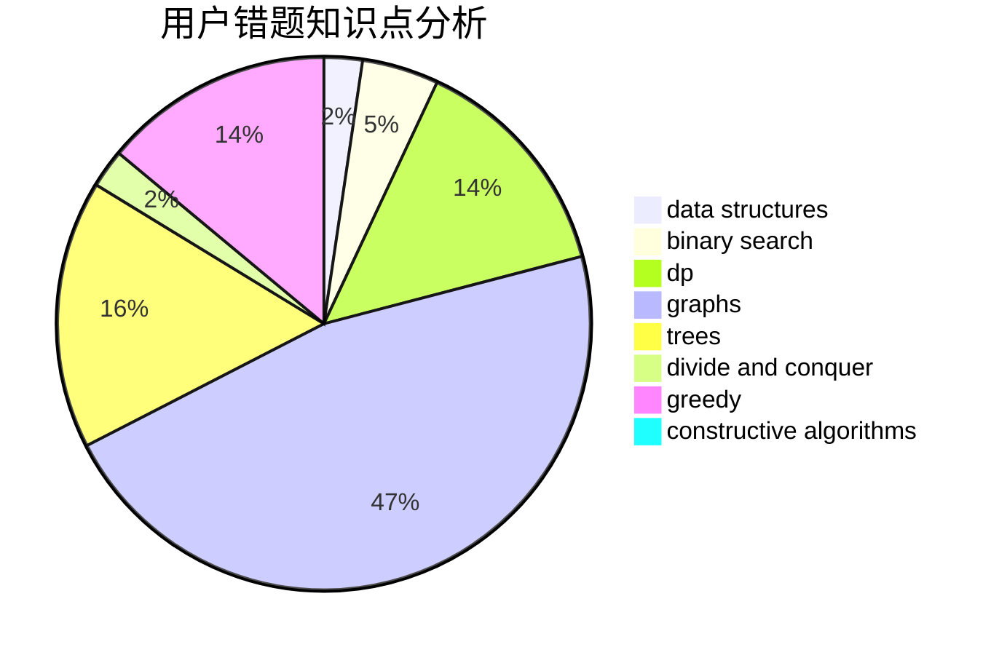

# dvorak

<!-- tabs:start -->

#### **用户提交结果分析**

#### **用户做题类型偏好分析**

#### **用户错题知识点分析**

<!-- tabs:end -->
# 推荐题目
[132C](https://codeforces.com/contest/132/problem/C)		dp		  
[733D](https://codeforces.com/contest/733/problem/D)		data structures,
                        hashing		  
[746A](https://codeforces.com/contest/746/problem/A)		implementation,
                        math		  
[784G](https://codeforces.com/contest/784/problem/G)		*special problem		  
[1057B](https://codeforces.com/contest/1057/problem/B)		*special problem,
                        brute force		  
[1240A](https://codeforces.com/contest/1240/problem/A)		dsu,graphs,sortings,trees		  
[9583](https://codeforces.com/contest/958/problem/3)		dsu,graphs,sortings,trees		  
[549E](https://codeforces.com/contest/549/problem/E)		geometry,
                        math		  
[360E](https://codeforces.com/contest/360/problem/E)		graphs,
                        greedy,
                        shortest paths		  
[303A](https://codeforces.com/contest/303/problem/A)		constructive algorithms,
                        implementation,
                        math		  
