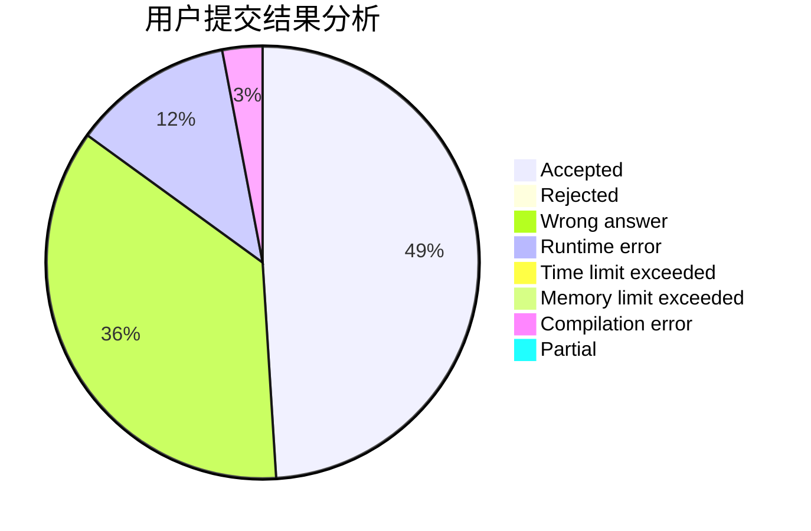
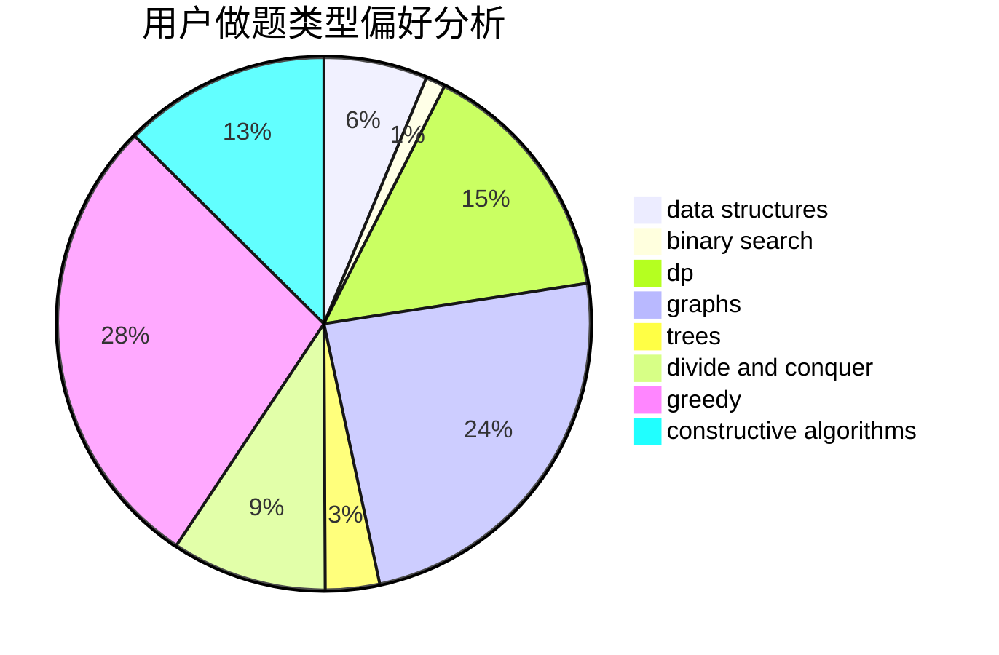
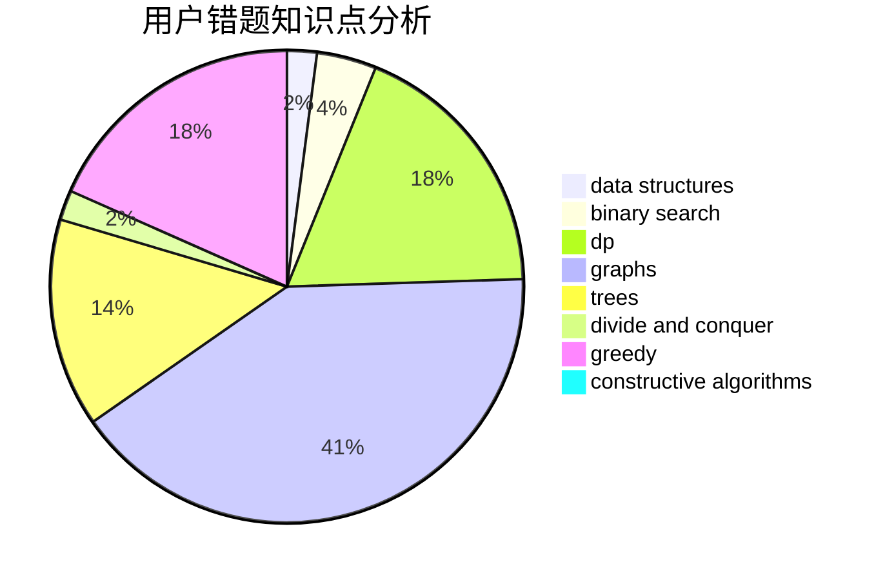

# dvorak
<!-- tabs:start -->
#### **用户提交结果分析**

#### **用户做题类型偏好分析**

#### **用户错题知识点分析**

<!-- tabs:end -->
# 推荐题目
[Mahmoud and Ehab and yet another xor task](http://codeforces.com/problemset/problem/959/F)		bitmasks,
                        dp,
                        math,
                        matrices		  
[The Brand New Function](https://codeforces.com/contest/244/problem/C)		bitmasks		  
[Write The Contest](http://codeforces.com/problemset/problem/1056/F)		binary search,
                        dp,
                        math		  
[Tokitsukaze and Duel](https://codeforces.com/contest/1191/problem/E)		brute force,
                        games,
                        greedy		  
[Make Equal](http://codeforces.com/problemset/problem/1188/D)		dp		  
[Physical Education](http://codeforces.com/problemset/problem/53/D)		sortings		  
[Fish Weight](http://codeforces.com/problemset/problem/297/B)		constructive algorithms,
                        greedy		  
[Tree Modification](http://codeforces.com/problemset/problem/1375/G)		brute force,
                        constructive algorithms,
                        dfs and similar,
                        graph matchings,
                        graphs,
                        trees		  
[Increase and Decrease](http://codeforces.com/problemset/problem/246/B)		greedy,
                        math		  
[Polo the Penguin and Lucky Numbers](http://codeforces.com/problemset/problem/288/E)		dp,
                        implementation,
                        math		  
<!-- tabs:start -->
#### **data structures**
[Mahmoud and Ehab and yet another xor task](http://codeforces.com/problemset/problem/1141/F2)		data structures,
                        greedy		  
[The Brand New Function](http://codeforces.com/problemset/problem/1137/E)		data structures,
                        greedy		  
[Write The Contest](http://codeforces.com/problemset/problem/1234/D)		data structures		  
[Tokitsukaze and Duel](http://codeforces.com/problemset/problem/459/D)		data structures,
                        divide and conquer,
                        sortings		  
[Make Equal](https://codeforces.com/contest/1504/problem/E)		binary search,
                        data structures,
                        dp,
                        greedy,
                        shortest paths,
                        sortings,
                        two pointers		  
[Physical Education](http://codeforces.com/problemset/problem/513/D2)		constructive algorithms,
                        data structures		  
[Fish Weight](http://codeforces.com/problemset/problem/1466/I)		binary search,
                        data structures,
                        data structures,
                        interactive		  
[Tree Modification](http://codeforces.com/problemset/problem/1492/C)		binary search,
                        data structures,
                        dp,
                        greedy,
                        two pointers		  
[Increase and Decrease](http://codeforces.com/problemset/problem/1490/G)		binary search,
                        data structures,
                        math		  
[Polo the Penguin and Lucky Numbers](http://codeforces.com/problemset/problem/1479/D)		binary search,
                        bitmasks,
                        brute force,
                        data structures,
                        probabilities,
                        trees		  
#### **binary search**
[Mahmoud and Ehab and yet another xor task](http://codeforces.com/problemset/problem/1056/F)		binary search,
                        dp,
                        math		  
[The Brand New Function](http://codeforces.com/problemset/problem/335/A)		binary search,
                        constructive algorithms,
                        greedy		  
[Write The Contest](http://codeforces.com/problemset/problem/812/C)		binary search,
                        sortings		  
[Tokitsukaze and Duel](http://codeforces.com/problemset/problem/1315/B)		binary search,
                        dp,
                        greedy,
                        strings		  
[Make Equal](http://codeforces.com/problemset/problem/715/B)		binary search,
                        constructive algorithms,
                        graphs,
                        shortest paths		  
[Physical Education](https://codeforces.com/contest/1504/problem/E)		binary search,
                        data structures,
                        dp,
                        greedy,
                        shortest paths,
                        sortings,
                        two pointers		  
[Fish Weight](http://codeforces.com/problemset/problem/1466/I)		binary search,
                        data structures,
                        data structures,
                        interactive		  
[Tree Modification](http://codeforces.com/problemset/problem/958/F2)		binary search,
                        two pointers		  
[Increase and Decrease](http://codeforces.com/problemset/problem/1492/C)		binary search,
                        data structures,
                        dp,
                        greedy,
                        two pointers		  
[Polo the Penguin and Lucky Numbers](http://codeforces.com/problemset/problem/1463/D)		binary search,
                        constructive algorithms,
                        greedy,
                        two pointers		  
#### **dp**
[Mahmoud and Ehab and yet another xor task](http://codeforces.com/problemset/problem/959/F)		bitmasks,
                        dp,
                        math,
                        matrices		  
[The Brand New Function](http://codeforces.com/problemset/problem/1056/F)		binary search,
                        dp,
                        math		  
[Write The Contest](http://codeforces.com/problemset/problem/1188/D)		dp		  
[Tokitsukaze and Duel](http://codeforces.com/problemset/problem/288/E)		dp,
                        implementation,
                        math		  
[Make Equal](http://codeforces.com/problemset/problem/1323/A)		brute force,
                        dp,
                        greedy,
                        implementation		  
[Physical Education](https://codeforces.com/contest/816/problem/E)		brute force,
                        dp,
                        trees		  
[Fish Weight](http://codeforces.com/problemset/problem/534/B)		dp,
                        greedy,
                        math		  
[Tree Modification](http://codeforces.com/problemset/problem/724/E)		dp,
                        flows,
                        greedy		  
[Increase and Decrease](http://codeforces.com/problemset/problem/1315/B)		binary search,
                        dp,
                        greedy,
                        strings		  
[Polo the Penguin and Lucky Numbers](http://codeforces.com/problemset/problem/1442/A)		constructive algorithms,
                        dp,
                        greedy		  
#### **graph**
[Mahmoud and Ehab and yet another xor task](http://codeforces.com/problemset/problem/1375/G)		brute force,
                        constructive algorithms,
                        dfs and similar,
                        graph matchings,
                        graphs,
                        trees		  
[The Brand New Function](http://codeforces.com/problemset/problem/715/B)		binary search,
                        constructive algorithms,
                        graphs,
                        shortest paths		  
[Write The Contest](http://codeforces.com/problemset/problem/732/F)		dfs and similar,
                        graphs		  
[Tokitsukaze and Duel](http://codeforces.com/problemset/problem/1487/C)		brute force,
                        constructive algorithms,
                        dfs and similar,
                        graphs,
                        greedy,
                        implementation,
                        math		  
[Make Equal](http://codeforces.com/problemset/problem/1437/C)		dp,
                        flows,
                        graph matchings,
                        greedy,
                        math,
                        sortings		  
[Physical Education](http://codeforces.com/problemset/problem/1470/D)		constructive algorithms,
                        dfs and similar,
                        graph matchings,
                        graphs,
                        greedy		  
[Fish Weight](http://codeforces.com/problemset/problem/1476/C)		dp,
                        graphs,
                        greedy		  
[Tree Modification](http://codeforces.com/problemset/problem/1304/D)		constructive algorithms,
                        graphs,
                        greedy,
                        two pointers		  
[Increase and Decrease](http://codeforces.com/problemset/problem/1475/C)		combinatorics,
                        graphs,
                        math		  
[Polo the Penguin and Lucky Numbers](http://codeforces.com/problemset/problem/553/E)		dp,
                        fft,
                        graphs,
                        math,
                        probabilities		  
#### **trees**
[Mahmoud and Ehab and yet another xor task](http://codeforces.com/problemset/problem/1375/G)		brute force,
                        constructive algorithms,
                        dfs and similar,
                        graph matchings,
                        graphs,
                        trees		  
[The Brand New Function](https://codeforces.com/contest/816/problem/E)		brute force,
                        dp,
                        trees		  
[Write The Contest](http://codeforces.com/problemset/problem/1394/D)		dp,
                        greedy,
                        sortings,
                        trees		  
[Tokitsukaze and Duel](http://codeforces.com/problemset/problem/1479/D)		binary search,
                        bitmasks,
                        brute force,
                        data structures,
                        probabilities,
                        trees		  
[Make Equal](http://codeforces.com/problemset/problem/1511/C)		brute force,
                        data structures,
                        implementation,
                        trees		  
[Physical Education](http://codeforces.com/problemset/problem/1499/F)		combinatorics,
                        dfs and similar,
                        dp,
                        trees		  
[Fish Weight](http://codeforces.com/problemset/problem/1491/E)		brute force,
                        dfs and similar,
                        divide and conquer,
                        number theory,
                        trees		  
[Tree Modification](http://codeforces.com/problemset/problem/1466/D)		data structures,
                        greedy,
                        sortings,
                        trees		  
[Increase and Decrease](http://codeforces.com/problemset/problem/1495/D)		combinatorics,
                        dfs and similar,
                        graphs,
                        math,
                        shortest paths,
                        trees		  
[Polo the Penguin and Lucky Numbers](http://codeforces.com/problemset/problem/1303/G)		data structures,
                        divide and conquer,
                        geometry,
                        trees		  
#### **divide and conquer**
[Mahmoud and Ehab and yet another xor task](http://codeforces.com/problemset/problem/459/D)		data structures,
                        divide and conquer,
                        sortings		  
[The Brand New Function](http://codeforces.com/problemset/problem/1461/D)		binary search,
                        brute force,
                        data structures,
                        divide and conquer,
                        implementation,
                        sortings		  
[Write The Contest](http://codeforces.com/problemset/problem/1466/G)		combinatorics,
                        divide and conquer,
                        hashing,
                        math,
                        string suffix structures,
                        strings		  
[Tokitsukaze and Duel](http://codeforces.com/problemset/problem/1490/D)		dfs and similar,
                        divide and conquer,
                        implementation		  
[Make Equal](https://codeforces.com/contest/1483/problem/C)		data structures,
                        divide and conquer,
                        dp		  
[Physical Education](http://codeforces.com/problemset/problem/1491/E)		brute force,
                        dfs and similar,
                        divide and conquer,
                        number theory,
                        trees		  
[Fish Weight](http://codeforces.com/problemset/problem/1303/G)		data structures,
                        divide and conquer,
                        geometry,
                        trees		  
[Tree Modification](http://codeforces.com/problemset/problem/1494/D)		constructive algorithms,
                        data structures,
                        dfs and similar,
                        divide and conquer,
                        dsu,
                        greedy,
                        sortings,
                        trees		  
[Increase and Decrease](http://codeforces.com/problemset/problem/1482/E)		data structures,
                        divide and conquer,
                        dp		  
[Polo the Penguin and Lucky Numbers](http://codeforces.com/problemset/problem/566/C)		dfs and similar,
                        divide and conquer,
                        trees		  
#### **greedy**
[Mahmoud and Ehab and yet another xor task](https://codeforces.com/contest/1191/problem/E)		brute force,
                        games,
                        greedy		  
[The Brand New Function](http://codeforces.com/problemset/problem/297/B)		constructive algorithms,
                        greedy		  
[Write The Contest](http://codeforces.com/problemset/problem/246/B)		greedy,
                        math		  
[Tokitsukaze and Duel](http://codeforces.com/problemset/problem/1323/A)		brute force,
                        dp,
                        greedy,
                        implementation		  
[Make Equal](http://codeforces.com/problemset/problem/534/B)		dp,
                        greedy,
                        math		  
[Physical Education](http://codeforces.com/problemset/problem/1141/F2)		data structures,
                        greedy		  
[Fish Weight](http://codeforces.com/problemset/problem/335/A)		binary search,
                        constructive algorithms,
                        greedy		  
[Tree Modification](http://codeforces.com/problemset/problem/1360/B)		greedy,
                        sortings		  
[Increase and Decrease](http://codeforces.com/problemset/problem/724/E)		dp,
                        flows,
                        greedy		  
[Polo the Penguin and Lucky Numbers](http://codeforces.com/problemset/problem/1137/E)		data structures,
                        greedy		  
#### **constructive algorithms**
[Mahmoud and Ehab and yet another xor task](http://codeforces.com/problemset/problem/297/B)		constructive algorithms,
                        greedy		  
[The Brand New Function](http://codeforces.com/problemset/problem/1375/G)		brute force,
                        constructive algorithms,
                        dfs and similar,
                        graph matchings,
                        graphs,
                        trees		  
[Write The Contest](http://codeforces.com/problemset/problem/335/A)		binary search,
                        constructive algorithms,
                        greedy		  
[Tokitsukaze and Duel](http://codeforces.com/problemset/problem/765/D)		constructive algorithms,
                        dsu,
                        math		  
[Make Equal](http://codeforces.com/problemset/problem/715/B)		binary search,
                        constructive algorithms,
                        graphs,
                        shortest paths		  
[Physical Education](http://codeforces.com/problemset/problem/1442/A)		constructive algorithms,
                        dp,
                        greedy		  
[Fish Weight](http://codeforces.com/problemset/problem/804/C)		constructive algorithms,
                        dfs and similar,
                        greedy		  
[Tree Modification](http://codeforces.com/problemset/problem/525/B)		constructive algorithms,
                        greedy,
                        math,
                        strings		  
[Increase and Decrease](http://codeforces.com/problemset/problem/513/D2)		constructive algorithms,
                        data structures		  
[Polo the Penguin and Lucky Numbers](http://codeforces.com/problemset/problem/1493/A)		constructive algorithms,
                        greedy		  
#### **sortings**
[Mahmoud and Ehab and yet another xor task](http://codeforces.com/problemset/problem/53/D)		sortings		  
[The Brand New Function](http://codeforces.com/problemset/problem/1360/B)		greedy,
                        sortings		  
[Write The Contest](http://codeforces.com/problemset/problem/843/A)		dfs and similar,
                        dsu,
                        implementation,
                        math,
                        sortings		  
[Tokitsukaze and Duel](http://codeforces.com/problemset/problem/812/C)		binary search,
                        sortings		  
[Make Equal](http://codeforces.com/problemset/problem/459/D)		data structures,
                        divide and conquer,
                        sortings		  
[Physical Education](https://codeforces.com/contest/1504/problem/E)		binary search,
                        data structures,
                        dp,
                        greedy,
                        shortest paths,
                        sortings,
                        two pointers		  
[Fish Weight](http://codeforces.com/problemset/problem/1430/B)		greedy,
                        implementation,
                        sortings		  
[Tree Modification](http://codeforces.com/problemset/problem/1394/D)		dp,
                        greedy,
                        sortings,
                        trees		  
[Increase and Decrease](https://codeforces.com/contest/1496/problem/C)		geometry,
                        greedy,
                        math,
                        sortings		  
[Polo the Penguin and Lucky Numbers](http://codeforces.com/problemset/problem/1495/A)		geometry,
                        greedy,
                        math,
                        sortings		  
<!-- tabs:end -->
