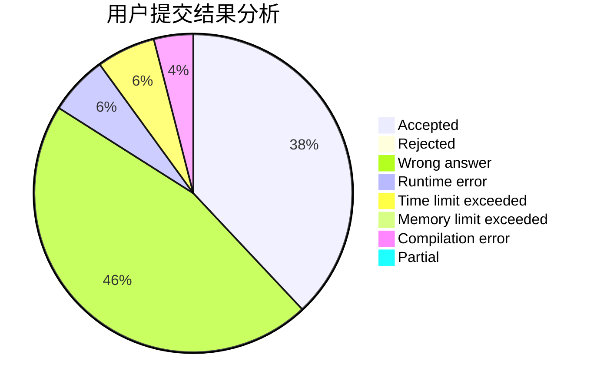
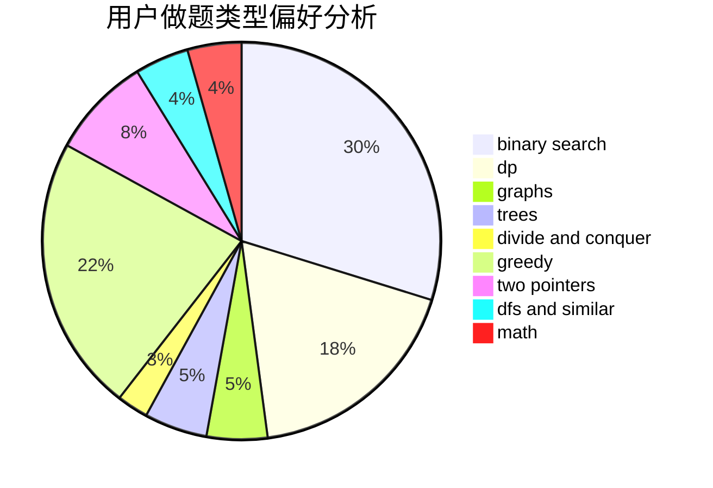

# dxd20031122

<!-- tabs:start -->

#### **用户提交结果分析**

#### **用户做题类型偏好分析**

<!-- tabs:end -->
# 推荐题目
[916B](https://codeforces.com/contest/916/problem/B)
[119D](https://codeforces.com/contest/119/problem/D)
[418E](https://codeforces.com/contest/418/problem/E)
[1010E](https://codeforces.com/contest/1010/problem/E)
[1083B](https://codeforces.com/contest/1083/problem/B)
[463D](https://codeforces.com/contest/463/problem/D)
[884F](https://codeforces.com/contest/884/problem/F)
[1213A](https://codeforces.com/contest/1213/problem/A)
[1187B](https://codeforces.com/contest/1187/problem/B)
[702F](https://codeforces.com/contest/702/problem/F)
