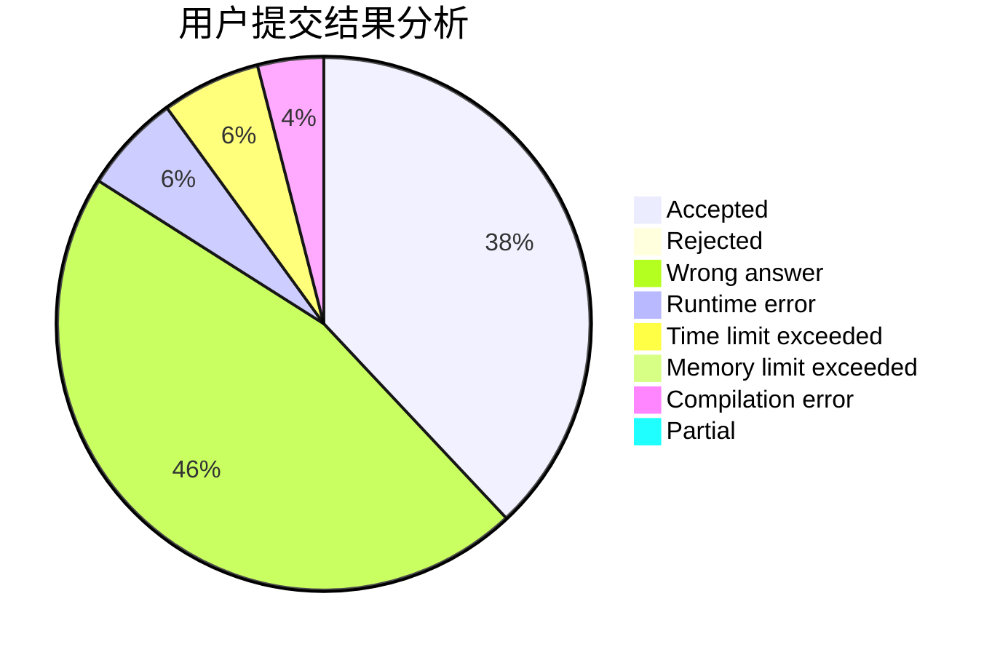
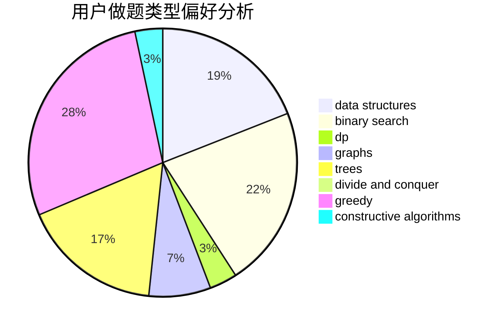

# dxd20031122

<!-- tabs:start -->

#### **用户提交结果分析**

#### **用户做题类型偏好分析**

#### **用户错题知识点分析**

<!-- tabs:end -->
# 推荐题目
[8D](https://codeforces.com/contest/8/problem/D)		binary search,
                        geometry		  
[1195E](https://codeforces.com/contest/1195/problem/E)		data structures,
                        two pointers		  
[38A](https://codeforces.com/contest/38/problem/A)		implementation		  
[1010B](https://codeforces.com/contest/1010/problem/B)		binary search,
                        interactive		  
[1082F](https://codeforces.com/contest/1082/problem/F)		dp,
                        strings,
                        trees		  
[443A](https://codeforces.com/contest/443/problem/A)		constructive algorithms,
                        implementation		  
[865B](https://codeforces.com/contest/865/problem/B)		binary search,
                        sortings,
                        ternary search		  
[1207E](https://codeforces.com/contest/1207/problem/E)		bitmasks,
                        interactive,
                        math		  
[1184A1](https://codeforces.com/contest/1184A/problem/1)		brute force,
                        math,
                        number theory		  
[679A](https://codeforces.com/contest/679/problem/A)		constructive algorithms,
                        interactive,
                        math		  
