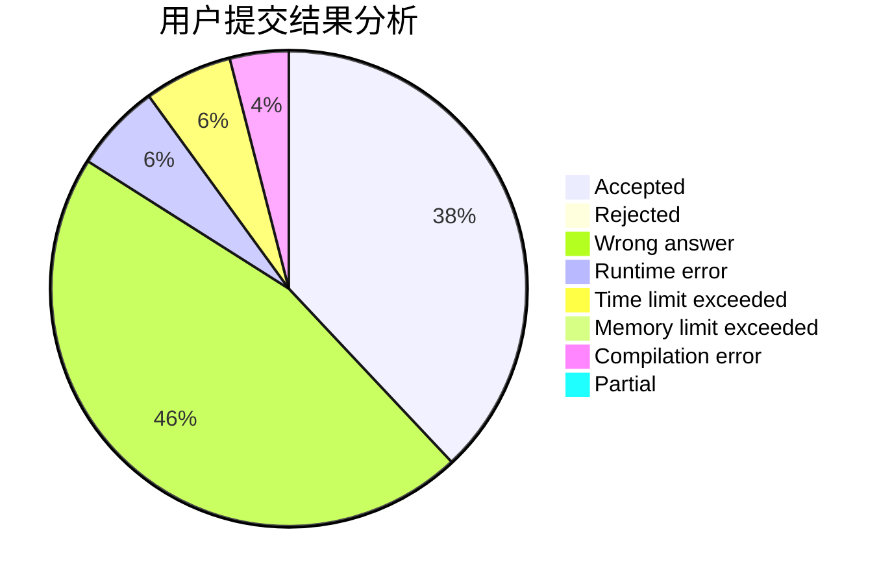
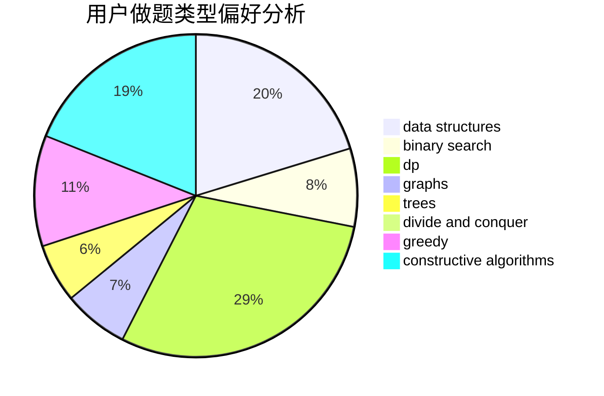

# dxd20031122

<!-- tabs:start -->

#### **用户提交结果分析**

#### **用户做题类型偏好分析**

#### **用户错题知识点分析**

<!-- tabs:end -->
# 推荐题目
[916B](https://codeforces.com/contest/916/problem/B)		bitmasks,
                        greedy,
                        math		  
[119D](https://codeforces.com/contest/119/problem/D)		hashing,
                        strings		  
[418E](https://codeforces.com/contest/418/problem/E)		data structures		  
[1010E](https://codeforces.com/contest/1010/problem/E)		data structures		  
[1083B](https://codeforces.com/contest/1083/problem/B)		greedy,
                        strings		  
[463D](https://codeforces.com/contest/463/problem/D)		dfs and similar,
                        dp,
                        graphs,
                        implementation		  
[884F](https://codeforces.com/contest/884/problem/F)		flows,
                        graphs,
                        greedy		  
[1213A](https://codeforces.com/contest/1213/problem/A)		math		  
[1187B](https://codeforces.com/contest/1187/problem/B)		binary search,
                        implementation,
                        strings		  
[702F](https://codeforces.com/contest/702/problem/F)		data structures		  
