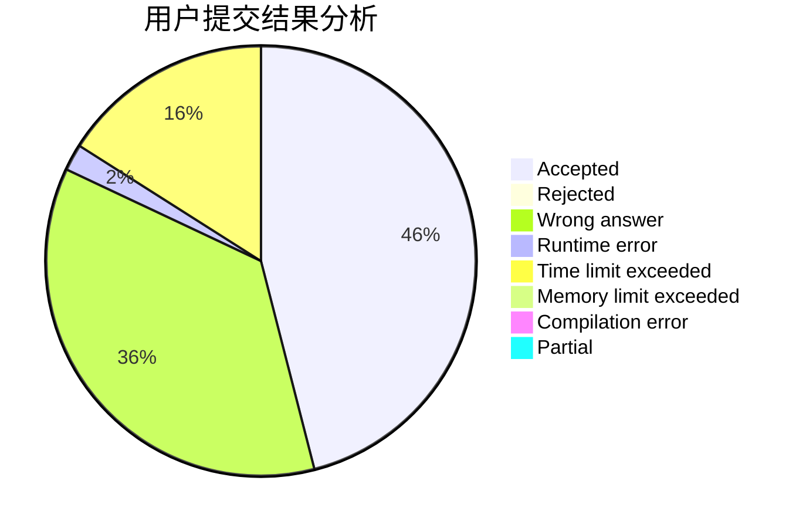
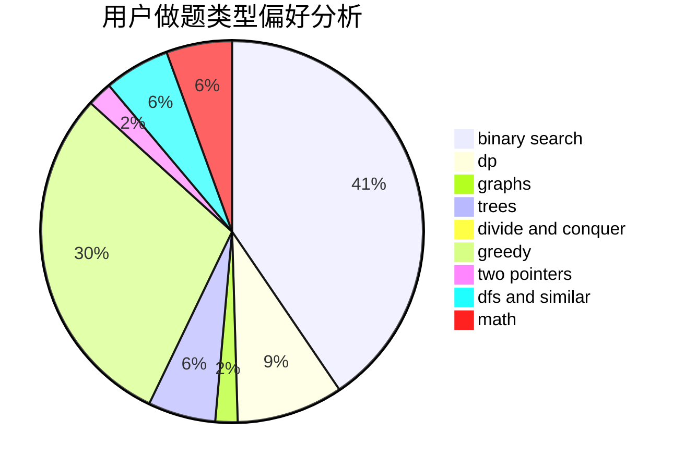

# dxdydw

<!-- tabs:start -->

#### **用户提交结果分析**

#### **用户做题类型偏好分析**

<!-- tabs:end -->
# 推荐题目
[555C](https://codeforces.com/contest/555/problem/C)
[13671](https://codeforces.com/contest/1367/problem/1)
[925F](https://codeforces.com/contest/925/problem/F)
[79D](https://codeforces.com/contest/79/problem/D)
[558A](https://codeforces.com/contest/558/problem/A)
[1264C](https://codeforces.com/contest/1264/problem/C)
[212D](https://codeforces.com/contest/212/problem/D)
[1431G](https://codeforces.com/contest/1431/problem/G)
[27B](https://codeforces.com/contest/27/problem/B)
[63C](https://codeforces.com/contest/63/problem/C)
