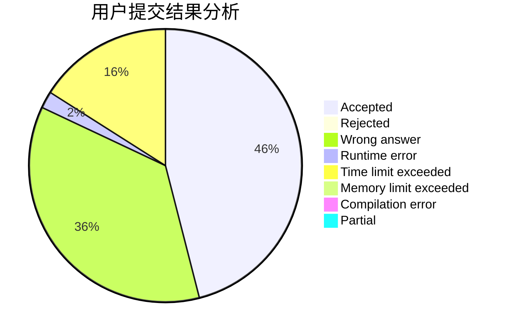
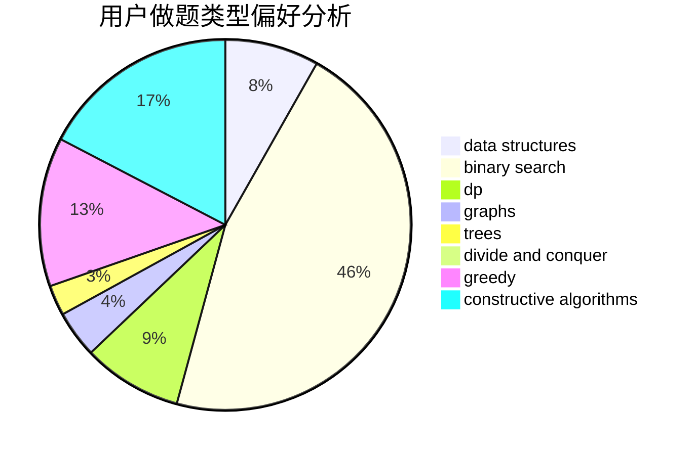

# dxdydw

<!-- tabs:start -->

#### **用户提交结果分析**

#### **用户做题类型偏好分析**

#### **用户错题知识点分析**

<!-- tabs:end -->
# 推荐题目
[555C](https://codeforces.com/contest/555/problem/C)		data structures		  
[13671](https://codeforces.com/contest/1367/problem/1)		dsu,graphs,sortings,trees		  
[925F](https://codeforces.com/contest/925/problem/F)		binary search,
                        flows		  
[79D](https://codeforces.com/contest/79/problem/D)		bitmasks,
                        dp,
                        shortest paths		  
[558A](https://codeforces.com/contest/558/problem/A)		brute force,
                        implementation,
                        sortings		  
[1264C](https://codeforces.com/contest/1264/problem/C)		data structures,
                        probabilities		  
[212D](https://codeforces.com/contest/212/problem/D)		binary search,
                        data structures,
                        dsu		  
[1431G](https://codeforces.com/contest/1431/problem/G)		*special problem,
                        dp,
                        games,
                        greedy		  
[27B](https://codeforces.com/contest/27/problem/B)		bitmasks,
                        brute force,
                        dfs and similar,
                        greedy		  
[63C](https://codeforces.com/contest/63/problem/C)		brute force,
                        implementation		  
