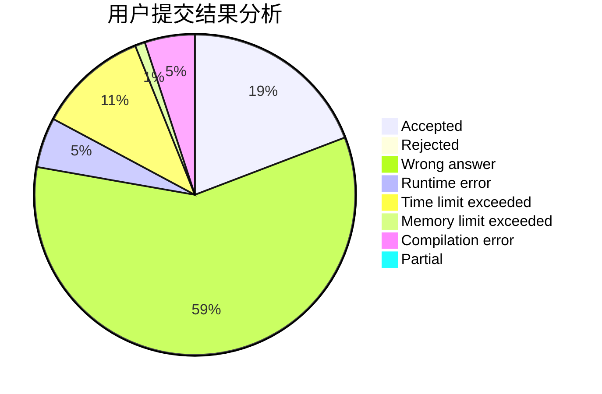
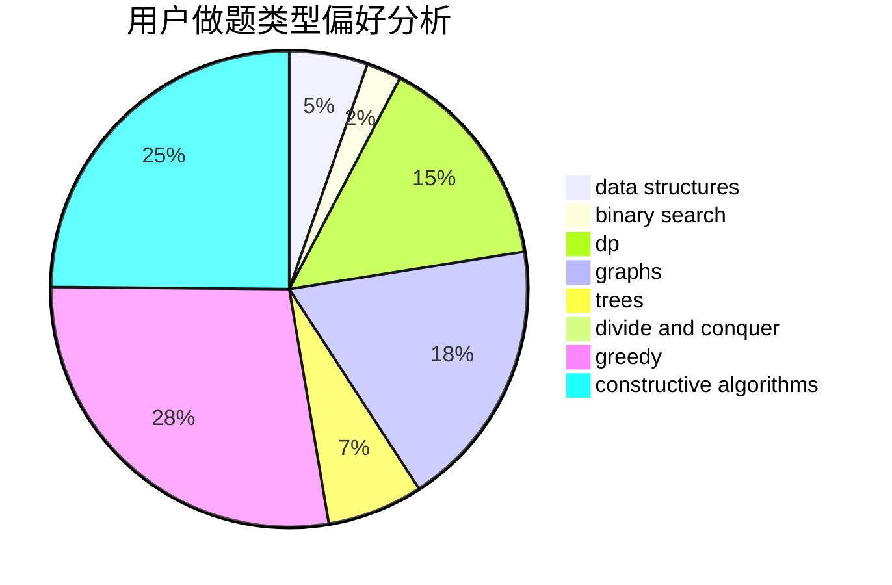

# dy14n3

<!-- tabs:start -->

#### **用户提交结果分析**

#### **用户做题类型偏好分析**

#### **用户错题知识点分析**

<!-- tabs:end -->
# 推荐题目
[841B](https://codeforces.com/contest/841/problem/B)		games,
                        math		  
[215B](https://codeforces.com/contest/215/problem/B)		greedy,
                        math		  
[616E](https://codeforces.com/contest/616/problem/E)		implementation,
                        math,
                        number theory		  
[705B](https://codeforces.com/contest/705/problem/B)		games,
                        math		  
[489B](https://codeforces.com/contest/489/problem/B)		dfs and similar,
                        dp,
                        graph matchings,
                        greedy,
                        sortings,
                        two pointers		  
[1020E](https://codeforces.com/contest/1020/problem/E)		dsu,graphs,sortings,trees		  
[948A](https://codeforces.com/contest/948/problem/A)		brute force,
                        dfs and similar,
                        graphs,
                        implementation		  
[309B](https://codeforces.com/contest/309/problem/B)		dp,
                        two pointers		  
[1083C](https://codeforces.com/contest/1083/problem/C)		data structures,
                        trees		  
[6C](https://codeforces.com/contest/6/problem/C)		greedy,
                        two pointers		  
