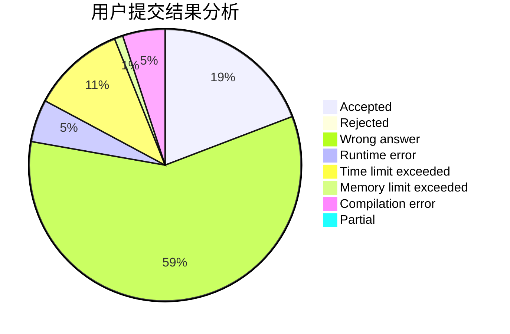
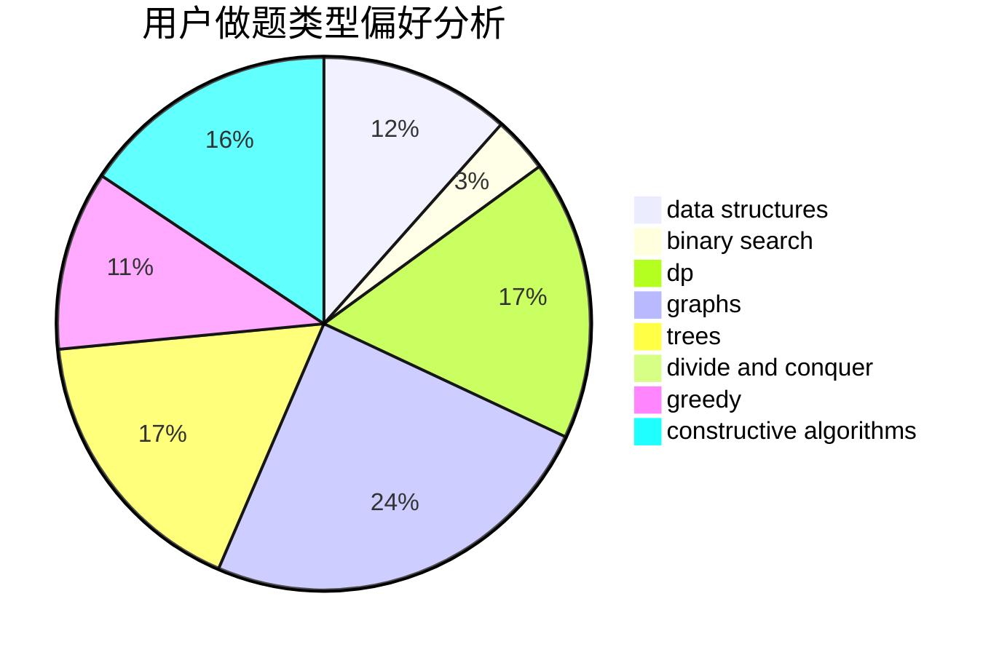

# dy14n3

<!-- tabs:start -->

#### **用户提交结果分析**

#### **用户做题类型偏好分析**

#### **用户错题知识点分析**

<!-- tabs:end -->
# 推荐题目
[860B](https://codeforces.com/contest/860/problem/B)		dsu,graphs,sortings,trees		  
[234A](https://codeforces.com/contest/234/problem/A)		implementation		  
[634B](https://codeforces.com/contest/634/problem/B)		dsu,graphs,sortings,trees		  
[724C](https://codeforces.com/contest/724/problem/C)		greedy,
                        hashing,
                        implementation,
                        math,
                        number theory,
                        sortings		  
[509C](https://codeforces.com/contest/509/problem/C)		dp,
                        greedy,
                        implementation		  
[1023C](https://codeforces.com/contest/1023/problem/C)		greedy		  
[965B](https://codeforces.com/contest/965/problem/B)		implementation		  
[32A](https://codeforces.com/contest/32/problem/A)		brute force		  
[1083F](https://codeforces.com/contest/1083/problem/F)		data structures		  
[717E](https://codeforces.com/contest/717/problem/E)		dfs and similar		  
