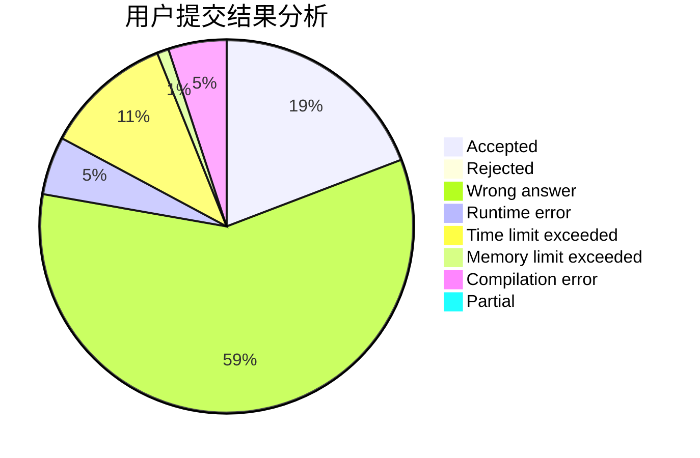
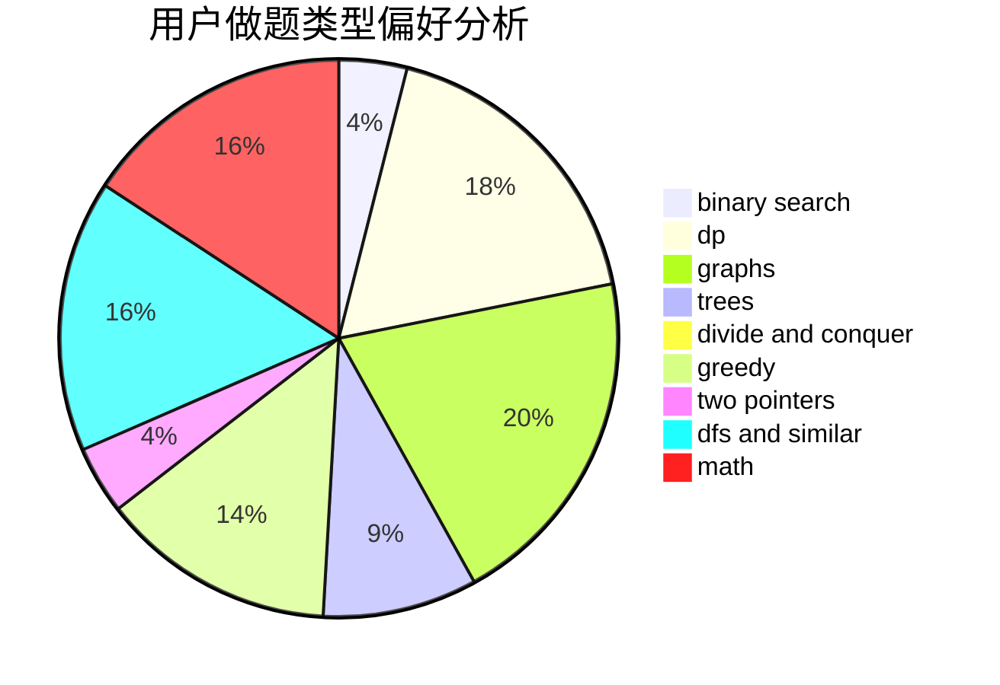

# dy14n3

<!-- tabs:start -->

#### **用户提交结果分析**

#### **用户做题类型偏好分析**

<!-- tabs:end -->
# 推荐题目
[860B](https://codeforces.com/contest/860/problem/B)
[234A](https://codeforces.com/contest/234/problem/A)
[634B](https://codeforces.com/contest/634/problem/B)
[724C](https://codeforces.com/contest/724/problem/C)
[509C](https://codeforces.com/contest/509/problem/C)
[1023C](https://codeforces.com/contest/1023/problem/C)
[965B](https://codeforces.com/contest/965/problem/B)
[32A](https://codeforces.com/contest/32/problem/A)
[1083F](https://codeforces.com/contest/1083/problem/F)
[717E](https://codeforces.com/contest/717/problem/E)
