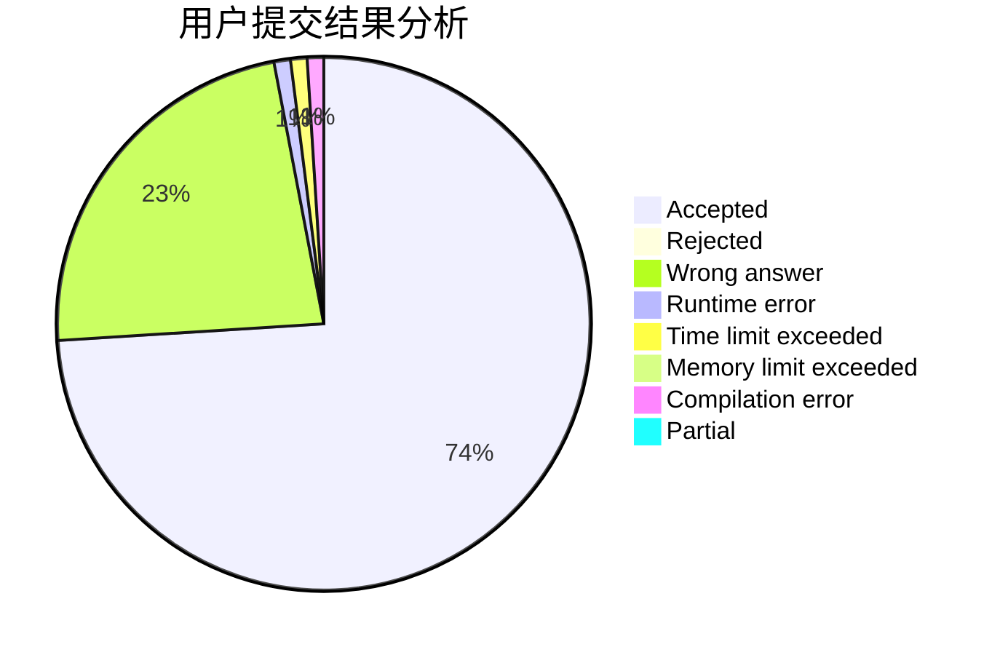
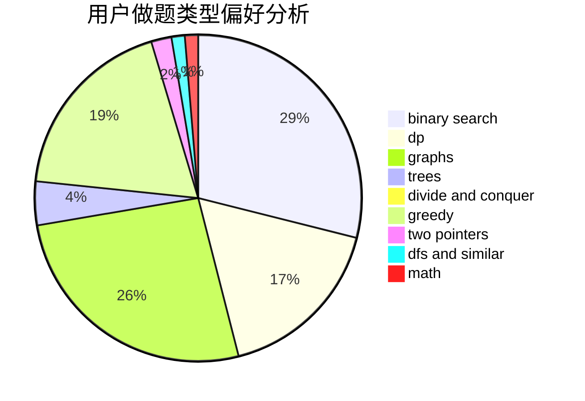

# dyhaohaoxuexi

<!-- tabs:start -->

#### **用户提交结果分析**

#### **用户做题类型偏好分析**

<!-- tabs:end -->
# 推荐题目
[1073C](https://codeforces.com/contest/1073/problem/C)
[610B](https://codeforces.com/contest/610/problem/B)
[231C](https://codeforces.com/contest/231/problem/C)
[400E](https://codeforces.com/contest/400/problem/E)
[260D](https://codeforces.com/contest/260/problem/D)
[290C](https://codeforces.com/contest/290/problem/C)
[1051D](https://codeforces.com/contest/1051/problem/D)
[682A](https://codeforces.com/contest/682/problem/A)
[1023C](https://codeforces.com/contest/1023/problem/C)
[1099D](https://codeforces.com/contest/1099/problem/D)
