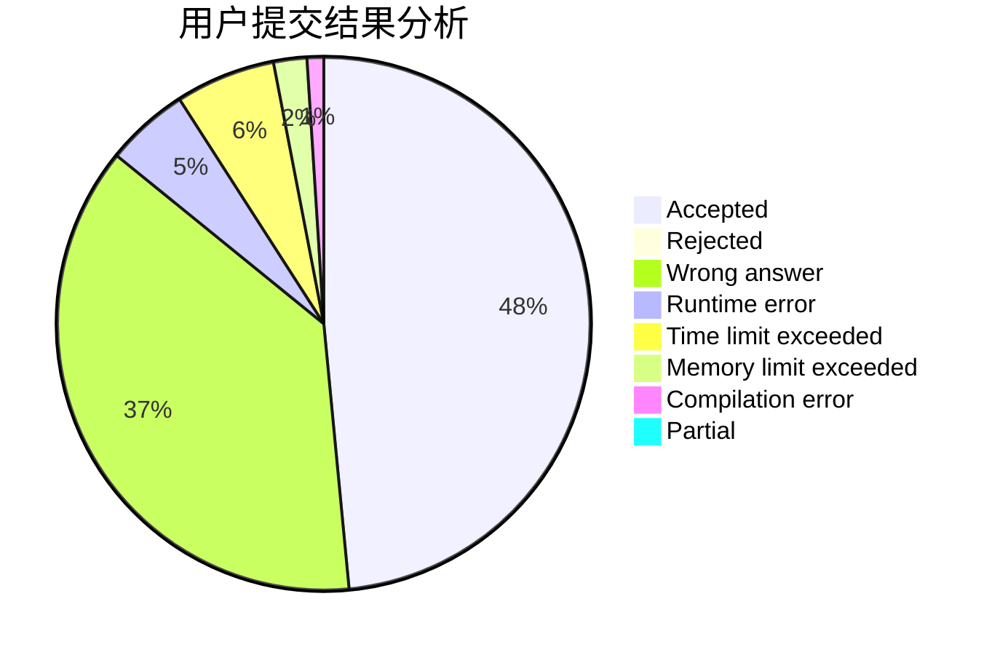
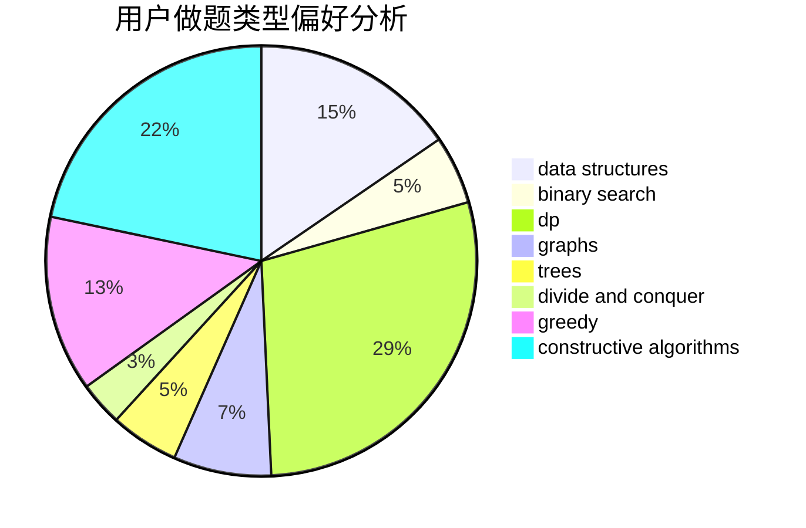

# dysyn1314

<!-- tabs:start -->

#### **用户提交结果分析**

#### **用户做题类型偏好分析**

#### **用户错题知识点分析**

<!-- tabs:end -->
# 推荐题目
[1225E](https://codeforces.com/contest/1225/problem/E)		binary search,
                        dp		  
[576C](https://codeforces.com/contest/576/problem/C)		constructive algorithms,
                        divide and conquer,
                        geometry,
                        greedy,
                        sortings		  
[771E](https://codeforces.com/contest/771/problem/E)		dp,
                        greedy		  
[1339D](https://codeforces.com/contest/1339/problem/D)		dsu,graphs,sortings,trees		  
[920F](https://codeforces.com/contest/920/problem/F)		brute force,
                        data structures,
                        dsu,
                        number theory		  
[119A](https://codeforces.com/contest/119/problem/A)		implementation		  
[920C](https://codeforces.com/contest/920/problem/C)		dfs and similar,
                        greedy,
                        math,
                        sortings,
                        two pointers		  
[1028B](https://codeforces.com/contest/1028/problem/B)		constructive algorithms,
                        math		  
[91A](https://codeforces.com/contest/91/problem/A)		greedy,
                        strings		  
[13701](https://codeforces.com/contest/1370/problem/1)		dsu,graphs,sortings,trees		  
