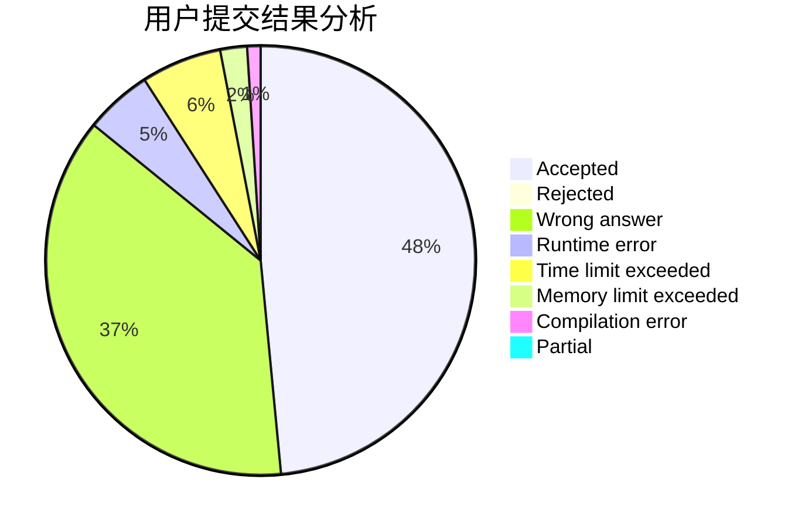
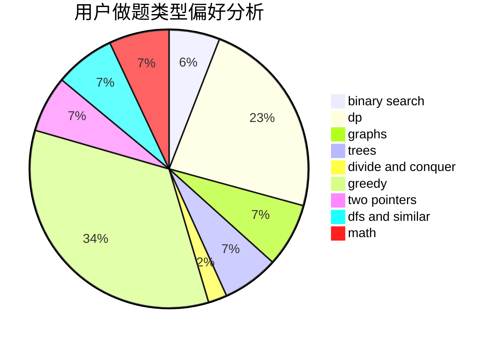

# dysyn1314

<!-- tabs:start -->

#### **用户提交结果分析**

#### **用户做题类型偏好分析**

<!-- tabs:end -->
# 推荐题目
[1225E](https://codeforces.com/contest/1225/problem/E)
[576C](https://codeforces.com/contest/576/problem/C)
[771E](https://codeforces.com/contest/771/problem/E)
[1339D](https://codeforces.com/contest/1339/problem/D)
[920F](https://codeforces.com/contest/920/problem/F)
[119A](https://codeforces.com/contest/119/problem/A)
[920C](https://codeforces.com/contest/920/problem/C)
[1028B](https://codeforces.com/contest/1028/problem/B)
[91A](https://codeforces.com/contest/91/problem/A)
[13701](https://codeforces.com/contest/1370/problem/1)
