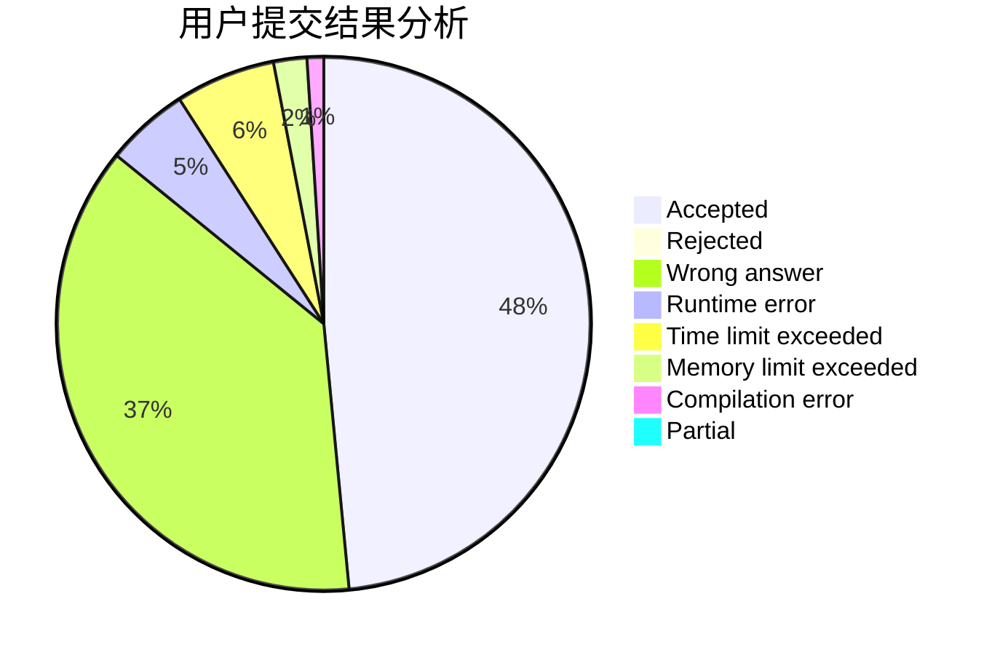
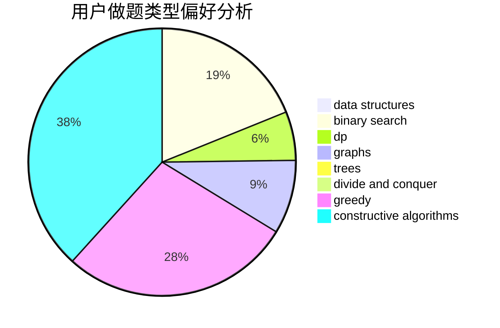

# dysyn1314

<!-- tabs:start -->

#### **用户提交结果分析**

#### **用户做题类型偏好分析**

#### **用户错题知识点分析**

<!-- tabs:end -->
# 推荐题目
[1218C](https://codeforces.com/contest/1218/problem/C)		dp		  
[551B](https://codeforces.com/contest/551/problem/B)		brute force,
                        constructive algorithms,
                        implementation,
                        strings		  
[753C](https://codeforces.com/contest/753/problem/C)		brute force,
                        constructive algorithms,
                        interactive		  
[1332G](https://codeforces.com/contest/1332/problem/G)		data structures		  
[907B](https://codeforces.com/contest/907/problem/B)		implementation		  
[1195D2](https://codeforces.com/contest/1195D/problem/2)		combinatorics,
                        math,
                        number theory		  
[906E](https://codeforces.com/contest/906/problem/E)		dp,
                        string suffix structures,
                        strings		  
[1027F](https://codeforces.com/contest/1027/problem/F)		binary search,
                        dfs and similar,
                        dsu,
                        graph matchings,
                        graphs		  
[906A](https://codeforces.com/contest/906/problem/A)		implementation,
                        strings		  
[1362F](https://codeforces.com/contest/1362/problem/F)		dsu,graphs,sortings,trees		  
