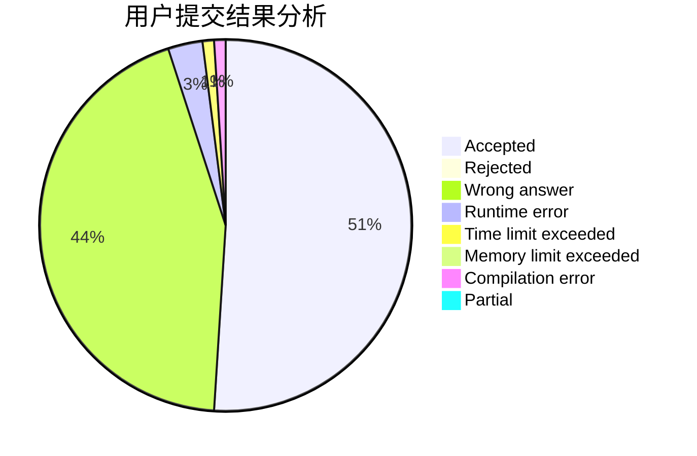
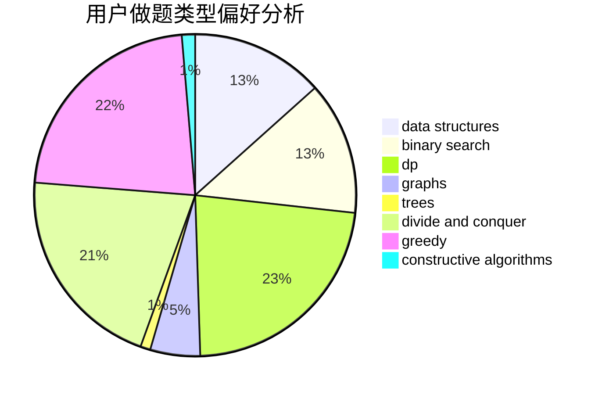
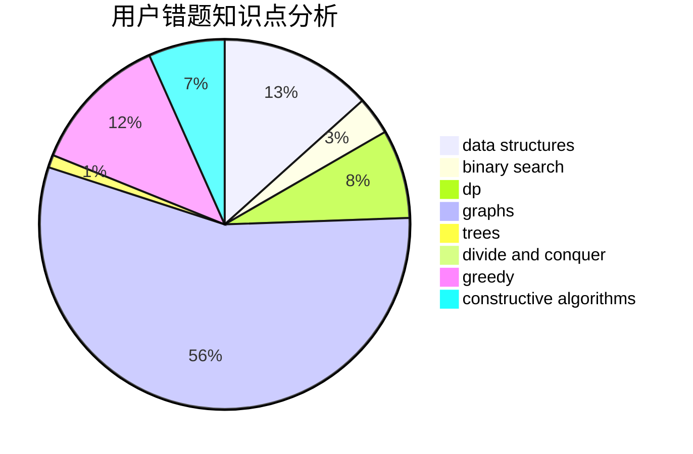

# dyx666

<!-- tabs:start -->

#### **用户提交结果分析**

#### **用户做题类型偏好分析**

#### **用户错题知识点分析**

<!-- tabs:end -->
# 推荐题目
[13563](https://codeforces.com/contest/1356/problem/3)		dsu,graphs,sortings,trees		  
[1182C](https://codeforces.com/contest/1182/problem/C)		data structures,
                        greedy,
                        strings		  
[1045C](https://codeforces.com/contest/1045/problem/C)		dfs and similar,
                        graphs,
                        trees		  
[11881](https://codeforces.com/contest/1188/problem/1)		dsu,graphs,sortings,trees		  
[584E](https://codeforces.com/contest/584/problem/E)		constructive algorithms,
                        greedy,
                        math		  
[13B](https://codeforces.com/contest/13/problem/B)		geometry,
                        implementation		  
[1010E](https://codeforces.com/contest/1010/problem/E)		data structures		  
[276E](https://codeforces.com/contest/276/problem/E)		data structures,
                        graphs,
                        trees		  
[1055B](https://codeforces.com/contest/1055/problem/B)		dsu,
                        implementation		  
[102A](https://codeforces.com/contest/102/problem/A)		brute force		  
