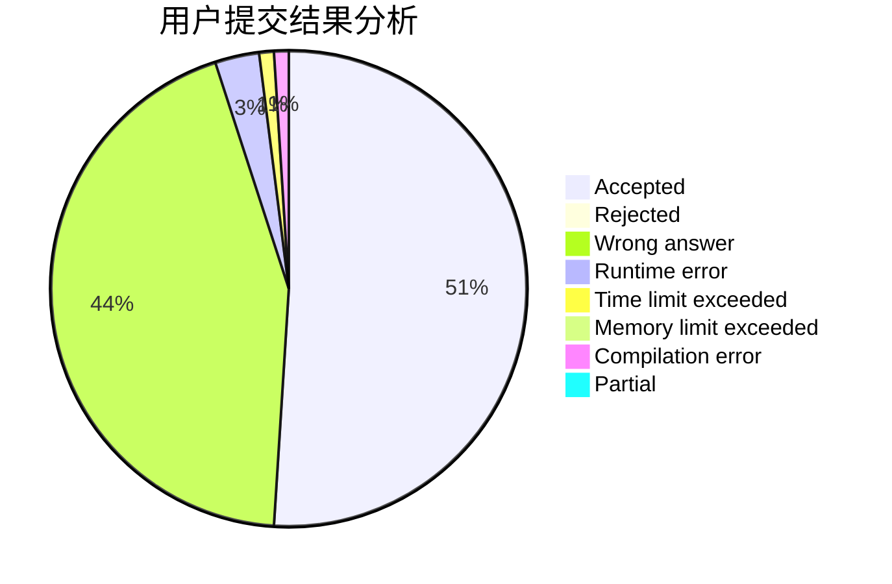
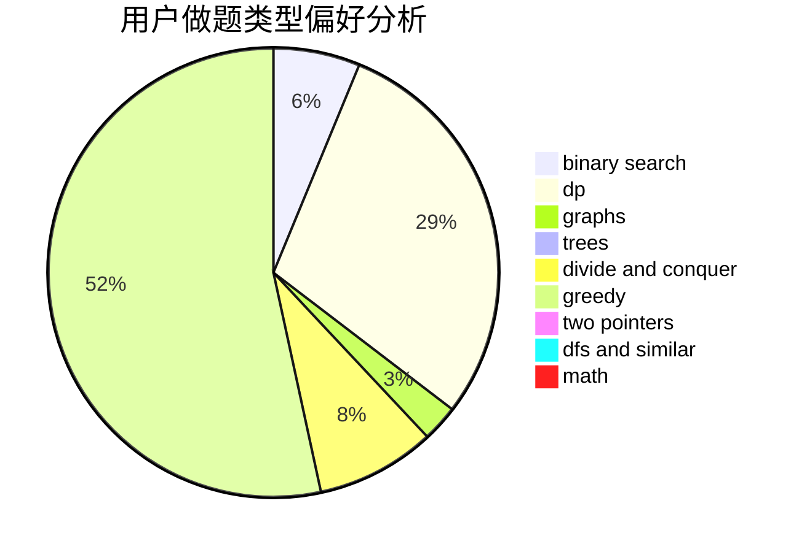

# dyx666

<!-- tabs:start -->

#### **用户提交结果分析**

#### **用户做题类型偏好分析**

<!-- tabs:end -->
# 推荐题目
[13563](https://codeforces.com/contest/1356/problem/3)
[1182C](https://codeforces.com/contest/1182/problem/C)
[1045C](https://codeforces.com/contest/1045/problem/C)
[11881](https://codeforces.com/contest/1188/problem/1)
[584E](https://codeforces.com/contest/584/problem/E)
[13B](https://codeforces.com/contest/13/problem/B)
[1010E](https://codeforces.com/contest/1010/problem/E)
[276E](https://codeforces.com/contest/276/problem/E)
[1055B](https://codeforces.com/contest/1055/problem/B)
[102A](https://codeforces.com/contest/102/problem/A)
