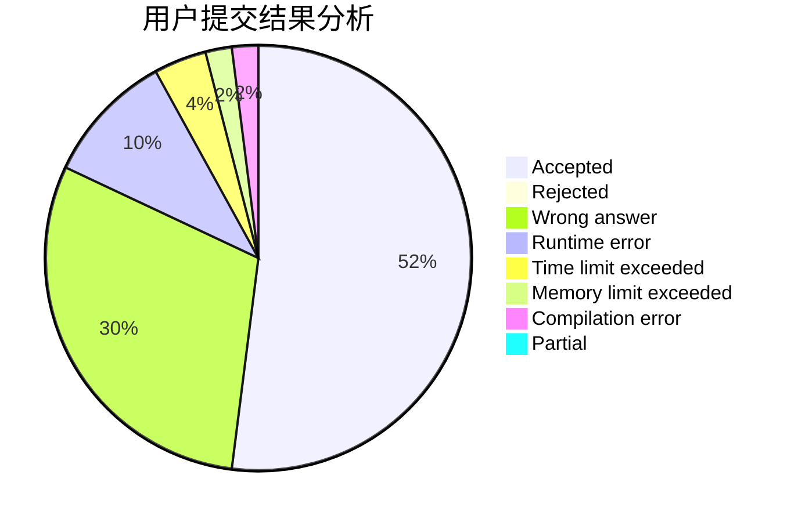
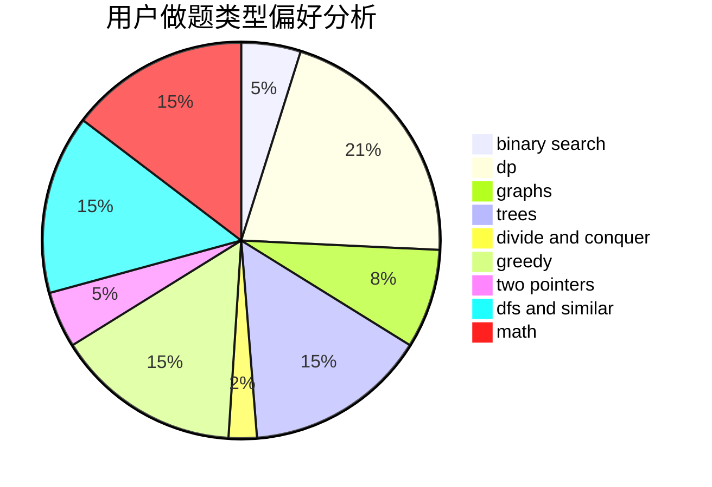

# dyxx

<!-- tabs:start -->

#### **用户提交结果分析**

#### **用户做题类型偏好分析**

<!-- tabs:end -->
# 推荐题目
[883C](https://codeforces.com/contest/883/problem/C)
[789D](https://codeforces.com/contest/789/problem/D)
[269D](https://codeforces.com/contest/269/problem/D)
[781C](https://codeforces.com/contest/781/problem/C)
[1394E](https://codeforces.com/contest/1394/problem/E)
[497E](https://codeforces.com/contest/497/problem/E)
[84C](https://codeforces.com/contest/84/problem/C)
[1241E](https://codeforces.com/contest/1241/problem/E)
[11651](https://codeforces.com/contest/1165/problem/1)
[721E](https://codeforces.com/contest/721/problem/E)
