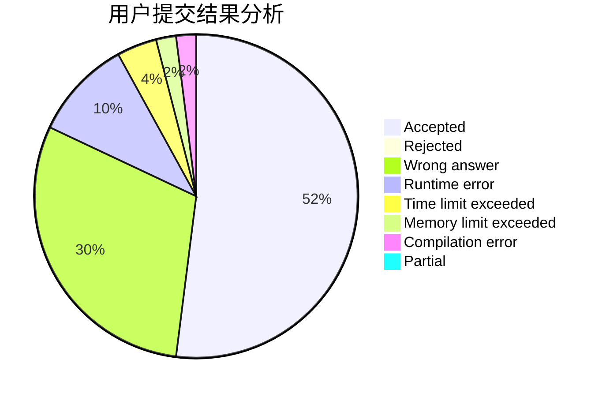
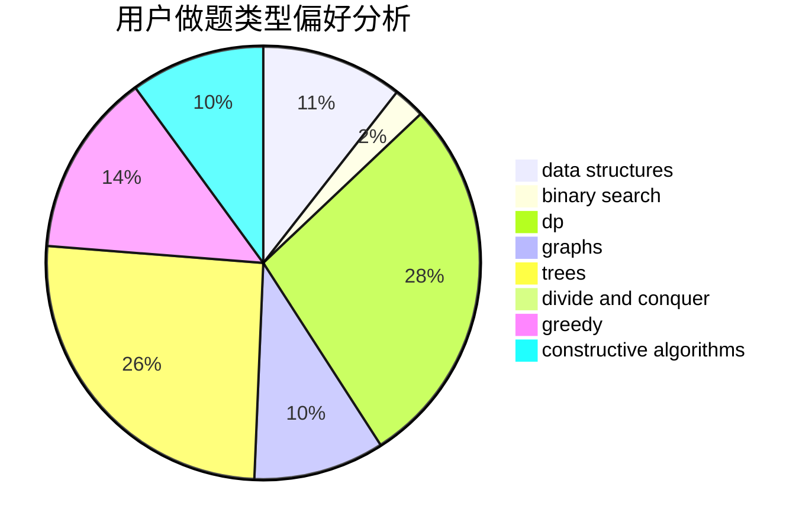
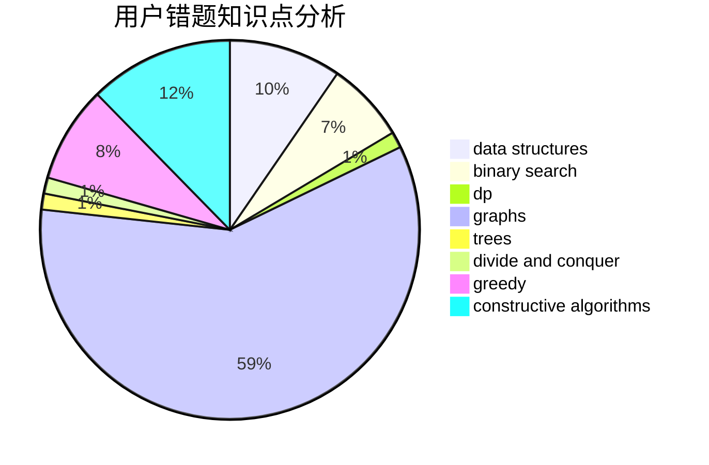

# dyxx

<!-- tabs:start -->

#### **用户提交结果分析**

#### **用户做题类型偏好分析**

#### **用户错题知识点分析**

<!-- tabs:end -->
# 推荐题目
[883C](https://codeforces.com/contest/883/problem/C)		binary search,
                        implementation		  
[789D](https://codeforces.com/contest/789/problem/D)		dsu,graphs,sortings,trees		  
[269D](https://codeforces.com/contest/269/problem/D)		data structures,
                        dp,
                        graphs,
                        sortings		  
[781C](https://codeforces.com/contest/781/problem/C)		dsu,graphs,sortings,trees		  
[1394E](https://codeforces.com/contest/1394/problem/E)		strings		  
[497E](https://codeforces.com/contest/497/problem/E)		dp,
                        matrices		  
[84C](https://codeforces.com/contest/84/problem/C)		binary search,
                        implementation		  
[1241E](https://codeforces.com/contest/1241/problem/E)		dsu,graphs,sortings,trees		  
[11651](https://codeforces.com/contest/1165/problem/1)		dsu,graphs,sortings,trees		  
[721E](https://codeforces.com/contest/721/problem/E)		binary search,
                        dp		  
