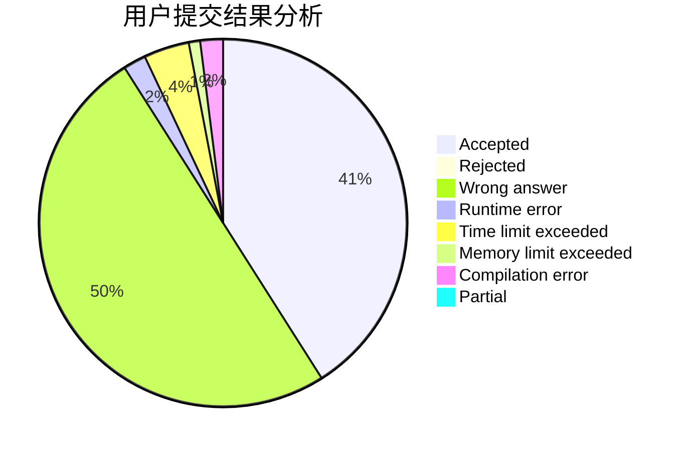
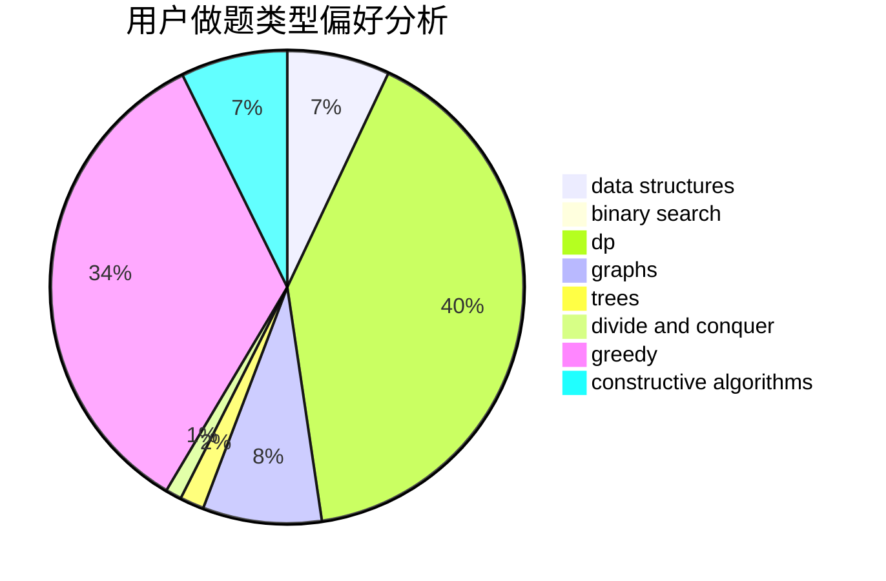
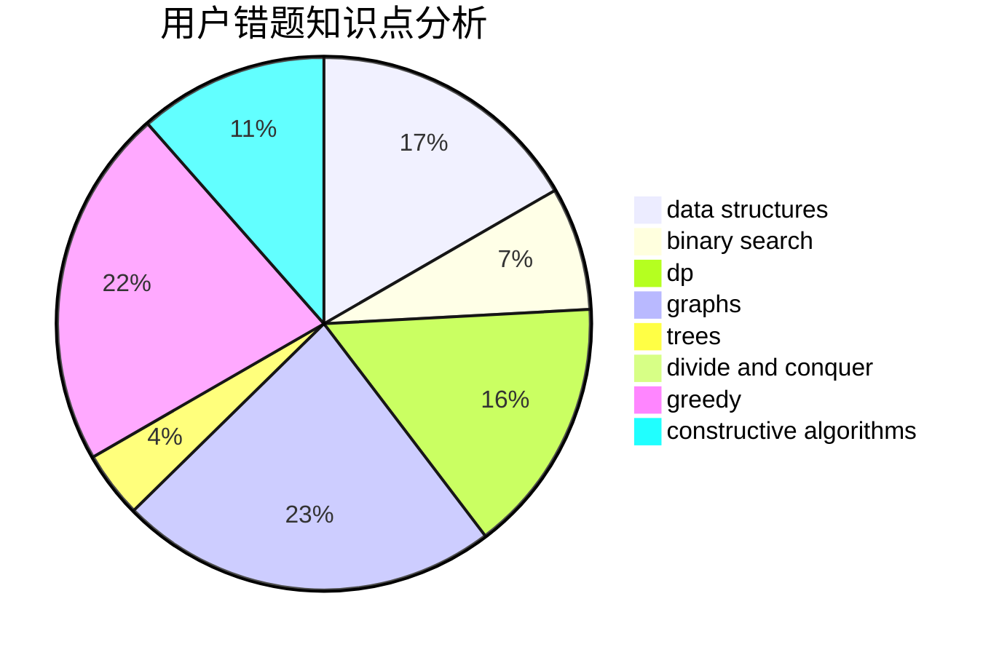

# Ash_Dr

<!-- tabs:start -->

#### **用户提交结果分析**

#### **用户做题类型偏好分析**

#### **用户错题知识点分析**

<!-- tabs:end -->
# 推荐题目
[1336E2](https://codeforces.com/contest/1336E/problem/2)		bitmasks,
                        brute force,
                        combinatorics,
                        math		  
[42A](https://codeforces.com/contest/42/problem/A)		greedy,
                        implementation		  
[429A](https://codeforces.com/contest/429/problem/A)		dfs and similar,
                        trees		  
[429C](https://codeforces.com/contest/429/problem/C)		bitmasks,
                        constructive algorithms,
                        dp,
                        greedy,
                        trees		  
[429B](https://codeforces.com/contest/429/problem/B)		dp		  
[42D](https://codeforces.com/contest/42/problem/D)		constructive algorithms,
                        math		  
[427D](https://codeforces.com/contest/427/problem/D)		dp,
                        string suffix structures,
                        strings		  
[430A](https://codeforces.com/contest/430/problem/A)		constructive algorithms,
                        sortings		  
[429E](https://codeforces.com/contest/429/problem/E)		graphs		  
[429D](https://codeforces.com/contest/429/problem/D)		data structures,
                        divide and conquer,
                        geometry		  
