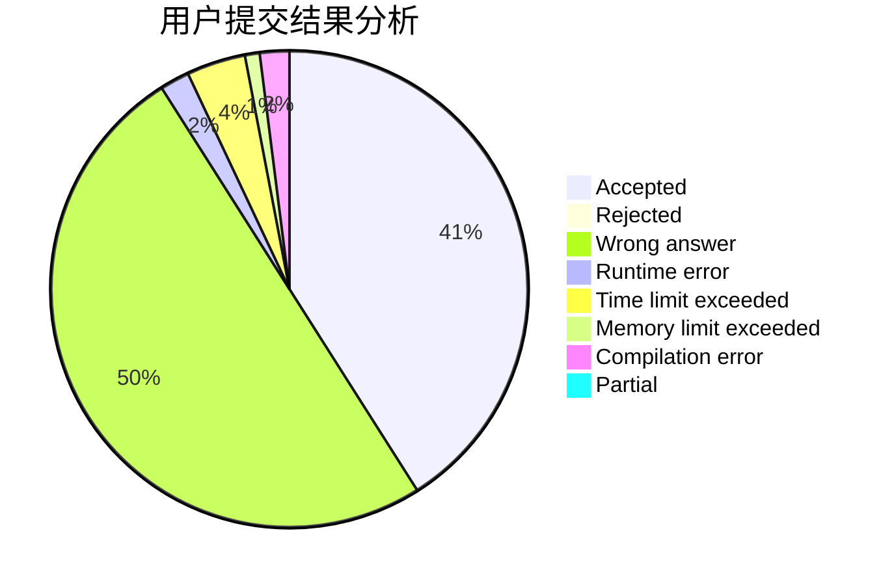
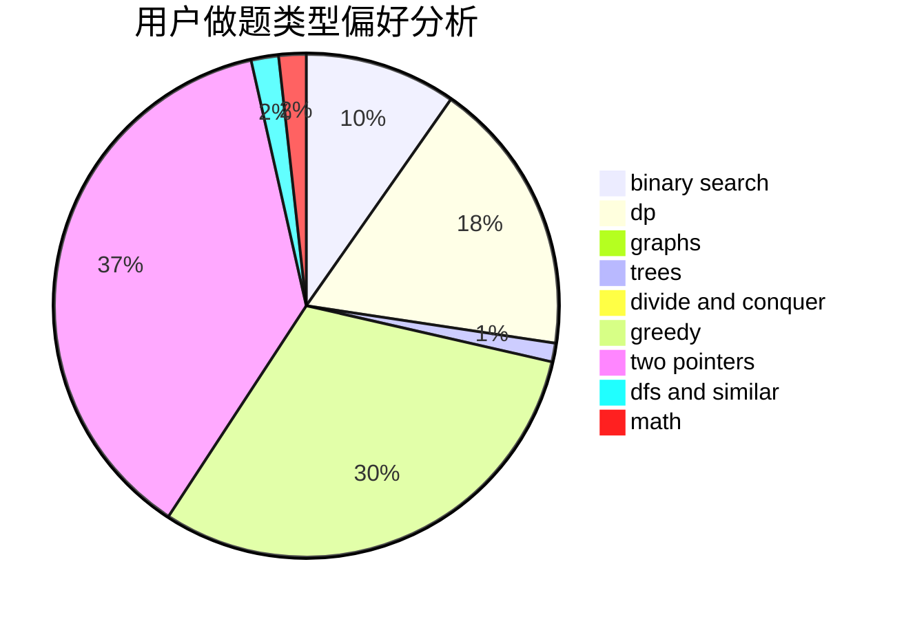

# Ash_Dr

<!-- tabs:start -->

#### **用户提交结果分析**

#### **用户做题类型偏好分析**

<!-- tabs:end -->
# 推荐题目
[1344A](https://codeforces.com/contest/1344/problem/A)
[451D](https://codeforces.com/contest/451/problem/D)
[44E](https://codeforces.com/contest/44/problem/E)
[44I](https://codeforces.com/contest/44/problem/I)
[44G](https://codeforces.com/contest/44/problem/G)
[452A](https://codeforces.com/contest/452/problem/A)
[44C](https://codeforces.com/contest/44/problem/C)
[452B](https://codeforces.com/contest/452/problem/B)
[451A](https://codeforces.com/contest/451/problem/A)
[450B](https://codeforces.com/contest/450/problem/B)
