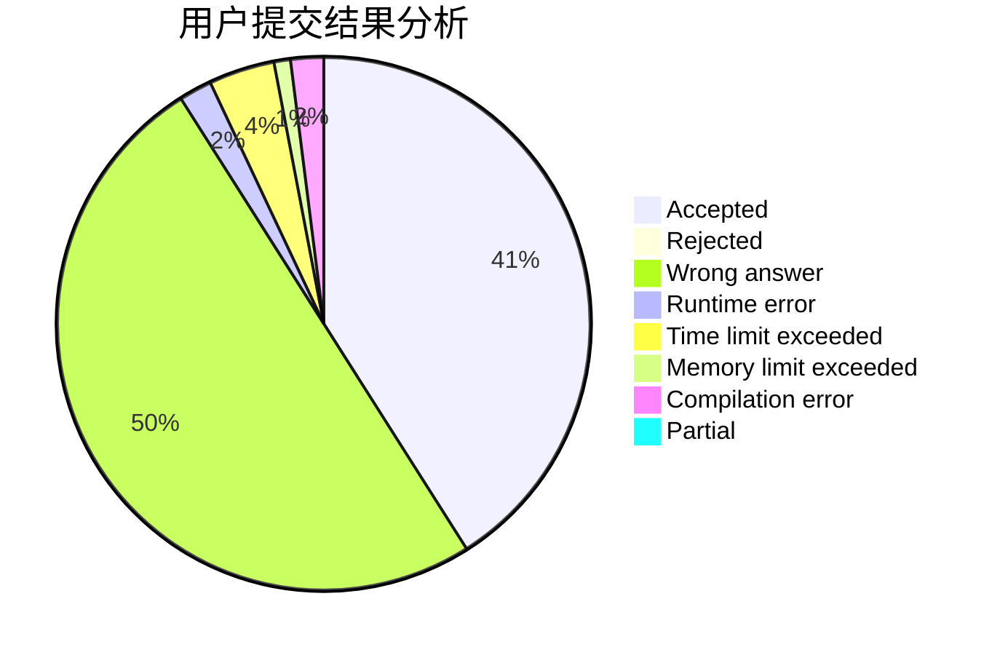
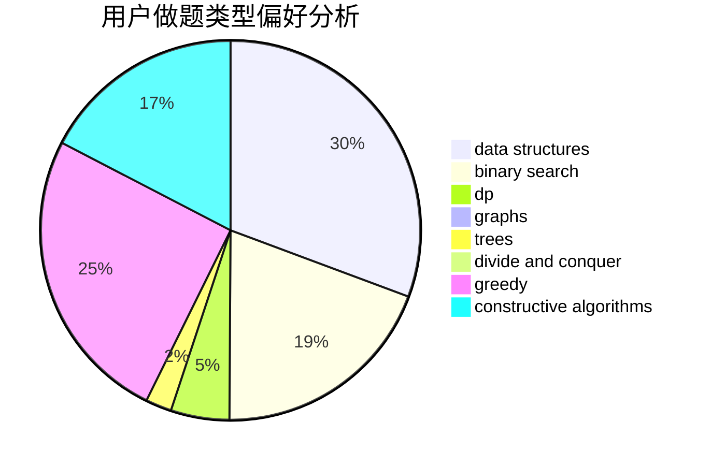
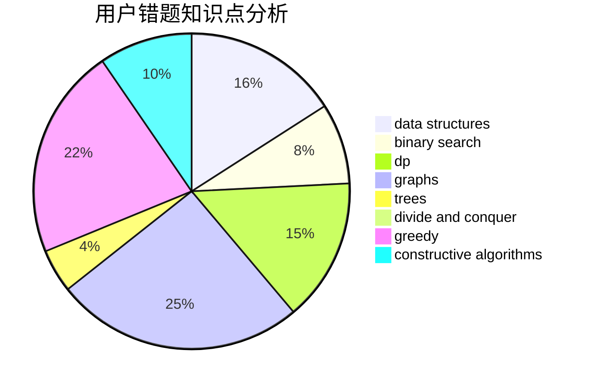

# Ash_Dr

<!-- tabs:start -->

#### **用户提交结果分析**

#### **用户做题类型偏好分析**

#### **用户错题知识点分析**

<!-- tabs:end -->
# 推荐题目
[1344A](https://codeforces.com/contest/1344/problem/A)		math,
                        number theory,
                        sortings		  
[451D](https://codeforces.com/contest/451/problem/D)		math		  
[44E](https://codeforces.com/contest/44/problem/E)		dp		  
[44I](https://codeforces.com/contest/44/problem/I)		brute force,
                        combinatorics		  
[44G](https://codeforces.com/contest/44/problem/G)		data structures,
                        implementation		  
[452A](https://codeforces.com/contest/452/problem/A)		brute force,
                        implementation,
                        strings		  
[44C](https://codeforces.com/contest/44/problem/C)		implementation		  
[452B](https://codeforces.com/contest/452/problem/B)		brute force,
                        constructive algorithms,
                        geometry,
                        trees		  
[451A](https://codeforces.com/contest/451/problem/A)		implementation		  
[450B](https://codeforces.com/contest/450/problem/B)		implementation,
                        math		  
