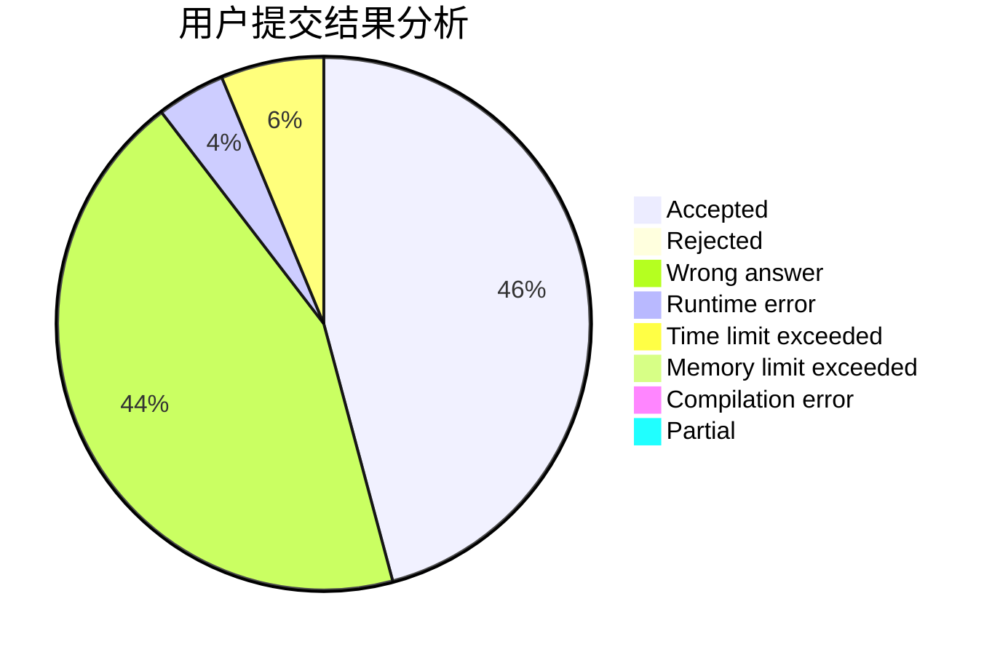
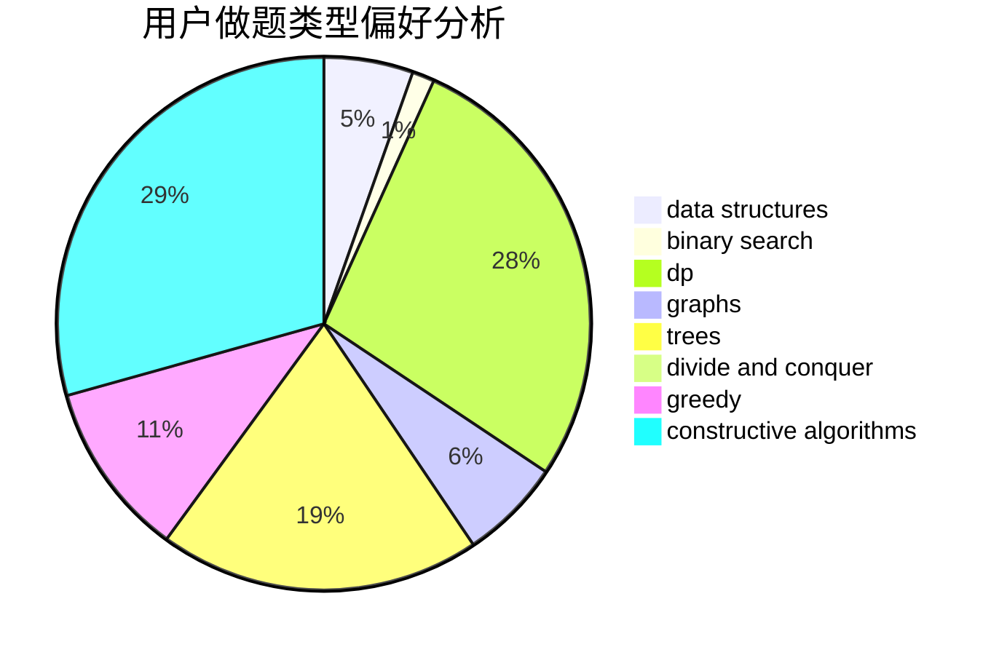
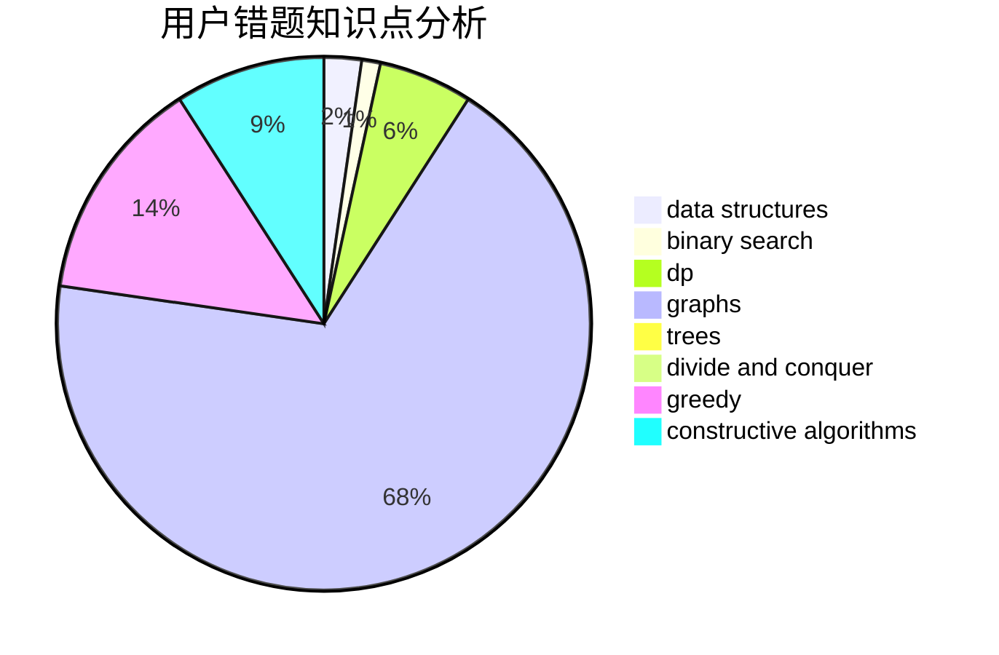

# dztlb

<!-- tabs:start -->

#### **用户提交结果分析**

#### **用户做题类型偏好分析**

#### **用户错题知识点分析**

<!-- tabs:end -->
# 推荐题目
[803D](https://codeforces.com/contest/803/problem/D)		binary search,
                        greedy		  
[10C](https://codeforces.com/contest/10/problem/C)		number theory		  
[911D](https://codeforces.com/contest/911/problem/D)		brute force,
                        math		  
[827A](https://codeforces.com/contest/827/problem/A)		data structures,
                        greedy,
                        sortings,
                        strings		  
[725A](https://codeforces.com/contest/725/problem/A)		implementation		  
[49A](https://codeforces.com/contest/49/problem/A)		implementation		  
[554A](https://codeforces.com/contest/554/problem/A)		brute force,
                        math,
                        strings		  
[960C](https://codeforces.com/contest/960/problem/C)		bitmasks,
                        constructive algorithms,
                        greedy,
                        implementation		  
[961F](https://codeforces.com/contest/961/problem/F)		binary search,
                        hashing,
                        string suffix structures		  
[1314F](https://codeforces.com/contest/1314/problem/F)		dsu,graphs,sortings,trees		  
