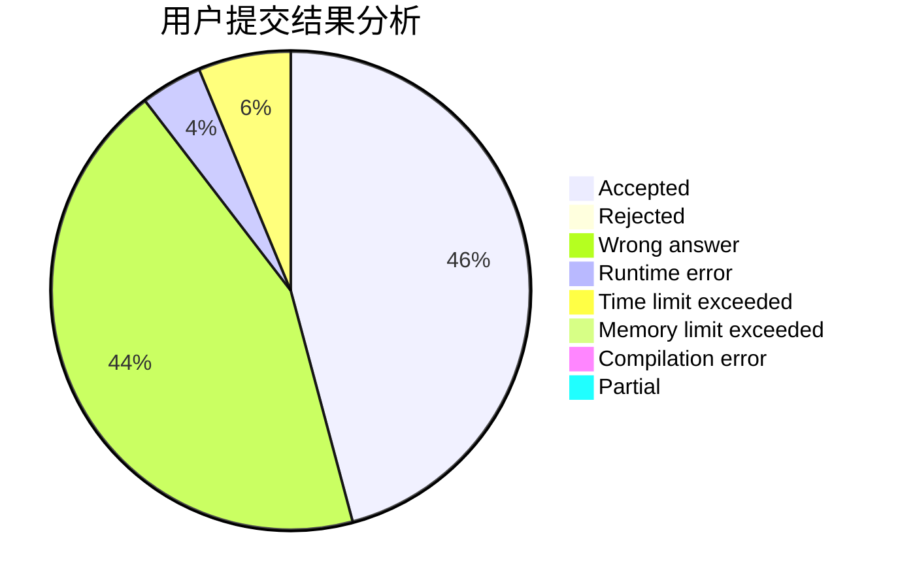
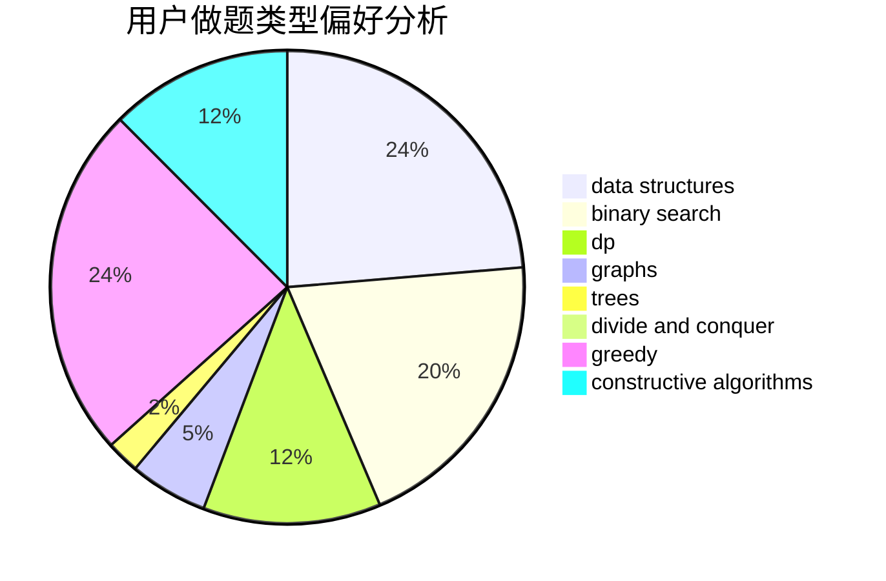
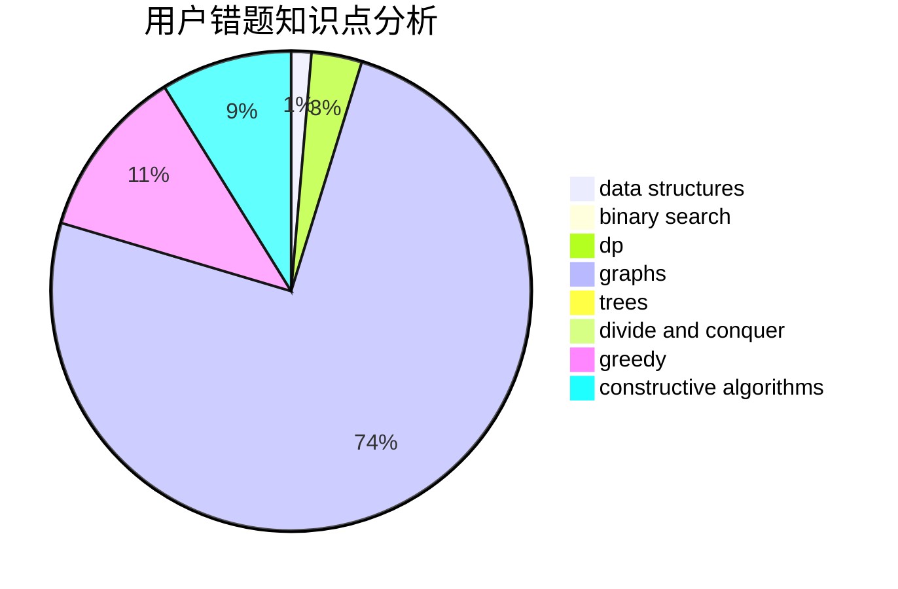

# dztlb

<!-- tabs:start -->

#### **用户提交结果分析**

#### **用户做题类型偏好分析**

#### **用户错题知识点分析**

<!-- tabs:end -->
# 推荐题目
[787D](https://codeforces.com/contest/787/problem/D)		dsu,graphs,sortings,trees		  
[109A](https://codeforces.com/contest/109/problem/A)		brute force,
                        implementation		  
[893D](https://codeforces.com/contest/893/problem/D)		data structures,
                        dp,
                        greedy,
                        implementation		  
[809B](https://codeforces.com/contest/809/problem/B)		binary search,
                        interactive		  
[706D](https://codeforces.com/contest/706/problem/D)		binary search,
                        bitmasks,
                        data structures,
                        trees		  
[479B](https://codeforces.com/contest/479/problem/B)		brute force,
                        constructive algorithms,
                        greedy,
                        implementation,
                        sortings		  
[533B](https://codeforces.com/contest/533/problem/B)		dfs and similar,
                        dp,
                        graphs,
                        strings,
                        trees		  
[938G](https://codeforces.com/contest/938/problem/G)		bitmasks,
                        data structures,
                        dsu,
                        graphs		  
[940B](https://codeforces.com/contest/940/problem/B)		dp,
                        greedy		  
[1305G](https://codeforces.com/contest/1305/problem/G)		bitmasks,
                        brute force,
                        dp,
                        dsu,
                        graphs		  
