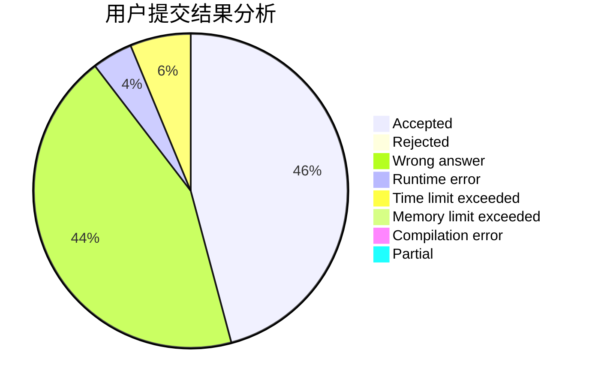
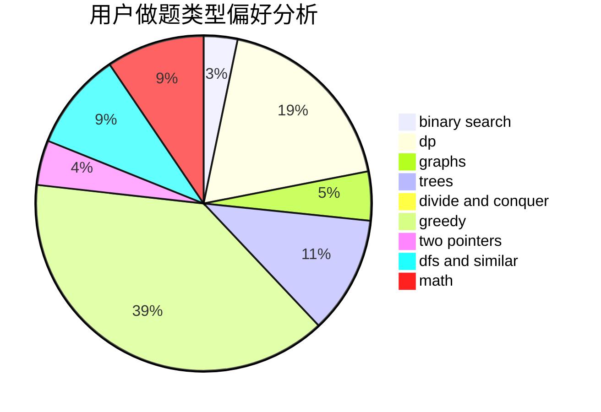

# dztlb

<!-- tabs:start -->

#### **用户提交结果分析**

#### **用户做题类型偏好分析**

<!-- tabs:end -->
# 推荐题目
[803D](https://codeforces.com/contest/803/problem/D)
[10C](https://codeforces.com/contest/10/problem/C)
[911D](https://codeforces.com/contest/911/problem/D)
[827A](https://codeforces.com/contest/827/problem/A)
[725A](https://codeforces.com/contest/725/problem/A)
[49A](https://codeforces.com/contest/49/problem/A)
[554A](https://codeforces.com/contest/554/problem/A)
[960C](https://codeforces.com/contest/960/problem/C)
[961F](https://codeforces.com/contest/961/problem/F)
[1314F](https://codeforces.com/contest/1314/problem/F)
