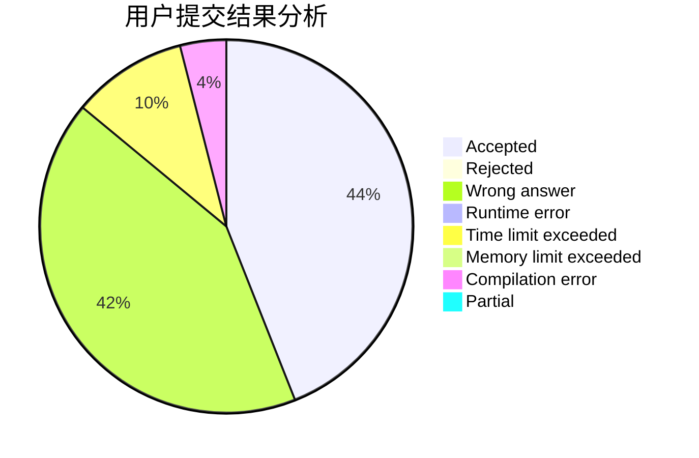
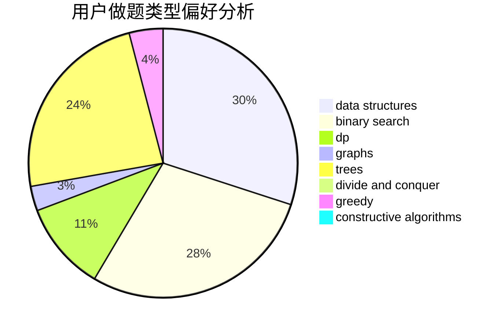
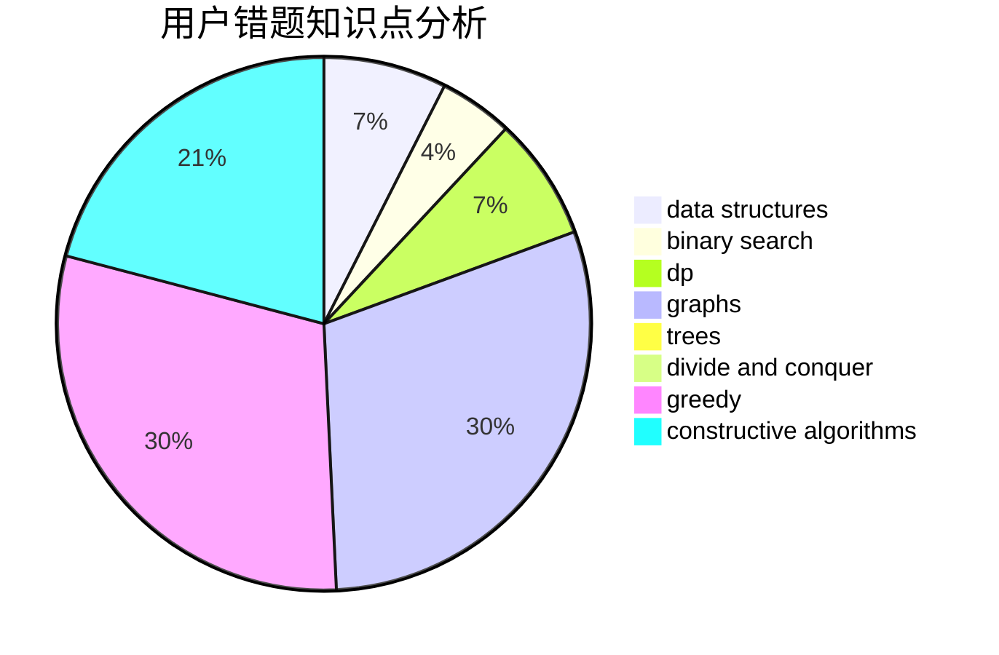

# e792a8

<!-- tabs:start -->

#### **用户提交结果分析**

#### **用户做题类型偏好分析**

#### **用户错题知识点分析**

<!-- tabs:end -->
# 推荐题目
[1436F](https://codeforces.com/contest/1436/problem/F)		combinatorics,
                        math,
                        number theory		  
[171H](https://codeforces.com/contest/171/problem/H)		*special problem,
                        implementation		  
[286D](https://codeforces.com/contest/286/problem/D)		data structures,
                        sortings		  
[1143F](https://codeforces.com/contest/1143/problem/F)		dsu,graphs,sortings,trees		  
[909A](https://codeforces.com/contest/909/problem/A)		brute force,
                        greedy,
                        sortings		  
[865A](https://codeforces.com/contest/865/problem/A)		constructive algorithms		  
[1426C](https://codeforces.com/contest/1426/problem/C)		binary search,
                        constructive algorithms,
                        math		  
[58E](https://codeforces.com/contest/58/problem/E)		dp		  
[1099A](https://codeforces.com/contest/1099/problem/A)		implementation		  
[434A](https://codeforces.com/contest/434/problem/A)		dsu,graphs,sortings,trees		  
