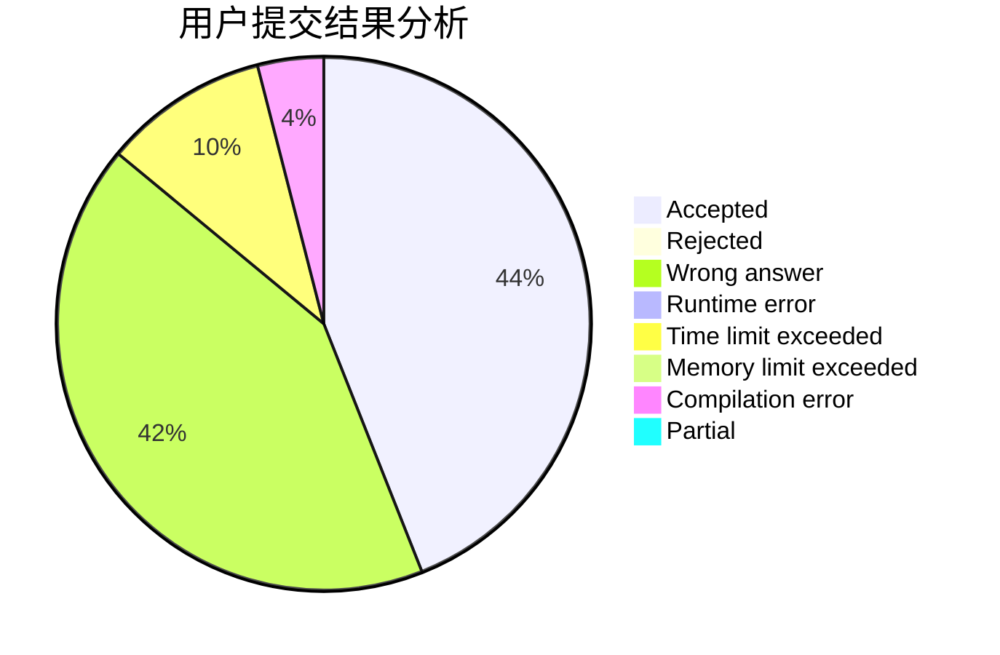
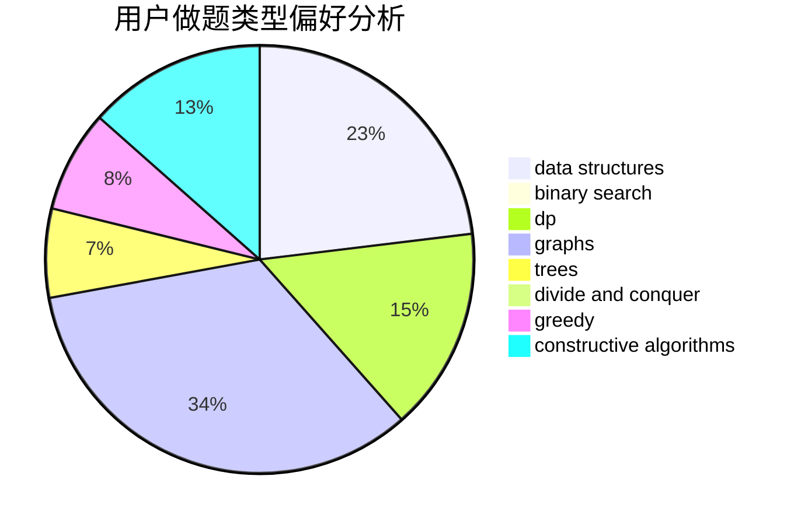
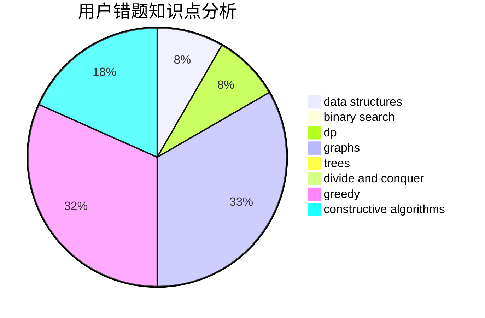

# e792a8

<!-- tabs:start -->

#### **用户提交结果分析**

#### **用户做题类型偏好分析**

#### **用户错题知识点分析**

<!-- tabs:end -->
# 推荐题目
[1446E](https://codeforces.com/contest/1446/problem/E)		constructive algorithms,
                        dfs and similar		  
[19A](https://codeforces.com/contest/19/problem/A)		implementation		  
[300E](https://codeforces.com/contest/300/problem/E)		binary search,
                        math,
                        number theory		  
[1146A](https://codeforces.com/contest/1146/problem/A)		implementation,
                        strings		  
[923D](https://codeforces.com/contest/923/problem/D)		constructive algorithms,
                        implementation,
                        strings		  
[884D](https://codeforces.com/contest/884/problem/D)		data structures,
                        greedy		  
[1434E](https://codeforces.com/contest/1434/problem/E)		dsu,
                        games		  
[609E](https://codeforces.com/contest/609/problem/E)		data structures,
                        dfs and similar,
                        dsu,
                        graphs,
                        trees		  
[1099D](https://codeforces.com/contest/1099/problem/D)		dsu,graphs,sortings,trees		  
[454A](https://codeforces.com/contest/454/problem/A)		implementation		  
